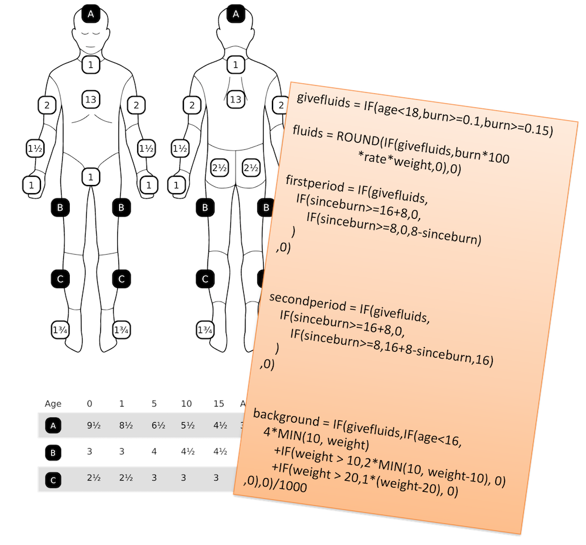
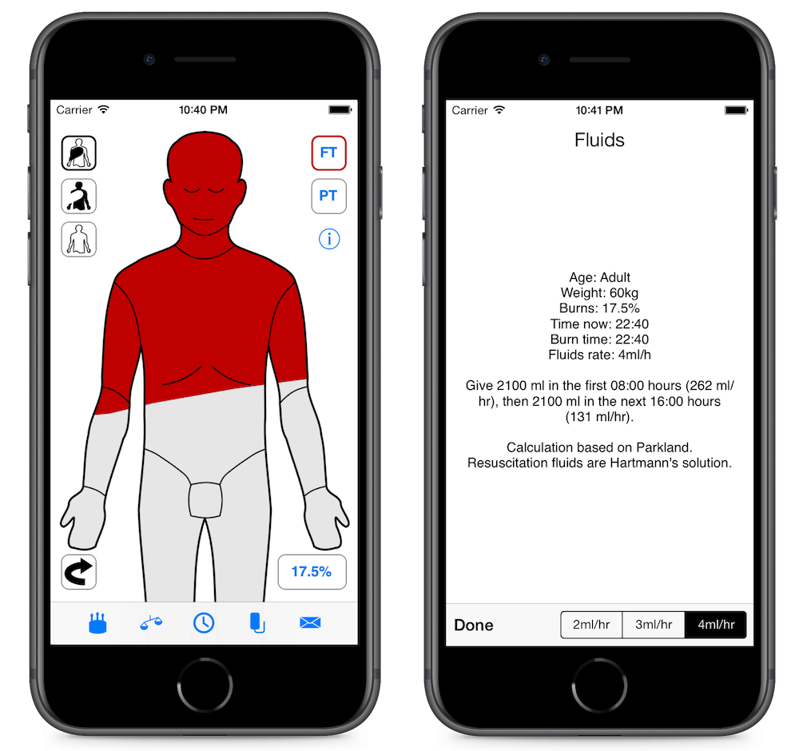
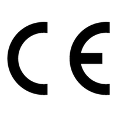
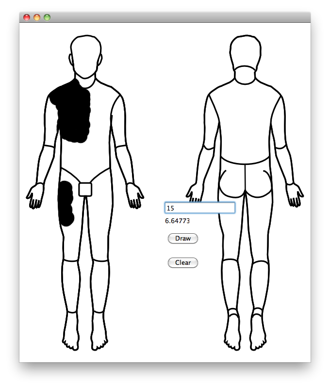
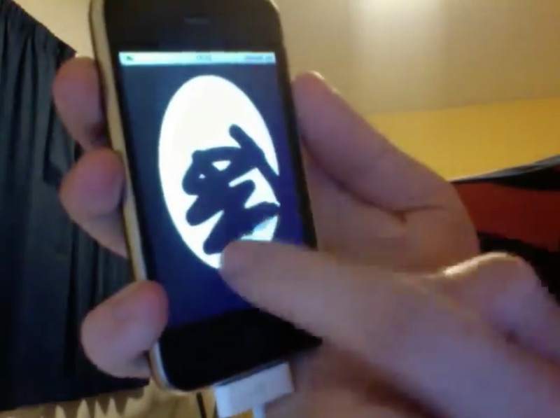
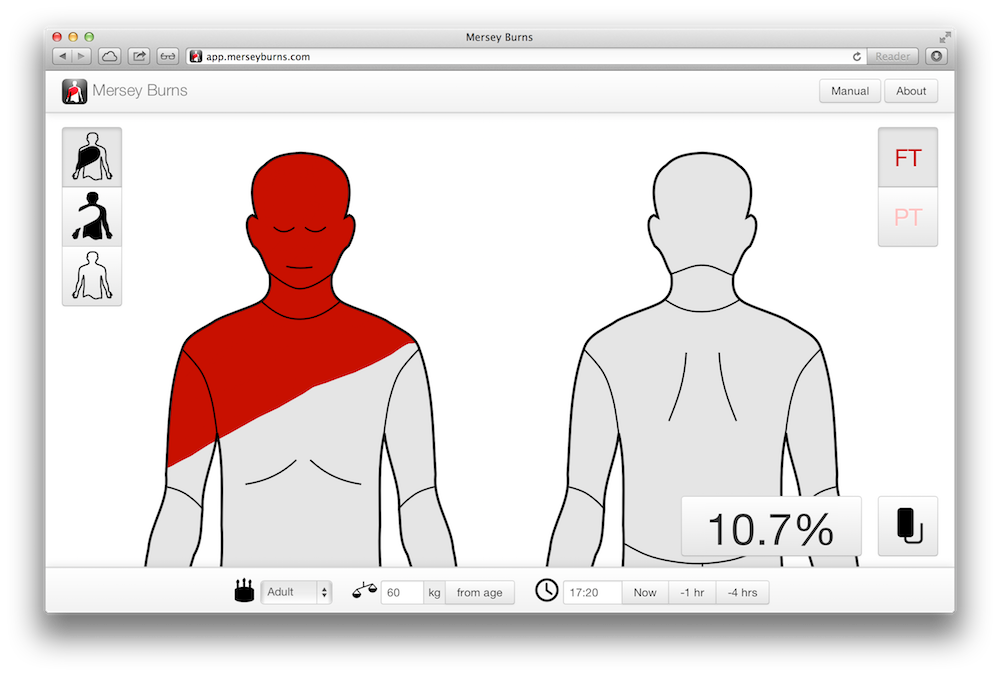
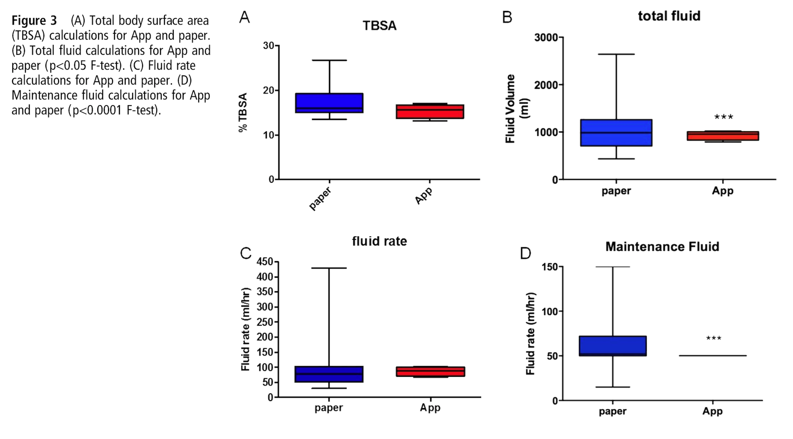
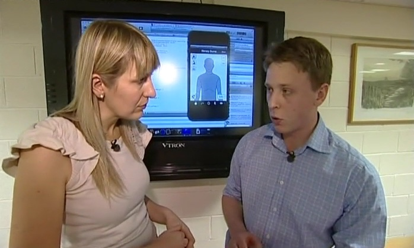

Mersey Burns is an app for iPhone and Android to help doctors quickly and
accurately prescribe resuscitation fluids to seriously burned people in
emergencies. I wrote it as a side-project in my spare time around 2011 when I
was planning to change career from the military into software development. Along
the way, my collaborators and I figured out how to get an app into use by the
UK's National Health Service and how to regulate a phone app as a medical
device.

It turned into a successful project, leading to media appearances, speaking
invitations, development and consulting contact work with major  pharmaceutical
companies, and it gave me something to concrete to talk about when people asked
me what I could do. I still bump into people who have used it today, and I still
use it to show that I can generate an idea, implement it, navigate regulation
and industry politics, ship the project, market it, support it, and generate
leads for future business opportunities.

You can see Mersey Burns being used in anger on a badly burned baby in this
clip from the 2018 Channel 4 documentary *Emergency Helicopter Medics*.

  <video controls>
    <source type="video/mp4" src="mersey-burns.mp4">
  </video>

This article talks about what we achieved with Mersey Burns and how I built a
successful side project for my portfolio.

## What the app does

When someone is very seriously burned they lose a lot of fluid from their
damaged skin. You need to put fluid back into them, but too little fluid isn't
effective and too much fluid can be harmful. Working out the correct volume
of fluid requires:

- Working out how much of the body surface are has been burned using a table
- Finding out the age of the patient
- Finding out the weight of the patient
- Finding out how long ago they were burned
- Doing a calculation based on these values

Doctors who don’t often see serious burns patients can get this process
seriously wrong - they mis-estimate the body surface, they don’t know the
calculation, and they also simply get the arithmetic in the calculation wrong.
This leads to large margins of error on the volume of fluid that they prescribe,
and unnecessary additional harm to burns victims.

Mersey Burns solves these problems by giving you an intuitive way to work out
the burn area and doing the calculation for you.

The doctor draws the burned areas on an outline of a person, enters their age,
weight and time of burn. The weight can be estimated from the age if it's not
known. A button then shows the doctor the fluids prescription.

The app is still available on the App Store, Google Play, but only in the United
Kingdom, and an online version. In the past it was also available on
Blackberry's store.

Mersey Burns is regulated by Her Majesty's Government as a medical device and
recommended by NHS trusts.

&nbsp;&nbsp;&nbsp;&nbsp;

&nbsp;&nbsp;&nbsp;&nbsp;

## How Mersey Burns came about

In 2010 I was a captain in the Royal Army Medical Corps and thinking about
leaving to go into a career in software development. I was looking for some kind
of side-project to show that I could program, not having really written any code
I could show since I graduated from my undergraduate degree.

My fiancée was working with a plastic surgeon, Rowan Pritchard Jones, who had also
been in the Royal Army Medical Corps, who was thinking about his own medical
equivalent of a side-project - writing a book with his colleague, Paul McArthur.
They decided to do some form of app instead to make it different, and asked me
if I was interested in working with them.

Rowan and Paul understood the problems that people faced and how things could be
better, and I understood how we could use technology to achieve that.

## Prototype implementation

I prototyped the app first as a Qt desktop application, where I worked out how
to allow the user to colour in an outline of a person and get a percentage of
the body area. The different regions of the body account for different
proportions of the body, and it also varies by age, so I had a bitmap that was
the drawn regions, then bitmaps for each region and I did a conjunction, counted
the pixels in that, then as a proportion of all the pixels in each region, and
used a table to get the total area.

I then prototyped the same idea as an iPhone app. I didn't have any experience
in mobile app development, so I was also learning the basics of this,
Objective-C, and the iOS API at the same time.

## Production implementation

I did a new implementation of the app in iOS based on the prototype, adding user
interface elements for all the functionality that we wanted. We wanted the
outline of the person to be touch-to-draw, but also to be touch-to-scroll at the
same time, which involved a lot of trial and error and poking around in the iOS
API.

I worked hard to make the app look very high quality. At the time there were
some other medical apps that implemented some kind of calculator, and they
invariably were in my opinion garish, childish and cheap looking. To me, they
didn't inspire any kind of confidence of clinical excellence. We thought just
looking better could be something unique, even though the rest of our app was
also novel.

I'd gotten the medical logic right in the prototype, and most of the development
work was pretty awkward fumbling around trying to make the UI work intuitively.

I added a self-test functionality, with a table of inputs and expected outputs
that we run each time the app started. This was like unit-testing but at runtime
to ensure the app behaved the same way even if the hardware or operating system
changed somehow out from underneath us and people already had the app on their
devices.

I extended the iPhone version for an iPad version. I learned about how to write
an Android app and wrote an Android version. I wrote a Blackberry version months
after they sent me a free device following the publicity I'll describe below. I
also wrote an HTML 5 web app version, as that was a popular concept at the time
and meant we could run on existing desktops in emergency departments.

## How we worked with the NHS and regulators

After most of the work of the production implementation was done, we started to
talk to the NHS (the United Kingdom's nationalised health service) and the
universities, medical schools and research institutions where my colleagues
worked.

At the time, there was a particular enthusiasm for the idea of mobile health,
and there were questions going around about how this was to be regulated. Our
project just happened to fit into almost exactly what several people with
resources and influence were trying to encourage. In order to get the local NHS
authorities to adopt the project, we actually sold them the intellectual
property rights to Mersey Burns for a single pound (about $1.60), and got them
to take on the liability for the use of the app within the NHS. We also took a
grant of several tens of thousand pounds from a Health and Innovation Cluster.

We did two particularly innovative things next.

First, we showed that the app was statistically better than the traditional
method using a study that we had published as a [peer-reviewed article in the
Emergency Medicine Journal](https://emj.bmj.com/content/32/8/637). We found a
lower variance in total body surface area estimation and fluid calculation. This
kind of publication is what you'd normally do if you came up with a new medical
procedure, so we were positioning our app as something equivalent to that, and
doing the same professional steps to have it reviewed and published.

Second, we got the app regulated as an actual formal medical device. People at
the time were worrying about whether this was needed for apps. Even large
companies, were sort of burying their heads in the sand about it. Somewhat
naively we decided to just give it a go, and went ahead and did it! It turned
out that as we were the first in the United Kingdom to do this, we could have a
bit of back-and-forth with the regulators to figure out how best to do it, and
we proposed the testing system I'd developed, and our peer-reviewed article as a
way to satisfy their demands. Being the first turned out to be the better way to
do it.

We were also 'badged' by the British Association of Plastic Reconstructive and
Aesthetic Surgeons, BAPRAS (serious burns are treated by plastic surgeons).

## How we publicised what we'd built

By the time we'd got this far I'd left the Army and was now a doctoral student
at the University of Manchester - Mersey Burns had been very effective for
convincing my advisor that I could program well enough to start a PhD.
Universities have dedicated media departments and are skilled at feeding stories
into the local and national media as building their reputation is important to
them. We had a story that was easy to sell - a former soldier (and this was
while the Afghanistan campaign was still major daily news) and now student
developing an app to help victims of serious burns. Mobile phone apps were still
somewhat novel at the time, and this looked like an example of how they could
really help people in need.

The University put out a press release and generated for us a TV news piece, a
radio interview, and a full-page article in a national newspaper.

We put ourselves forward for health and technology awards, and similar to the
media interest we were often exactly what they were looking for and we ended up
going to lot of black tie dinners in London.

- Winner, Excellence in Mobile Healthcare and overall winner, eHealth Insider Awards, 2013
- Highly Commended, Improving Care with Technology, Health Service Journal Awards, 2013
- Highly Commended, Innovative Mobile App of the Year, BCS UK IT Industry Awards, 2013
- Highly Commended, Best Use of Mobile Technology in Healthcare, eHealth Insider Awards, 2012
- Winner, Excellence in Innovation, NHS North West Health Innovation Awards, 2011

We were even the subject of a [twenty-five page
briefing](https://www.nice.org.uk/advice/mib58/resources/mersey-burns-for-calculating-fluid-resuscitation-volume-when-managing-burns-pdf-63499233245893)
by the United Kingdom's National Institute for Health and Care Excellence.

## How we built on success

Although we had given away the IP for Mersey Burns and hadn't made any
substantial income from it, we then built on the success of our side project.

We did commercial consulting work for other companies, including one of the
leading international pharmaceutical companies, trying to make their own medical
device apps. We could show them what we'd done, our testing systems, and how we
had achieved regulation.

We built under contract a second app for the NHS that implemented similar
clinical calculators but this time for a range of antibiotic drugs. We
generalised the process so that we could declaratively specify a clinical
algorithm rather than writing custom code each time.

For a time I thought about doing a startup to build a system for anyone with a
medical algorithm to write an Excel spreadsheet version and turn it into an app,
but in the end I decided I was more interested in computer science research than
business.

## Lessons learned

Something that I tell anyone trying to develop their own app in the medical
industry is to just get on and do it themselves. When it's working then start
to show people. If you involve more than a couple of people in the early design
you'll get into a bog of opinions that slows you down. A working
minimal-viable-product is everything.

When you've got something that works and people are interested in it then you need
to be a bit aggressive and shameless about promoting your work.

If you can give the media a story that they want then they will be coming to you
to promote your work for you. That then gets more people to come and talk to
you.

We found that there were a lot of awards and prizes that we could enter. The
people running these are presumably tasked to find projects to champion, so if
you turn up with something great they will be glad to run with it for you.

Developing a safety-critical app for multiple platforms is an absolute
nightmare. I never want to develop this kind of front-end software ever again.
Just the mundane problems of iOS key management and working with all the
different SDKs drained my enthusiasm. Maintaining a project on top of constantly
changing platforms is also demoralising. People would email me and say it didn't
run on some Android phone variant I'd never heard of. All the ecosystems are a
mess.

As I’ve said, I can always point to Mersey Burns to show that I can do the full
spectrum where I generate an idea, implement it, navigate regulation and
industry politics, ship the project, market it, support it, and generate leads
for future business opportunities.

People I meet today still ask if I’m ‘that chap with the burns app’, and a great
thing about an app is I always have it on my phone and as it’s quite a tactile
app even people who aren’t doctors can trying colouring in the patient to see
how much fluid they’d need. It's actually my 3-year-old daughter's favourite app -
she loves to colour in the little man.

Mersey Burns isn't actually open source - people won't find it on GitHub if
they're looking for my side-projects there. People can see the projects I can
create and the impact that I have, but they can't see how I code from it.

Mersey Burns is copyright © 2010-2013 St Helens and Knowsley Teaching Hospitals NHS Trust.
