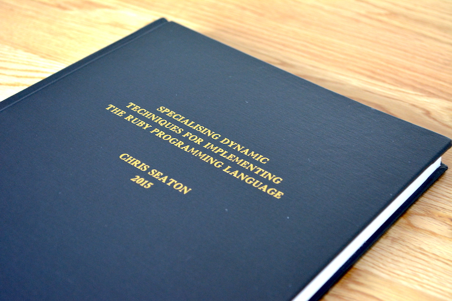

# Informal Abstract

People who write Ruby programs want to use metaprogramming. It's part of what makes the language what it is. But in existing implementations of Ruby, metaprogramming is slow. My work focused on making it fast, providing fast tooling for Ruby programmers, and fast support for legacy C extensions.

The techniques had a very significant impact on synthetic benchmarks and real-world code, often achieving a full order of magnitude or more performance increase over existing state-of-the-art implementations of Ruby.

As far as I am aware, this is the first and only doctoral thesis written focused on the Ruby programming language.

# Formal Abstract

The Ruby programming language is dynamically typed, uses dynamic and late bound dispatch for all operators, method calls and many control structures, and provides extensive metaprogramming and introspective tooling functionality.
Unlike other languages where these features are available, in Ruby their use is not avoided and key parts of the Ruby ecosystem use them extensively, even for inner-loop operations.
This makes a high-performance implementation of Ruby problematic.
Existing implementations either do not attempt to dynamically optimise Ruby programs, or achieve relatively limited success in optimising Ruby programs containing these features.

One way that the community has worked around the limitations of existing Ruby implementations is to write extension modules in the C programming language.
These are statically compiled and then dynamically linked into the Ruby implementation.
Compared to equivalent Ruby, this C code is often more efficient for computationally intensive code.
However the interface that these C extensions provides is defined by the non-optimising reference implementation of Ruby.
Implementations which want to optimise by using different internal representations must do extensive copying to provide the same interface.
This then limits the performance of the C extensions in those implementations.

This leaves Ruby in the difficult position where it is not only difficult to implement the language efficiently, but the previous workaround for that problem, C extensions, also limits efforts to improve performance.

This thesis describes an implementation of the Ruby programming language which embraces the Ruby language and optimises specifically for Ruby as it is used in practice.
It provides a high performance implementation of Ruby's dynamic features, at the same time as providing a high performance implementation of C extensions.
The implementation provides a high level of compatibility with existing Ruby implementations and does not limit the available features in order to achieve high performance.

Common to all the techniques that are described in this thesis is the concept of specialisation.
The conventional approach taken to optimise a dynamic language such as Ruby is to profile the program as it runs.
Feedback from the profiling can then be used to specialise the program for the data and control flow it is actually experiencing.
This thesis extends and advances that idea by specialising for conditions beyond normal data and control flow.

Programs that call a method, or lookup a variable or constant by dynamic name rather than literal syntax can be specialised for the dynamic name by generalising inline caches.
Debugging and introspective tooling is implemented by specialising the code for debug conditions such as the presence of a breakpoint or an attached tracing tool.
C extensions are interpreted and dynamically optimised rather than being statically compiled, and the interface which the C code is programmed against is provided as an abstraction over the underlying implementation which can then independently specialise.

The techniques developed in this thesis have a significant impact on performance of both synthetic benchmarks and kernels from real-world Ruby programs.
The implementation of Ruby which has been developed achieves an order of magnitude or better increase in performance compared to the next-best implementation.
In many cases the techniques are 'zero-overhead', in that the generated machine code is exactly the same for when the most dynamic features of Ruby are used, as when only static features are used.

# Thesis Text

[Specialising Dynamic Techniques for Implementing The Ruby Programming Language](specialising-ruby.pdf) (PDF)

# More Information

The work in my thesis was implemented as [JRuby+Truffle](../rubytruffle). Research papers, blog posts, videos, slides etc are listed on that project page.
