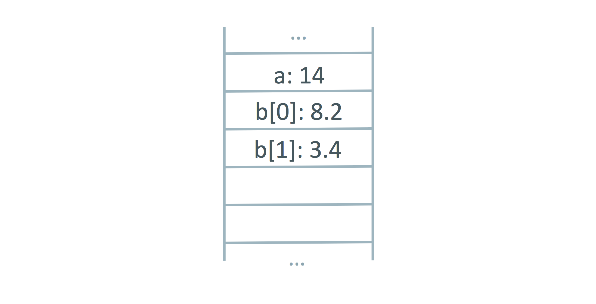
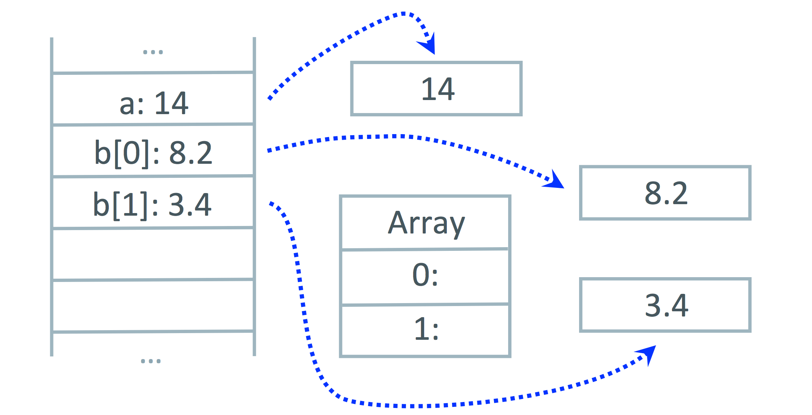
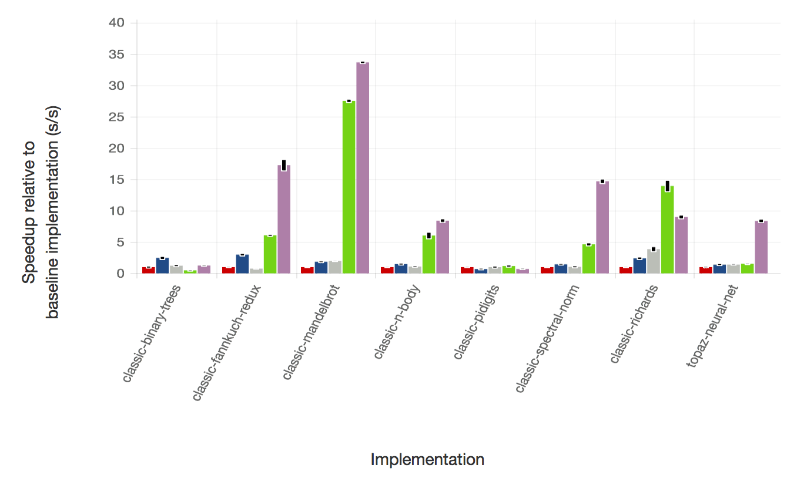
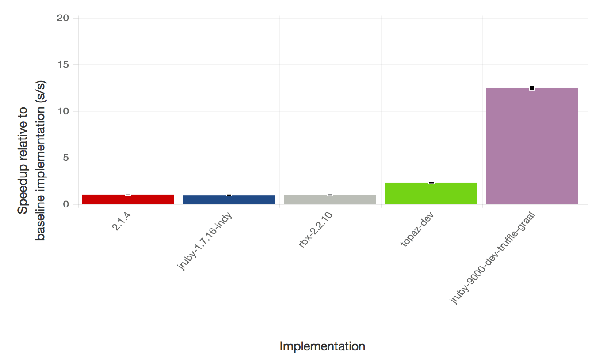
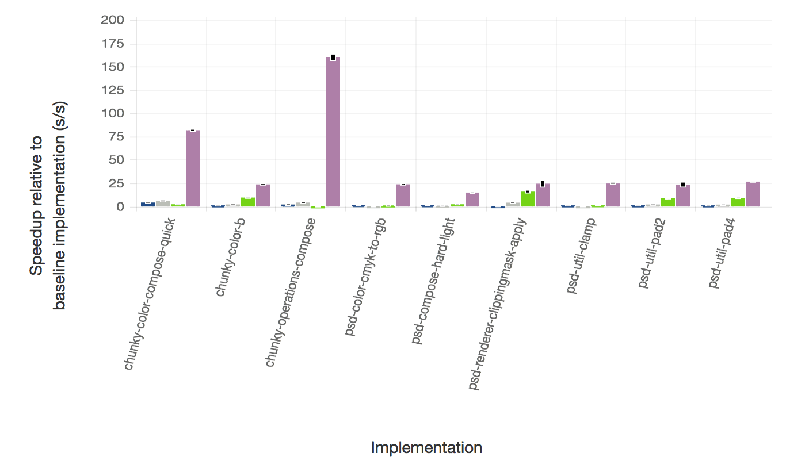

## Introduction

Most of us would like to have a faster implementation of Ruby. As a language it generally sits at the bottom of performance tables, and although some people claim that this doesn't matter because their Ruby code is IO bound and they write performance critical parts in other languages such as C or Java, wouldn't it be nice if you didn't have to do that and Ruby could be both high performance as well as fun to program?

The reason that this hasn't happened yet is that Ruby has proved to be extremely difficult to optimize. It has a lot of features which increase programmer productivity but are very hard to implement efficiently. Examples we'll show later include `Fixnum` to `Bignum` promotion, monkey patching methods, `#binding`, `ObjectSpace`, `set_trace_func` and `Thread#raise`.

These features all make implementation hard because they require you to keep checking things - check that a calculation hasn't overflowed, check that a method hasn't been redefined, check that a trace function hasn't been installed, check if you should stop the current thread and so on. All those checks cost dearly in both time and space - the time taken to make the checks, and the space that the checks take up in your instruction cache. These checks quickly pile up and soon you are doing more work to check things than you are to actually do any useful work. It's very hard to optimise these checks. For example you can't check something once and then assume it's ok for the rest of a method - someone on another thread might be changing something as you run.

Some of these features also make implementation hard because they can make it very hard to use simple and obvious optimisations that other languages take for granted such as storing Ruby local variables on the stack or allocating an object on the stack instead of the heap.

The typical approach to improve the performance of Ruby has been to use a just-in-time compiler. This means that we compile Ruby to machine code as the program runs. It's a technique used by both JRuby and Rubinius. However despite a lot of really great work neither of these implementations has produced an order of magnitude increase in performance yet.

The solution to this problem is a technique called *deoptimization*. To deoptimize means to jump from more optimised code to less optimized code. In practice that usually means to jump from just-in-time compiled machine code back into an interpreter. If we can do this at any point, and if we can perfectly restore the entire state of the interpreter, then we can start to throw away those checks in our optimized code, and instead we can deoptimize when the check would fail.

Several Ruby implementations use some form of deoptimization to a greater or less degree, including JRuby and Rubinius, but none use deoptimization as pervasively or as aggressively as does Truffle, a new high performance backend for JRuby. JRuby+Truffle is a research project of Oracle Labs and is now an open source component of JRuby. It uses a new just-in-time compiler for the JVM written in Java called Graal. As Graal is a Java library and not native code it can expose a Java API, which the application can use to directly control the just-in-time compiler. This is powerful but tricky, so a framework called Truffle helps us by taking a high-level Ruby interpreter and using Graal on your behalf to emit machine code. JRuby+Tuffle doesn't have a bytecode format - it goes straight from high-level interpreter to machine code.

This blog post is the companion piece to our RubyConf 2014 Talk, *Deoptimizing Ruby*. We'll provide some more background and technical depth here, and will provide pointers to where you can find more information.

<iframe width="720" height="433" src="//www.youtube.com/embed/z-YVygbDHLE" frameborder="0" allowfullscreen></iframe>

## Why is Ruby Hard to Optimize?

There are lots of language features that make Ruby nice to use, but very tricky to optimize. Charles Nutter [identified several of these](http://blog.headius.com/2012/10/so-you-want-to-optimize-ruby.html) in a blog post, and in interviews other Ruby implementors have talked about the features they are most problematic, such as Laurent Sansonetti [talking about the problems with `#binding`](http://www.sitepoint.com/laurent-sansonetti-on-rubymotion-internals/). We'll consider some of these problematic features that are most relevant to deoptimization.

### Fixnum to Bignum Promotion

The `Fixnum` object uses a machine word to represent integer values. This can only hold values so large, and in some languages when you go beyond that limit the value either wraps around, or worse the behaviour is left undefined. In `Ruby` we automatically get a `Bignum` value when we go beyond the limits of `Fixnum`.

To support this, Ruby implementations need to check if the value has overflown. Processors provide a flag to make this pretty quick (although in JRuby it's not always easy to access processor flags like this), but it's not so much the check that makes this an expensive feature. It's what you need to do if the value has overflown - you're going to need a code path that recovers from the error and redoes the calculation using `Bignum`. That's a lot of code, and you're going to have it at every location where you have an operation on a `Fixnum`. You can imagine how this makes a simple piece of code such as a couple of `+` and `-` instructions quickly blow up to take up a lot of instruction cache.

### Monkey Patching Methods

Ruby famously allows any method to be redefined at any point. It doesn't just apply to methods that an end-user developer writes, it also applies to core library methods and operations that a novice Ruby programmer might think of as being more fundamental such as `Fixnum#+`. It also also applies to operations that can reach deep into the runtime such as `#binding`. All of those methods can be redefined at any point - including by one of their own arguments and other threads, and the redefinition could be to an included module or a superclass, not just the immediate class of the object you are calling a method on.

Monkey patching means that many Ruby implementations have to keep checking that methods have not been redefined. This can be made fairly efficient and reduced to just checking a single flag or a cache version number. However when fundamental operations such as `Fixnum#+` are method calls, adding an active flag check more than doubles the amount of work that you are doing. The computation is swamped by the book-keeping.

As with `Fixnum` to `Bignum` promotion, you also have the problem of the code path that recovers when you find that a method has been redefined. That's even more code to clog up your instruction cache.

### #binding

`#binding` is a Ruby feature that allows you to get the local variables referenced in a method or a `Proc` and turn them into an object like a hash that you can read and write. `Kernel#binding` does it for the method you are currently in. `Proc#binding` does it for the environment in which a `Proc`, lambda or a block was declared.

`#binding` is one of those features that is very easy for MRI to implement, but very troublesome for more advanced implementations. In fact some Ruby implementers cite it as one of [most problematic](http://www.sitepoint.com/laurent-sansonetti-on-rubymotion-internals/) Ruby features. It's easy for MRI because they represent all frames (the data structure that contains local variables) as an object on the C heap. They can just wrap up a reference to that data structure and give it to you as a `Binding` object.

Other implementations of Ruby would like to use registers and the stack, rather than the heap, to store local variables. Registers are much faster than RAM, where the stack and the heap live, and the stack does not need complicate management or garbage collection. The stack is also almost certainly in cache, where an arbitrary heap location may not be.

Unfortunately in implementations without deoptimization, using registers and the stack are in many cases incompatible with `#binding`. Consider a method that is compiled by a just-in-time compiler and using the stack to store local variables. `Kernel#binding` is then called, and has to copy all the values from the calling frame into a Ruby object. Not only that, but then any updates to the `Binding` object have to update the method where it came from, and they also have to update any other bindings or blocks that captured the scope! These updates could come from other methods, or even other threads!

### ObjectSpace

`ObjectSpace` allows you to enumerate all live objects in your Ruby program. It's most commonly to go through all classes, but it's possible to list all objects of any class. In MRI and Rubinius this is pretty straightforward - they have their own GCs, so they can simply re-use a mark phase from a full collection. In JRuby it's much more problematic as the JVM does not normally provide access to the GC - so `ObjectSpace` is disabled by default.

However the problem isn't just finding all the live objects. Advanced implementations of Ruby would like to avoid allocating objects if they can. As long as nobody outside of your method, or the methods that you inline, needs to be able to see an object a compiler can allocate it on the stack instead of the heap. The memory is basically the same, we just reserve stack space instead of calling something like `malloc`. This is faster because the stack is very likely to be in cache and stack allocations are local to one thread.

There are a few problems preventing this - first of all the algorithm to work out when this can be done, called escape analysis is not simple. The OpenJDK, often seen as one of the most advanced VMs ever, only got escape analysis in 1.7. We would actually also like to be able to allocate objects on stack for some code paths, but move them to the heap on others. This is called partial escape analysis and is even more advanced. It's further complicated by `#binding`, as described above, and finally by `ObjectSpace`. If some of your objects are stored on the stack instead of the heap, how do you return them to the block in `ObjectSpace`?

### set_trace_func

`set_trace_func` allows a `Proc` to be installed to be called as your program runs, once on every line, again when you enter and leave methods, and on some other events. The `Proc` can be installed and removed as the program runs. Like some of the other problems we've talked about, it could be installed by one thread and need to take effect on all others with [sequential consistency](http://en.wikipedia.org/wiki/Sequential_consistency) (if the thread sets a global variable and then uses `set_trace_func`, other threads need to see those two effects in order).

How do you support `set_trace_func` in a just-in-time compiler? When code is compiled you don't know what `Proc` might be installed in the future so you can't assume that there will be none, and you can't compile a direct reference to it. You could have a flag that you check, as with method definition, but we've already discussed the problems with that approach. Because of these problems, JRuby currently only supports `set_trace_func` with a flag which disables the just-in-time compiler (this will hopefully change in 9k) and Rubinius does not support it at all at the moment.

### Thread#raise

The final problematic feature we're going to look at is `Thread#raise` and the similar method `Thread#kill`. `#raise` allows you to send an exception from one thread to another, and `#kill` allows you to kill a running thread from another thread.

This is another case of needing to continually check something, and we have the same problems as listed before.

That's a lot of big problems making the implementation of Ruby hard, discussed from quite a technical angle. Let's step back and look at the solution in the abstract first.

## Deoptimization Illustrated

In Lewis Carroll's Alice in Wonderland, Alice finds herself chasing a white rabbit down a rabbit hole and into a room where he has disappeared through a tiny door. Alice peers through the door and can see a beautiful garden on the other side with bright flowers and cool fountains, but she's far too large to fit through.

{:.center-image}

By chance Alice finds that on a table in the room is a bottle labelled *DRINK ME*. She is drinks the medicine and she shuts up like a telescope and is now the right size to fit through the door.

{:.center-image}

But she finds there's a problem! The door needs a key and she's left it on the table where the found the bottle, now several storeys above her. Again with luck she finds a tiny little cake beside her labelled *EAT ME*. She braves trying the cake and grows huge enough to reach the key again so she can unlock the door.

{:.center-image}

We can use this as an analogy for what we're trying to achieve with deoptimization. Ruby is Alice and she can see through the door to the beautiful garden of high performance language implementations, but she's far too large - and Ruby is far too complicated - to fit through the door.

Alice takes the medicine in the bottle labelled *DRINK ME*. This is like Ruby using a just-in-time compiler. It shrinks your Ruby program and makes it higher performance, discarding as much of the baggage of Ruby as possible so it will fit through the door.

The problem then is that maybe we have discarded too much. Alice finds that she needs the key, and maybe we find that we need to start calling a different method because it's been monkey patched, or to deal with a `Fixnum` that has overflowed into a `Bignum`, or to use `ObjectSpace`, or another thread wants to throw ours an exception.

Alice eats the cake labelled *EAT ME* to grow large again. In Ruby, that cake is deoptimization. It allows us to reverse the just-in-time compilation process and go back to a simpler interpreter where all the checks Ruby needs are explicit, all the objects really exist, and we have code paths to handle anything.

As long as we can always eat that cake and return to our full size, we can start to produce more efficient code. Instead of all those checks that Ruby needs, we produce machine code that pretends they were never needed. If we find that we did need them - if we left the key on the table - then we eat the cake at resume executing with the checks. If another thread needs to communicate with our thread, to tell it a method has been redefined or to throw an exception, it can effectively force our thread to eat the cake from afar and cause the deoptmization.

A powerful enough implementation of a just-in-time compiler and deoptimization allows us to shrink and grow on demand at any point, and if needs be to force feed cake to other threads as they're running if we decide we want them to deoptimize but they aren't aware of it.

## What Deoptimization Does for Ruby

Let's go back to the features that we said made Ruby difficult to optimize, and consider how deoptimization applies to each of them.

We'll talk about how deoptimization is actually implemented later, using JRuby+Truffle as our case study, but for now just keep in mind one trade-off: deoptimization is relatively slow - you don't want to do it in an inner loop of your application.

### Fixnum to Bignum Promotion

The first problem we said we had with `Fixnum` to `Bignum` promotion was that we had to check if a value has overflown. At worst this is going to be some bit operation tricks (as in JRuby currently) or checking against minimum and maximum values (as in Rubinius currently). It could also be a simple `jo`, or 'jump on overflow' instruction (a jump is like a goto), as in Topaz and JRuby+Truffle. On modern processors we can't do any better than that for the actual check, unless we do some original research into working out if it possible for a particular calculation to overflow. Some people also advocate for overflow to be a trap (a hardware exception) instead of a flag - MIPS and Alpha have this, which could remove the explicit check.

The problem we can address with deoptimization is what to do when the check, however it is done, fails. The code to create a `Bignum` and to repeat the operation is complicated and dwarfs the more common case of not overflowing. Worse than that, the possibility of having overflow means than all subsequent operations may have to handle a `Bignum` as well as a `Fixnum`.

Consider this pseudo-code version of some generated machine code for the simple operation `a + b + c`. We'll say that the compiler has already determined that all the variables are `Fixnum` going into this code, but it can't work out if the operations will overflow or not.


t1 = Fixnum(a) + Fixnum(b)
if t1.overflowed?
  t1 = Bignum(a) + Bignum(b)
  t2 = Bignum(t1) + Bignum(c)
else
  t2 = Fixnum(t1) + Fixnum(c)
  if t2.overflowed?
    t2 = Bignum(t1) + Bignum(c)
  end
end


The code to handle the overflows quickly mounts up, and we either have to make the subsequent code generic to handle either `Fixnum` of `Bignum`, even if we knew that `a` and `b` are always `Fixnum`, or we have to copy the code for the different types on each code path, as we've done here. It gets worse from there - all the code in the method now has to be ready to handle `t1` and `t2` that may be either `Fixnum` or `Bignum`, even if this has never actually happened yet.

Using deoptimization we can *cut off* the code paths that we think are unlikely to be used. Instead of jumping on overflow to code that handles the overflow case, we deoptimize, and we don't emit any more code on that path from that point on. The code then looks like this:


t1 = Fixnum(a) + Fixnum(b)
deoptimize! if t1.overflowed?
t2 = Fixnum(t1) + Fixnum(c)
deoptimize! if t2.overflowed?


Now the code is significantly simpler and more compact, with fewer branches, and we haven't had to refer to `Bignum` at all. If we deoptimize we continue in code that looks similar to the first example.

What about an operation that always overflows? If that's a normal part of your application you don't want the cost of deoptimization every time. In that case we deoptimize the first time it happens, and then the next time we recompile we explicitly handle the one particular operation that overflowed - but only that one. If the first `+` overflowed the code would then look like this:


t1 = Fixnum(a) + Fixnum(b)
if t1.overflowed?
  t1 = Bignum(a) + Bignum(b)
  t2 = Bignum(t1) + Bignum(c)
else
  t2 = Fixnum(t1) + Fixnum(c)
  deoptimize! if t2.overflowed?
end


That now handles overflow on the first operation, but still deoptimizes on the second, and so is still more compact than the general case. JRuby+Truffle handles this through a form of [AST specialization](http://lafo.ssw.uni-linz.ac.at/papers/2012_DLS_SelfOptimizingASTInterpreters.pdf) in the interpreter.

### Monkey Patching Methods

The problem of handling one case that is usual and needs to be fast, and one case that is unusual and needs to be handled just in case it does happen was covered in the section above. That's a common pattern and it's repeated here with monkey patching methods. We want to check if a method was redefined, and if it wasn't use the common fast path. If the method was redefined we want to find the new correct method. We use deoptimization to solve this common problem, just as described above.

With monkey patched methods we can do something more though. With overflow we have to actually check for overflow, because the processor's we usually have will not tell us it happened without us doing that. In the case of monkey patching a method, some part of our code is doing the redefinition, and that's under our control. Instead of repeatedly checking if a method is redefined, we can modify the code that redefines methods to also trigger deoptimization. That way there is never a need to check if a method has been redefined in compiled code - because if the code has not been deoptimized, the method has not been redefined.

This allows an implementation with deoptimization to entirely remove any code needed to handle method redefinitions from compiled code - both the check and the code path needed to handle the slow path. After a method is redefined, the code can be recompiled referring to the new method, just as it was before.

### #binding

Apply deoptimization to the `#binding` methods takes us to the other feature that we talked about - being able to take local variables that were stored on the stack, and objects that were never allocated, and to recreate them on as an actual object on the heap.

To illustrate this, consider a method that has local variables `a` containing a `Fixnum` and  `b` containing an `Array` containing two `Float` objects. We've used some advanced escape analysis work to decide to put them on the stack because they can't be accessed from outside the method - or at least they can't until we start using those tricky metaprogramming features.

Conceptually our stack contains references to several objects, but in our implementation we've put those directly on the stack as simple values - this is called [scalar replacement of aggregates](http://design.cs.iastate.edu/vmil/2013/papers/p04-Duboscq.pdf) when we do it with an object that contains other objects.

To deoptimize and turn our frame into an object, we need to transition from one representation to the other, and then we need to perform the final action of turning the stack itself into an object that contains local variables.

It might sound like black-magic to be able to extract values from your stack, but if you take a step back for a second you can see that the only people putting values on the stack is us, in our compiler. We know where everything is, and what type it is and what it all means, because we put it there. All we have to do is use that information to map it back.

The final trick is where we said that you could modify a `Binding` and the other users would see the modifications. To handle that we also deoptimize and then recompile the method where the binding came from, and any other methods also use the same stack frames, to use the newly heap allocated structure instead.

### ObjectSpace

Deoptimization can be used to implement `ObjectSpace` in a similar way to how `#binding` works. All the objects that were previously inaccessible because they were allocated on the heap can be made accessible by telling all threads to deoptimize. When we have all local variables stored in heap allocated objects we can then walk those objects to find all routines and to iterate over all live objects.

### set_trace_func

`set_trace_func` can be implemented using the same technique as we did for monkey patched methods. Effectively we always have a `Proc` installed but it does nothing by default and is inlined, which means it generates no machine code. When a new `Proc` is installed it's as if we are defining the current `Proc`, so the implementation is very similar.

### Thread#raise

Again we can express `Thread#raise` and `#kill` in terms of method redefinition. Imagine there is a default method that we call about every line that does nothing. To `#raise` or `#kill` we redefine that method to either raise an exception or to stop the thread. Deoptimization works as we described for monkey patching.

## Deoptimization in JRuby+Truffle

As we said in the introduction, JRuby, Rubinius both use deoptimization to some extent, but neither to the degree that JRuby+Truffle does. We've talked about a lot of functionality in the abstract but how is that actually implemented in JRuby+Truffle?

We can separate the problem into three interconnected problems. The first problem is how to jump from compiled code back into an interpreter. The second problem is how to get a thread to do that from another thread. The final problem is extracting locals from the stack and recreating objects which you had previously decided not to allocate on the heap.

First of all, we need to be able to jump from compiled code back into the interpreter. This isn't as simple as a `goto`. We not only need to jump from one place to another, but we also need to recreate the state that the interpreter expects. That means that we need to recreate the stack frames for every method that was compiled but now is being interpreted. We then just have to restart execution in the interpreter in the AST node that corresponds to the machine code where we deoptimized - so we maintain a mapping between the two for all generated code.

The second problem is how to get another thread to deoptimize. We need this in Ruby to implement monkey patching - if you monkey patch a method on one thread then you need to stop any other thread that is using that method and get it to deoptimize to pick up the new method. We also need it for features such as `Thread#raise` where we want to communicate to another thread that may be busy in compiled code.

The solution to this is something called *safepoints*. All Java threads will periodically ask if they should stop. They do this by reading a shared flag variable. If the flag is set the thread can deoptimize itself, as described above. To cause another thread to deoptimize then all you have to do is set the flag and wait for it to happen.

It sounds like we're adding some overhead here - an extra machine memory load for every method call and backward jump. However the memory load is as efficient as possible. We use the `test` instruction which loads memory but does not need to write it somewhere, and instead of comparing the value of the flag and branching we use make the memory where the flag lives private and cause a segmentation fault which the threads catch and recover from. Also, the JVM needs these safepoints so that the GC can stop the world, so they're already there and are free for Ruby to use.

Our final problem was moving locals onto the heap and recreating objects that we allocated on the stack instead of the heap. When we were talking about `#binding` we said how we knew where everything was on the stack because we put it there. JRuby+Truffle (actually Graal on our behalf) maintains a record of where all values are for each safepoint. An operation like `#binding` implicitly creates a kind of safepoint at exactly that location. When we deoptimize we can then just read the stack like normal memory - which it is - and extract values using our record.

## The Performance of JRuby+Truffle

JRuby+Truffle is not yet a complete implementation of Ruby. Most importantly it cannot run Rails yet, due to an incomplete core library implementation. However we believe we've implemented enough of the Ruby language so that there is nothing left that will impact on the performance of our benchmarks.

JRuby+Truffle passes 83% of the RubySpec language specs and we have support for all of the usual tricky features including `Fixnum` to `Bignum` promotion, `eval`, `#binding`, `#send`, `ObjectSpace`, `set_trace_func`, `Thread#raise`, C extensions (an early implementation but it works for real gems). In fact our support for many of these features is superior to both JRuby and Rubinius. `ObjectSpace` is always enabled for us, where it's behind a flag in JRuby. JRuby only supports `#eval` and `#binding` if you haven't aliased the methods. Rubinius doesn't support `set_trace_func` at all (but it has its own debugging tracing support with limited performance). We have also published peer-reviewed scientific papers on the novel techniques we have used to implement some of these features.

If you're sceptical about our claims of having sufficient completeness to be talking about performance, speak to people outside of the team who have looked at Truffle in some depth such as Charlie Nutter of JRuby or Tim Felgentreff of MagLev and Topaz and get their opinion. If you think we're missing a feature that will impact performance, let us know and we'll make sure we code it up.

This first graph show the performance of JRuby+Truffle against other Ruby implementations, normalised to Ruby 2.1.4, for a range of 8 synthetic benchmarks. Higher is better - twice as high is twice as fast. These benchmarks are very well understood by language implementers, so they're useful to compare performance, but they aren't necessarily representative of normal Ruby programs. For highly numerical benchmarks such as fannkuch, mandelbrot and spectral-norm, JRuby+Truffle performance is well beyond that achieved by any other implementation of Ruby. For some other benchmarks where memory allocation is the bottleneck such as binary-trees, performance is comparable to other implementations.

We also ran two production gems that we have been experimenting on over the last few months: `chunky_png` and `psd.rb`. This is real code taken unmodified from real applications, however it may be unusually computationally intensive and  represent an [extreme of metaprogramming](http://www.chrisseaton.com/rubytruffle/pushing-pixels/) that probably isn't representative of the majority of Ruby programs. We can look at it as an upper bound of what we can achieve with real code at the moment. We've described how we achieve this in previous blog posts - it's a combination of deoptimization, specialization, and extraordinarily strong support for tracing values through data structures.

The two graphs above show a summary across all the routines from the two gems, showing an order of magnitude increase in performance, and then the second graph picks out a few benchmarks where JRuby+Truffle does particularly well - up to two orders of magnitude faster than other implementations in some cases.

All experiments were run on an otherwise idle system with 2 Intel Xeon E5345 processors with 4 cores each at 2.33 GHz and 64 GB of RAM, running 64bit Ubuntu Linux 14.04. Where an unmodified Java VM was required, we used the 64bit JDK 1.8.0u5 with default settings. For JRuby+Truffle we used a development build of Graal VM. We ran iterations of benchmarks until they stabilized (after 30s and when range was below 10% over a moving window of 20 iterations), and then sampled 10 iterations. The summary shown is a geometric mean, and the error ± one standard deviation.

Our benchmarks and harness core is [available on GitHub](https://github.com/jruby/bench9000) and the interactive report we generated these results from here also [available](benchmarks/).

## Conclusions

Deoptimization is probably the most important optimization for implementation of the Ruby language. It allow us to remove most of the optimization barriers that are introduced by making the language as friendly and powerful as we'd like it to be. That frees us from worrying about using these features because of their performance impact, and will hopefully make us better Ruby programmers, less worried about the cost of what we're using and with less need to reach for tools like C extensions.

Deoptimization is a powerful and extremely advanced programming language topic. JRuby+Truffle is the first implementation of Ruby to implement it as pervasively as we've described here, although Rubinius and JRuby should be able to use the same techniques, even if they aren't at the moment. For Rubinius there is [active research](http://llvm.org/docs/StackMaps.html) in the LLVM community on adding better support for techniques used in deoptimization, motivated by projects like [FTL](https://trac.webkit.org/wiki/FTLJIT). For JRuby the excellent work that Charles Nutter has done with `invokedynamic` comes very close to what we are doing in some of the techniques and in the case of `Thread#raise` it's pretty much the same.

## Acknowledgements

JRuby+Truffle is implemented using code from both [JRuby](http://jruby.org) and [Rubinius](http://rubini.us) and is tested using [RubySpec](http://rubyspec.org). Those projects are all essential for our research and we really appreciate the work and care that has gone into them. JRuby+Truffle also depends on the huge engineering effort that has gone into the Graal, Truffle and the OpenJDK.

We're particularly grateful to Charles Nutter, Thomas Enebo and the JRuby community for giving us commit rights to their repository.

People who have contributed directly to the development of JRuby+Truffle include Chris Seaton, Benoit Daloze, Matthias Grimmer, Josef Haider, Andreas Wöß, Michael Van de Vanter, Thomas Würthinger, Christian Wirth, Bernhard Urban, Lucas Allan Amorim, and Aditya Bhardwaj.

Thomas Enebo, Gilles Duboscq and Yorick Pertese reviewed drafts of this article.

The author, Chris Seaton, is grateful for the patience of his PhD supervisor, Mikel Luján, during this distraction.

The John Tenniel illustrations are from [Project Guternberg](http://www.gutenberg.org/ebooks/114) and are public domain in the UK and US.

## Appendix: The History of Deoptimization

You may have heard many people say that Ruby is influenced by [Smalltalk](http://en.wikipedia.org/wiki/Smalltalk), and that's where deoptimization came from. The term that is actually used in the literature is generally *dynamic deoptimization* because many people talk about *dynamic optimization* instead of just-in-time compilation. You may also see the terms *uncommon trap* and *transfer to interpreter*. We talk about just *deoptimization* for simplicity - the terms have differences but they aren't very important for what we're talking about here.

Smalltalk is even more object orientated than Ruby - where Ruby has an `if` expression, Smalltalk has an `ifTrue`/`ifFalse` method on Boolean objects that accepts two blocks and runs one if the value if true and the other if it is false. Smalltalk also featured a concept that is fashionable again today - program images where the code is stored as data and manipulated visually like projects such as Light Table are proposing.

Smalltalk was developed in the 1970s by Alan Kay, Dan Ingalls and Adele Goldberg and standardized in the 1980s. Today it isn't in widespread use but there are a few modern implementations such [Pharo](http://en.wikipedia.org/wiki/Pharo). Most importantly it has had a huge impact in language design, including Ruby and, via Self, JavaScript.

The typical reference for deoptimization is a paper from 1992 on applying it for debugging [1]. In their paper they want to deoptimize so that all the data structures are available for introspection. It's like how we deoptimize to introspect all live objects in `ObjectSpace`. There is also some similar ideas in the much earlier doctoral thesis of [Jim Mitchell](http://en.wikipedia.org/wiki/James_G._Mitchell) in 1970.

The OpenJDK JVM, HotSpot, uses deoptimization extensively [2, 3] and the new Graal compiler even more so [4, 5]. Our work on Ruby has again demonstrated the utility of deoptimization for debugging [6] and shows how the technique allows for [zero-overhead tracing](http://www.chrisseaton.com/rubytruffle/set_trace_func/).

1. U. Hölzle, C. Chambers, and D. Ungar, "[Debugging optimized code with dynamic deoptimization](http://dl.acm.org/citation.cfm?id=143114)," presented at the PLDI '92: Proceedings of the ACM SIGPLAN 1992 conference on Programming language design and implementation, New York, New York, USA, 1992, pp. 32–43.

2. T. Kotzmann, C. Wimmer, H. Mössenböck, T. Rodriguez, K. Russell, and D. Cox, "[Design of the Java HotSpot™ client compiler for Java 6](https://www.complang.tuwien.ac.at/andi/java-hotspot.pdf)," Transactions on Architecture and Code Optimization (TACO, vol. 5, no. 1, pp. 1–32, May 2008.

3. M. Paleczny, C. Vick, and C. Click, "[The Java HotSpot Server Compiler](https://www.usenix.org/legacy/events/jvm01/full_papers/paleczny/paleczny.pdf)," presented at the Proceedings of the Java Virtual Machine Research and Technology Symposum, 2001.

4. G. Duboscq, T. Würthinger, L. Stadler, C. Wimmer, D. Simon, and H. Mössenböck, "[An intermediate representation for speculative optimizations in a dynamic compiler](http://design.cs.iastate.edu/vmil/2013/papers/p04-Duboscq.pdf)," presented at the VMIL '13: Proceedings of the 7th ACM workshop on Virtual machines and intermediate languages, New York, New York, USA, 2013.

5. G. Duboscq, T. Würthinger, and H. Mössenböck, "[Speculation without regret: reducing deoptimization meta-data in the Graal compiler](http://dl.acm.org/citation.cfm?id=2647521)," presented at the PPPJ '14: Proceedings of the 2014 International Conference on Principles and Practices of Programming on the Java platform: Virtual machines, Languages, and Tools, New York, New York, USA, 2014, pp. 187–193.

6. C. Seaton, M. L. Van De Vanter, and M. Haupt, "[Debugging at Full Speed](http://www.lifl.fr/dyla14/papers/dyla14-3-Debugging_at_Full_Speed.pdf)," presented at the Proceedings of the 8th Workshop on Dynamic Languages and Applications (DYLA), 2014.


