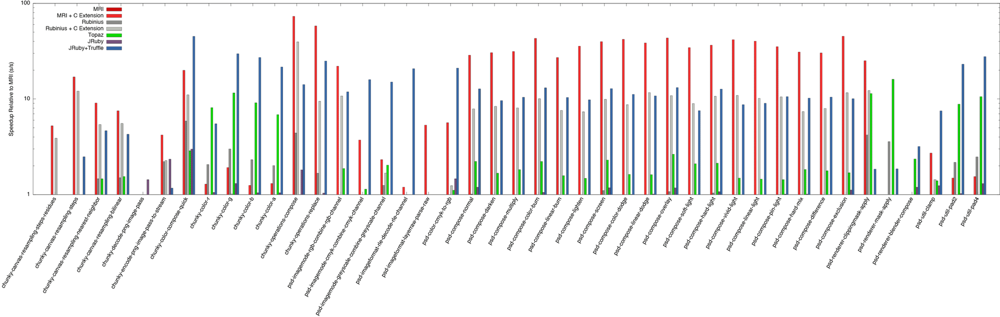

We've been talking about the new [high-performance Truffle backend in JRuby](https://github.com/jruby/jruby/wiki/Truffle) for a while now, but so far the only benchmarks we've been running are the classic synthetic benchmarks from the Computer Language Benchmarks Game. These benchmarks are useful to study and we should be able to optimise them well as they're generally simple and easy to understand, but some people make the reasonable point that they may be unrepresentative of real Ruby programs written by real Ruby users. The risk is that our implementation is not as fast when running these real programs.

In this blog post we'll show that when running 43 benchmarks which have been taken unmodified from real gems, JRuby+Truffle is on average 9x as fast as JRuby and up to 28x as fast. Compared to MRI it is on average 9x as fast and up to 45x. Compared to Rubinius it is on average 8x and up to 344x. JRuby+Truffle runs Ruby code on average 80% as fast as MRI runs the equivalent native C extensions and up to 21x. This is even faster than we can run synthetic benchmarks, so in this blog post we'll explain what it is about real Ruby code that makes this possible and what the limitations are in existing implementations of Ruby.

Remember that JRuby+Truffle does all this while still supporting the language features that make it Ruby, such as Fixnum to Bignum promotion, monkey patching basic operators, bindings, `#eval` and so on. We even support `set_trace_func` enabled by default, which JRuby and Rubinius currently do not. In fact as we will describe, it is the more dynamic aspects of Ruby where JRuby+Truffle really excels in performance.

For more background on JRuby+Truffle, read the [previous blog posts](../).

## Gems

The challenge we started with was to find some real Ruby code that was written to do something useful and not just to be a benchmark. We still needed something that does a lot of computation rather than a lot of IO, as Truffle can't magically make your network return data more quickly. We also wanted something that was fairly self-contained, instead of being part of a huge Rails application.

We found that the `chunky_png` and `psd.rb` gems were what we were looking for. [`chunky_png`](https://github.com/wvanbergen/chunky_png) reads and writes PNG image files, and includes utilities for general image and colour processing. It was written by [Willem van Bergen](https://github.com/wvanbergen) and others for [floorplanner.com](http://www.floorplanner.com/). [`psd.rb`](https://cosmos.layervault.com/psdrb.html) reads and writes the complex Photoshop file format and was written by [Ryan LeFevre](https://github.com/meltingice) and [Kelly Sutton](https://github.com/kellysutton) at [LayerVault](https://layervault.com) and others. Both of these gems are pure Ruby code. We know that the existing implementations of Ruby aren't fast enough for the users of these gems, as they've both also written native C extension gems, [`oily_png`](https://github.com/wvanbergen/oily_png) and [`psd-native`](https://github.com/layervault/psd_native). These replace key methods in the Ruby code with native code to improve performance. That was a good indication that people had found this code did not run fast enough in existing implementations of Ruby.

We took all the methods for which native versions had been written and wrote a harness to run both the Ruby and native versions as benchmarks. The routines include code for extracting colour channels, composing colour values, RLE encoding, resampling, general utility routines and more.

We haven't modified the methods - we use them straight out of the gem source code although we do mock some objects to remove IO. For example instead of returning bytes from a file, we return bytes from an array. We haven't been selective about which methods we try to run - we're running all of them for which there is a native version.

## Difficult to Optimise Patterns

Both `chunky_png` and `psd.rb` include some patterns of Ruby code that are extremely difficult for existing implementations of Ruby to optimise. We want to emphasise that this section absolutely isn't a criticism of the authors of the gems. They're free to write whatever code with whatever abstractions they want and we believe it's the job of a Ruby implementation to run it as fast as possible, without expressing an opinion on it. There are native versions of these gems so the idea is probably that the Ruby version is high-level and designed to be easy to read while the native code is designed for performance in production. That's a perfectly fine way to design a gem. Of course, ideally Ruby's implementation would be good enough to run the high level Ruby code fast anyway and there wouldn't be a need for the native code.

### Lots of Small Methods

Both of the gems are fairly well factored into small methods. For example [this method](https://github.com/wvanbergen/chunky_png/blob/efd61c8d0ddcabdcf09fb44f8e8c1ba709995940/lib/chunky_png/color.rb#L187-L189) for extracting the red component of colour packed into a `Fixnum`:


def r(value)
  (value & 0xff000000) >> 24
end


Again this is a good design decision, but it does make optimisation more difficult for traditional implementations of Ruby. A conventional JVM used by JRuby will only inline so far, and in many of these benchmarks we're going to have spent that inlining budget before we get to the interesting bit. If you don't inline far enough it has a knock-on effect where more values escape and constants cannot be propogated. Rubinius and its LLVM-based JIT also stops inlining far too early for many of these benchmarks.

### `#method_missing`, `#respond_to?` and `#send`

You may think of meta-programming methods like `#method_missing`, `#respond_to?` and `#send` as something that should be used perhaps just to facilitate rare cases like mocking objects for testing, if at all, but the reality is that code is being written such as these gems that use these methods in the inner loop. For example `psd.rb` uses `#method_missing`, `#respond_to?` and `#send` to implement a kind of module import. In [this line](https://github.com/layervault/psd.rb/blob/e14d652ddc705e865d8b2b897d618b25d78bcc7c/lib/psd/renderer/compose.rb#L23) they call the method `#r`.


new_r = blend_channel(r(bg), r(fg), mix_alpha)


That method isn't defined in this scope, so we run `#method_missing` [here](https://github.com/layervault/psd.rb/blob/e14d652ddc705e865d8b2b897d618b25d78bcc7c/lib/psd/renderer/compose.rb#L327-L330). That calls `#respond_to?` and then `#send` to call the correct method from another module.


def method_missing(method, *args, &block)
  return ChunkyPNG::Color.send(method, *args) ↩
    if ChunkyPNG::Color.respond_to?(method)
  normal(*args)
end


They could have imported the module (they've actually changed this one example in a newer release since we started work to do that) but they chose not to. That's their decision and it's the compiler's job to deal with that and deliver the same performance anyway.

In one extreme case the inner loop of a compose operation on an image [calls `#send` with a method name that is a dynamic string](https://github.com/layervault/psd.rb/blob/e14d652ddc705e865d8b2b897d618b25d78bcc7c/lib/psd/renderer/blender.rb#L31-L36), which [runs a method](https://github.com/layervault/psd.rb/blob/e14d652ddc705e865d8b2b897d618b25d78bcc7c/lib/psd/renderer/compose.rb#L18-L29) which makes a call that results in `#method_missing`, which in turn calls `#respond_to?` and `#send` as above. We think for each pixel in the image there are 7 calls to `#send` and 6 each to `#method_missing` and `#respond_to?`. Again, this is the code they wrote and the implementations of Ruby should be making it fast even though it looks strange.

### Temporary Arrays and Hashes

Both gems also make very heavy use of temporary arrays and hashes. In the most extreme example, `psd.rb` represents pixel values as a hash of `{r:,g:,b:}` values, [in the inner loop of an image processing routine](https://github.com/layervault/psd.rb/blob/e14d652ddc705e865d8b2b897d618b25d78bcc7c/lib/psd/color.rb#L117-L122). One hash is created, then mapped to an array, then another hash is created with the result. The hashes and arrays don't escape the method so we should be able to just use the values that we take out of them directly without actually creating the objects.


def cmyk_to_rgb(c, m, y, k)
  Hash[{
    r: (65535 - (c * (255 - k) + (k << 8))) >> 8,
    g: (65535 - (m * (255 - k) + (k << 8))) >> 8,
    b: (65535 - (y * (255 - k) + (k << 8))) >> 8
  }.map { |k, v| [k, Util.clamp(v, 0, 255)] }]
end


Another example is the inner loop utility method [`clamp`](https://github.com/layervault/psd.rb/blob/e14d652ddc705e865d8b2b897d618b25d78bcc7c/lib/psd/util.rb#L14-L16) in `psd.rb`, which returns a value between two bounds. This has been implemented by putting the values into an array, sorting it, and taking the middle value. Again this is a fine way to write Ruby code - nice and expressive - but if the implementation actually allocates an array and then calls another method to sort it you are not going to achieve much performance.


def clamp(num, min, max)
  [min, num, max].sort[1]
end


## The Acid Test

We can put several of these difficult to optimise patterns together in a single acid test to illustrate their impact. This code calls a method on an object which isn't defined, and so goes through `#method_missing`, which uses `#respond_to?` to check if a module can handle the method, and then uses `#send` to delegate. The method that is finally run puts the parameters into a hash, calls `#map` and then indexes the resulting array. It then creates another array and sorts it to find the middle value of the parameters, and adds this to the other value.

This code is built up from patterns that are found on the critical path in the gems we're using, so it's not a contrived example. This is the Ruby code that people want to run, so we want to run it as fast as possible.


module Foo
  extend self

  def foo(a, b, c)
    hash = {a: a, b: b, c: c}
    array = hash.map { |k, v| v }
    x = array[0]
    y = [a, b, c].sort[1]
    x + y
  end

end

class Bar

  def method_missing(method, *args)
    if Foo.respond_to?(method)
      Foo.send(method, *args)
    else
      0
    end
  end

end

bar = Bar.new

loop do
  start = Time.now

  1_000_000.times do
    # This block should be compiled to the constant Fixnum value 22
    bar.foo(14, 8, 6)
  end

  puts Time.now - start
end


A sufficiently smart implementation of Ruby should be able to inline and constant fold through all of that code to compile the `#times` block at the bottom into a single constant value of `22`, probably plus some guards of some kind. The `#method_missing`, `#respond_to?` and `#send` can all be handled by inline polymoprhic caches and inlined into the caller. The values put into the hash and arrays can be taken out again as we can determine that they don't escape the method. The `#map` operation can be evaluated at compile time as the receiver and arguments are all constant, as can the `#sort` and the `#+`. Of course we have to speculate that the methods will not be redefined by some other thread as the code is running, but if they are we can use dynamic deoptimisation to transfer back to the interpreter and handle that case.

Unlike all other implementations of Ruby, JRuby+Truffle is actually able to do all of this and literally produces machine code that is `guard(); return 22`. Proving that we can do this is a little too technically involved for this post but if you want to do it for yourself [contact us](mailto:chris.seaton@oracle.com) and we'll show you how to do it by inspecting the generated IR. The guards we are left with are not trivial at the moment, so there is still work to be done, but as the final value is constant the optimisations can continue even further from this point if you had more code.

The following graph shows the speedup when running this benchmark on different implementations. We aren't infinitely faster, as the guards still have a runtime cost.

## Performance

We compared Truffle to the latest versions of MRI (2.1.2), Rubinius (2.2.10), JRuby (1.7.13 with `invokedynamic`) and Topaz (nightly). For MRI and Rubinius we also compared against the native code.

All experiments were run on a system with 2 Intel Xeon E5345 processors with 4 cores each at 2.33 GHz and 64 GB of RAM. We used 64bit Ubuntu Linux 13.04, using system default compilers. Where an unmodified Java VM was required, we used the 64bit JDK 1.8.0u5. For JRuby+Truffle we used the Graal VM version 0.3. Each iteration lasts for at least several seconds for MRI and was sampled 30 times. We discarded the first 15 runs to allow VMs to reach steady state, as verified informally using lag plots.

The graph at the start of this post shows the summary, with the geometric mean across all the benchmarks relative to MRI. The following two graphs show the speedup of individual benchmarks relative to MRI. We show the results both in linear (twice as tall is twice as fast) and logarithmic (taller is exponentially faster) to better see the differences. Click on the graphs for high-resolution PDFs.

The performance of both the current version of JRuby and Rubinius is severely limited on these benchmarks. Neither implementation is able to perform much better than MRI, and they're often actually worse. We're not testing JRuby's new IR backend as it's early days for their JIT, but they may be able to make some of the same optimisations as we are. It's definitely a step in the right direction as using their IR they can manually inline and bypass normal JVM budgets and their dataflow analysis may be able to trace values through data structures. Topaz does pretty well, but not quite as good as us. To be fair to them, they have been inactive for around a year and we were seriously impressed they do as well as they do considering they haven't even tried running these benchmarks themselves.

Sometimes JRuby+Truffle outperforms the native code. How can this be? Surely we can't be doing better than the C code? The problem is that the actual native code is fast, but the API calls they use to call back into MRI or Rubinius are not. If C code allocates a hash, it's always going to actually call `malloc` and allocate it on the heap, where when JRuby+Truffle runs Ruby code that creates a hash it can choose to allocate it on the heap, on the stack, or not at all. Going into native code creates a barrier that prevents many of these optimisations and more. This is most clear in our smaller benchmarks, such as [`chunky_color_r`](https://github.com/wvanbergen/chunky_png/blob/efd61c8d0ddcabdcf09fb44f8e8c1ba709995940/lib/chunky_png/color.rb#L187-L189), where the barrier is a higher proportion of the runtime.

The code we used to run these benchmarks and produce the graphs is open source in the JRuby project on GitHub. Please feel free to have a go at reproducing our results for yourselves.

Some of the benchmarks fail to run in some implementations. Two of the native versions when running in Rubinius didn't finish in reasonable time. MRI produces a different result for one of the native versions - we're not sure if this is an error or permissible variance in the result. Topaz can't run a handful of the benchmarks, probably due to missing features. This is all documented in the [benchmark repository](https://github.com/jruby/pushing-pixels-benchmarks).

## Future Work

Over the next few weeks on this blog we'll highlight some of the key optimisations we use to achieve this performance, so follow [@ChrisGSeaton](https://twitter.com/chrisgseaton) on Twitter if you want to see when new posts are published.

If you are wondering what the tradeoff is here and you look at the raw data (in the repository), you might notice that we do take a little longer to warm up (to start running quickly) than the other implementations. This kind of powerful optimisation isn't free but we're focusing on long-running server applications and we're also still working to reduce the warmup time.

An obvious final question is whether we will support running the C extensions. You don't always have equivalent Ruby code and if Rubinius can also run the C code maybe it could still be a better choice. JRuby used to have experimental support for C extensions but it has since been removed. The answer is yes - JRuby+Truffle can also run the C extensions, and we can run them very fast. But we're afraid that's work we're not ready to talk about yet so it will have to wait.

## Acknowledgements

We'll take the opportunity to say that without JRuby to build on, we wouldn't be where we are today. JRuby+Truffle is just one part of JRuby and we depend on the excellent work done by the rest of the project. JRuby+Truffle also depends entirely on the work of the rest of the Graal and Truffle teams at Oracle and JKU Linz.

We're grateful for the open source gems we used written by [Willem van Bergen](https://github.com/wvanbergen), [Ryan LeFevre](https://github.com/meltingice), [Kelly Sutton](https://github.com/kellysutton), and others.
