*Graal* is a new just-in-time, or *JIT*, compiler for the Java Virtual Machine, or *JVM*. It translates your Java program to machine code while it's running. Graal can also be used for other languages beyond Java, through the [*Truffle*](#truffle) language implementation framework. At [Shopify](https://engineering.shopify.com/) we're using Graal to JIT compile Ruby to native code, using [*TruffleRuby*](..), but this blog post is just about Java in order to keep things as simple as possible.

Many people will know that when you use Java you compile your application using the `javac` compiler to a data structure called bytecode. Many people will also be familiar with a data structure called an abstract-syntax-tree, or *AST*, which is the way that the Java compiler represents your Java source code while compiling.

Fewer people will be aware that there's another key data structure used at runtime to JIT compile Java programs to native code - the compiler intermediate representation, or the IR. The compiler transforms and optimizes your code by manipulating this data structure, so you can get a lot of insight into what the compiler is doing by looking at it. We have to use special tools to do this - for example the [*Ideal Graph Visualizer*](https://www.oracle.com/downloads/graalvm-downloads.html), or IGV, from Oracle Labs, or Shopify's internal *Seafoam* tool, which we're using here.

[Graal's IR](#graal) is particularly interesting because it's a cyclic graph - this means that if you follow the edges you can go in circles. Most representations of source code are some form of tree, without cycles, so for many people it's a new way of looking at and thinking about their code. I also find them really satisfying to look at and work with - I think they can be very artistic.

In this blog post I'm going to show a gallery of some Graal graphs for basic Java language constructs, and explain what each part of the graph means and what we can learn from this to understand how Java is compiled and optimized.

A little bit of history is that compilers traditionally use a linear format for their IR, meaning there is a sequence of one instruction after another in chunks called basic blocks. Instructions pass information between each other using temporary names or entries on a stack. There is a graph of control flow between these blocks, but within each block the instructions are linear. This is easy to reason about and easy to output as text. A model called [Static Single Assignment](#ssa), or *SSA*, constrains each temporary name to be only assigned in one source location.

If we do away with the explicit ordering of instructions one after the other, we get a more free representation of the program. We can also do away with the temporary names and instead make the values edges between instruction nodes in a graph. This has been done for a long time, known as a [Program Dependence Graph](#pdg), or *PDG*, but it became particularly notable in the most common Java optimising JIT, called [*C2*](#c2), which is what you normally use if you are using HotSpot or OpenJDK. This compiler, designed by Cliff Click, uses a very free-form graph, called a *sea-of-nodes*, or sometimes a *soup-of-nodes*. This highlights one drawback, which is that the loosely structured graph can be hard to comprehend - humans aren't great at reasoning about graphs and it's hard to express them as text. That's why we might want to draw them as graphs, which is what we're going to do here.

The Graal compiler that we're using uses a similar sea-of-nodes graphical IR to C2.

## Arithmetic and logic

```java
private static int exampleArithOperator(int x, int y) {
    return x + y;
}
```

<figure>
<a href="exampleArithOperator@6.svg">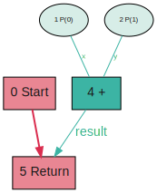</a>
</figure>

A Graal graph has *nodes* (the little boxes and ovals) and *edges* (the lines between them.) The text in each node starts with a unique number for easy reference. Broadly, the nodes mean an instruction of some kind, and the edges mean data-flow or control-flow passing between instructions. This distinction is important, so here we show data edges in green and control edges in red. A green data-flow edge means that the result of a node (instruction) is used as input to another node. A red control-flow edge means that control passes from one node, which is executed first, to another, which is executed next. Graal typically models the data-flow edges as going upward, showing one node being dependent on another which supplies the data it needs. We've found in practice that people find it easier to understand the direction of data-flow rather than the direction of dependency, so we draw them going downward.

What we have in this graph is an addition node, from the Java addition operator. It takes as input `P(0)` and `P(1)` which mean the first and second parameters to the method. Their edges are labelled `x` and `y` for the two operands to an addition operator. Note that these are the names of the operands to the addition node - they aren't related to any names from the Java source code. It produces a result, which is sent to the `Return` node. The function also has a `Start` node, and control flows from start to return. You can execute the function in your head by beginning at the start node, following the red control-flow edges, and each time you need to do something you execute all the nodes that produce data that you need for input.

```java
private static boolean exampleCompareOperator(int x, int y) {
    return x <= y;
}
```

<figure>
<a href="exampleCompareOperator@6.svg">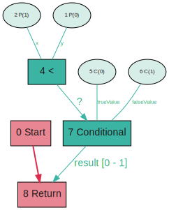</a>
</figure>

In this graph, we can start to see how Graal uses the free-form graph data structure to reason about your program. We have a less-than node, but we wrote less-than-or-equal to in our code. And notice that the `trueValue` edge comes from `C(0)`, meaning constant value `0`, or `false`, and `falseValue` comes from `C(1)`.

What has happened is that Graal has rewritten our program from `x <= y`, to `!(y < x)`. This is part of a process called *canonicalization*, similar to a concept called *desugaring* that you may have heard of in other contexts. The idea is that if we only ever use less-than, rather than less-than-or-equal-to, then the rest of the compiler can be simpler by never having to handle less-than-or-equal-to. Graal could use either less-than or greater-than as the canonical form - it doesn't make a difference and they just picked one. The `Conditional` node is like the ternary operator - it selects one of two values from a condition.

```java
private static int exampleExactArith(int x, int y) throws ArithmeticException {
    return Math.addExact(x, y);
}
```

<figure>
<a href="exampleExactArith@6.svg">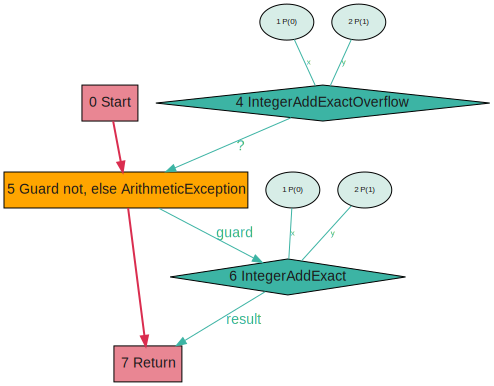</a>
</figure>

`Math.addExact` performs addition but throws an exception if it overflows. Graal doesn't implement this by a method call to the runtime routine, but instead inserts nodes through a system called replacements and graph builder plugins. The `addExact` here is composed of two nodes, the `AddExactOverflow` and the `AddExact`. The first node tells you if the operation would overflow, and the second performs the operation. Separating the two operations allows them to optimize independently.

The `Guard` node, in orange, checks the result of the overflow test, and throws an `ArithmeticException` if needed. Guard nodes will become more important later on.

## Local variables

```java
private static int exampleLocalVariables(int x, int y) {
    int a = x + y;
    return a * 2 + a;
}
```

<figure>
<a href="exampleLocalVariables@6.svg">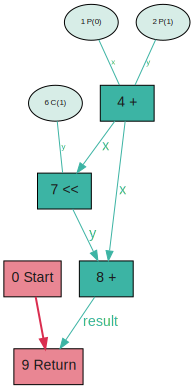</a>
</figure>

The difference that a graph representation makes becomes more clear when we think about local variables. Looking at this graph, the local variables seem to have gone away entirely. You cannot see any local variable names here, just edges. It doesn't matter if a value came from a parameter, a local variable, or an expression, it's always just an edge. We can also see how Graal has chosen to represent the multiplication operation by the simpler shift-left-one-bit operation.

```java
private static int exampleLocalVariablesState(int x, int y) {
    int a = x + y;

    /*
     * The purpose of this function call to is to create a 'safepoint' - that
     * means a location where a debugger could be attached. It means that the
     * user may request the value of the local variable a at this point.
     */
    opaqueCall();

    return a * 2 + a;
}
```

<figure>
<a href="exampleLocalVariablesState@6.svg">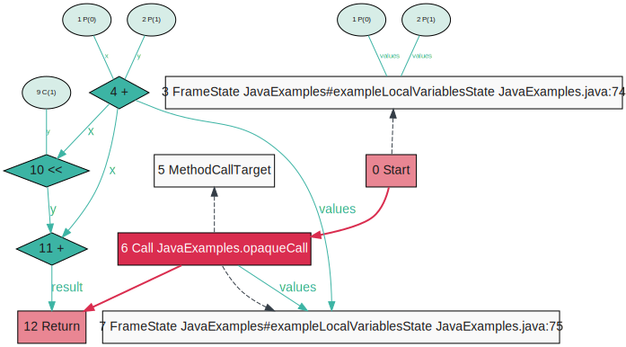</a>
</figure>

How can Graal throw away information about local variables like this? If we attached a debugger at the second line of that method we'd want to see the value of the local variable a at that point. How does that work? Graal maintains metadata about the state of the program at locations called *frame states*. These are only added where needed, such as at the start of a method, or at locations such as method calls (the call to `opaqueCall` here). As well as the debugger they're also used so that optimized code and be deoptimized if you attach a debugger. These are hidden by default in most tools, but we can show them if wanted. The value of the local variable a was the result of the addition operation, and we can see an edge from that operation into the `FrameState`, as well as to the two places where it is actually used.

## Method calls


```java
private static class ExampleObject {
    public int x;

    public ExampleObject(int x) {
        this.x = x;
    }

    public int instanceCall(int y) {
        return x + y;
    }
}

private static int exampleSimpleCall(ExampleObject object, int x) {
    return object.instanceCall(x);
}
```

<figure>
<a href="exampleSimpleCall@6.svg">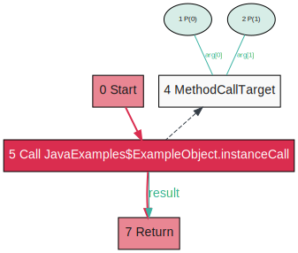</a>
</figure>

Simple method calls in Graal are represented by a `Call` node. Information about the call is attached to a separate node, the `MethodCallTarget`. We show that the edge is just information by drawing a dashed line. You can see how `arg[0]` and `arg[1]` are inputs to the `MethodCallTarget`. `arg[0]` is the receiver, or the *this* object, called *self* in Ruby or Python, for instance calls.

```java
private static int exampleStaticCall(int x) {
    return staticCall(x);
}
```

<figure>
<a href="exampleStaticCall@6.svg">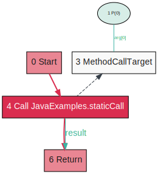</a>
</figure>

A static call is the same, except now we aren't passing any receiver.

```java
private interface InterfaceOneImpl {
    int interfaceCall();
}

private static class OneImpl implements InterfaceOneImpl {
    public int interfaceCall() {
        return 14;
    }
}


private static int exampleInterfaceCallOneImpl(InterfaceOneImpl x) {
    return x.interfaceCall();
}
```

<figure>
<a href="exampleInterfaceCallOneImpl@6.svg">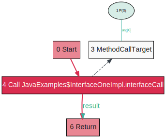</a>
</figure>

The interface call is initially represented by a *Call* node.

<figure>
<a href="exampleInterfaceCallOneImpl@9.svg">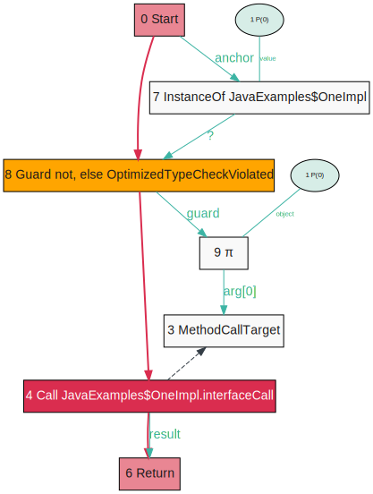</a>
</figure>

After later compiler phases we can see that Graal is checking that the object is of the type expected, and the π (pronounced *pi*) node then narrows the type to be exactly `InterfaceOneImpl`. We'll talk more about π nodes later in the sections on stamps. When the Call node is compiled now it will be able to make a devirtualized call to the specific method.

```java
private interface InterfaceManyImpls {
    int interfaceCall();
}

private static class ManyImplsA implements InterfaceManyImpls {
    public int interfaceCall() {
        return 14;
    }
}

private static class ManyImplsB implements InterfaceManyImpls {
    public int interfaceCall() {
        return 14;
    }
}

private static int exampleInterfaceCallManyImpls(InterfaceManyImpls x) {
    return x.interfaceCall();
}
```

<figure>
<a href="exampleInterfaceCallManyImpls@6.svg"></a>
</figure>

The many-implementation case does not get these extra nodes. It appears to be simpler, but there is no stamp on the value of the receiver going into the `Call` node from a π node so it remains a proper virtual interface call.

## Control flow

```java
private static int exampleIf(boolean condition, int x, int y) {
    final int a;
    if (condition) {
        intField = x;
        a = x;
    } else {
        intField = y;
        a = y;
    }
    return a;
}
```

<figure>
<a href="exampleIf@6.svg">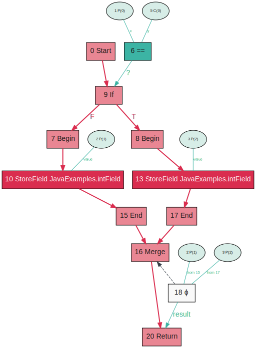</a>
</figure>

In the examples so far the red control line has formed a single path through the program. If we write an `if-else` statement, the control-flow line diverges. In this case it merges again for the `return` statement following the `if-else` block. An input to the `If` node is the condition to use for branching. We'll talk about the ϕ (pronounced *phi*) node next.

```java
private static int examplePhi(boolean condition, int x) {
    final int a;
    if (condition) {
        a = opaqueCall();
    } else {
        a = opaqueCall();
    }
    return a + x;
}
```

<figure>
<a href="examplePhi@6.svg">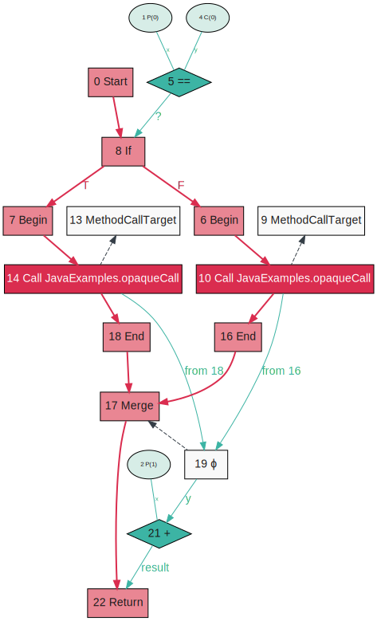</a>
</figure>

A concept people find challenging in both typical SSA form, and graphs like Graal, is ϕ, or *phi*, nodes. The name is from *ph-ony*! Meaning they're not a real instruction. In this Java code we assign the local variable `a` in two locations, but we said that in SSA a value is only assigned in one location. How can you get the value of two different expressions after control-flow merges? What we do is send both values as input to the ϕ node, and then a single output is produced, based on which value was produced. The ϕ node is attached to the point where control-flow merges. We label the edges into the ϕ node with the control flow edge that triggers this value being taken. We'll see some more complicated ϕ nodes later when we talk about loops.

```java
private static int exampleIfNeverTaken(boolean condition, int x, int y) {
    final int a;t
    if (condition) {
        intField = x;
        a = x;
    } else {
        intField = y;
        a = y;
    }
    return a;
}

exampleIfNeverTaken(false, RANDOM.nextInt(), RANDOM.nextInt());
```

<figure>
<a href="exampleIfNeverTaken@6.svg">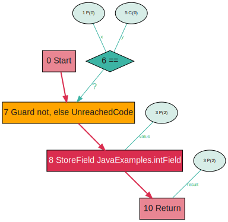</a>
</figure>

If we write a version of an `if-else` statement where we never actually use the `true` case, then Graal will not compile it into the code, with the expectation that it will never be used. In its place it leaves a `Guard` node that checks the value is still not true. If the value is true, the code will deoptimize and jump back into the interpreter. This is sometimes called an *uncommon trap*.

```java
private static int exampleIntSwitch(int value, int x, int y, int z) {
    final int a;
    switch (value) {
        case 0:
            intField = x;
            a = x;
            break;
        case 1:
            intField = y;
            a = y;
            break;
        default:
            intField = z;
            a = z;
            break;
    }
    return a;
}
```

<figure>
<a href="exampleIntSwitch@6.svg">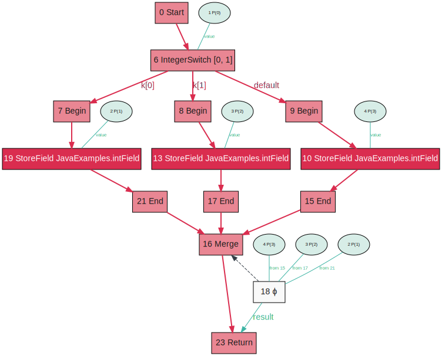</a>
</figure>

`switch` statements on integers look like a multi-way `If` node. The key values are labelled in the node, and then the edges coming out of it are labelled with the keys they correspond to, or if they're the default case. Our ϕ now has three values going into it. Note how it looks strange with the values being computed outside of the `switch` - the control-flow and data-flow are completely separate here.

```java
private static int exampleStringSwitch(String value, int x, int y, int z) {
    final int a;
    switch (value) {
        case "foo":
            intField = x;
            a = x;
            break;
        case "bar":
            intField = y;
            a = y;
            break;
        default:
            intField = z;
            a = z;
            break;
    }
    return a;
}
```

<figure>
<a href="exampleStringSwitch@6.svg">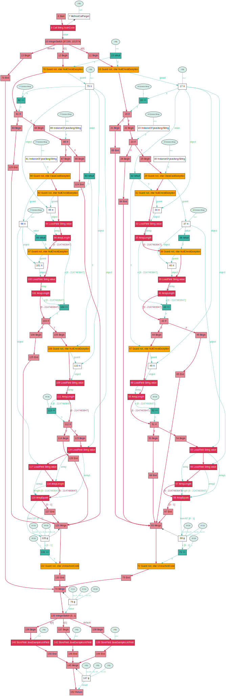</a>
</figure>

`switch` statements on strings look like those on integers, but we can learn from the Graal graph how much more complicated they really are. Part of this translation is done in the `javac` Java compiler, and part in Graal.

There's some really interesting structure here. Most clear is that there are two big control-flow diverges - two diamonds made up of nodes - one tall on the top, and a smaller one below. What we have is code to find out which string we have, and then a separate normal `IntegerSwitch` below that is the actual switch body.

The code to find out which string we have is also itself initially an integer `switch`, on the hash code of the string. Then each case of that `switch` also checks if the string is the same instance as the constant in the case expression, or if not it checks if it's the same length, and then if it is it checks that the characters are equal by doing an array comparison. Along the way it guards that parts of the data structures are not null. Why break down what looks like an atomic operation - a `switch` on a string - to so many small operations? Part of it is that there is no bytecode for a string `switch` and they didn't want to add one so it needs to be expressed in terms of existing bytecode, but also in Graal the idea is that if you decompose the operation then parts of it can optimize independently. At one point in this graph we load the string length - and if we use the string length elsewhere then we can do that just once and both parts of the program can use the result.

## Loops

```java
private static int exampleWhile(int count) {
    int a = count;
    while (a > 0) {
        intField = a;
        a--;
    }
    return count;
}
```

<figure>
<a href="exampleWhile@6.svg"></a>
</figure>

So far all the arrows have pointed downward (except the dashed information edges.) This means the program has been going in only one direction. In a program with loops, we need to go backward to earlier parts of the program. This is shown with a thick red arrow. We draw it thickly because these edges are so important - loops are where key optimisations are to be found, and where many complex constraints come from.

Looking at just the control-flow to begin with, we see how this loop has a begin, and then it has both an end and an exit. The end has the arrow back up to the beginning - the exit is where we leave the loop and go on to other code such as the return in this case.

Looking at the control-flow, the ϕ is now a bit more complicated. The value on entering the loop is `P(0)`, then you can see that subsequent values are itself added to the constant `-1` (Graal canonicalizes subtraction to addition with a negative value.) That's then the value for deciding if we leave the loop or not.

So we have two cycles in our graph - one in the control-flow, and another in the data-flow. They're separate, but working together.

```java
private static int exampleFor(int count) {
    for (int a = count; a > 0; a--) {
        intField = a;
    }
    return count;
}
```

<figure>
<a href="exampleFor@6.svg">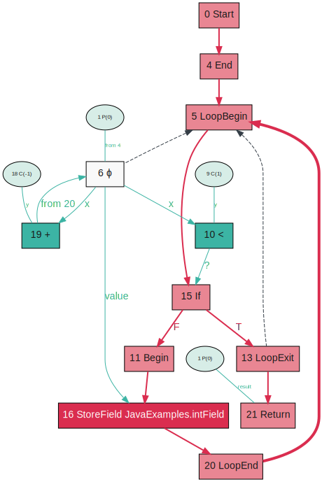</a>
</figure>

The graph for a `for` loop is exactly the same as the `while` loop - the extra syntax of for desugars in the `javac` Java compiler to the same bytecode.

```java
private static int exampleNestedWhile(int count) {
    int a = count;
    while (a > 0) {
        int y = count;
        while (y > 0) {
            intField = a;
            y--;
        }
        a--;
    }
    return count;
}
```

<figure>
<a href="exampleNestedWhile@6.svg">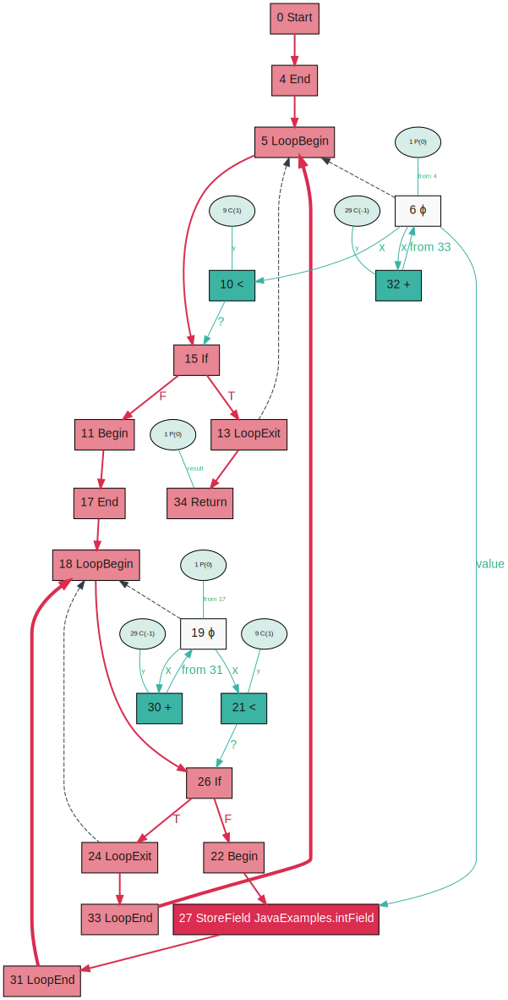</a>
</figure>

The control-flow structure starts to become very interesting when we nest loops. We have two thick backward control-flow edges now. Notice how the return statement is in the middle of the graph.

```java
private static int exampleWhileBreak(int count) {
    int a = count;
    while (a > 0) {
        if (a == 4) {
            break;
        }
        intField = a;
        a--;
    }
    return count;
}
```

<figure>
<a href="exampleWhileBreak@6.svg">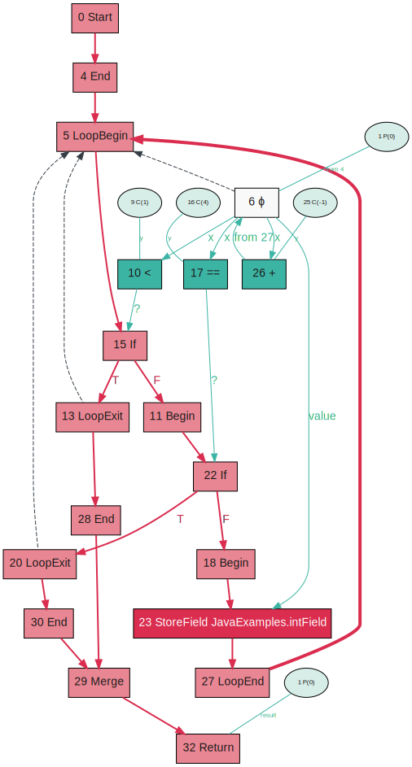</a>
</figure>

A loop with a `break` statement in it produces two loop exits. Notice how the exit from the `break` is no different to the exit from the condition.

```java
private static int exampleNestedWhileBreak(int count) {
    int a = count;
    outer: while (a > 0) {
        int b = count;
        while (b > 0) {
            if (b == 4) {
                break outer;
            }
            intField = a;
            b--;
        }
        a--;
    }
    return count;
}
```

<figure>
<a href="exampleNestedWhileBreak@6.svg">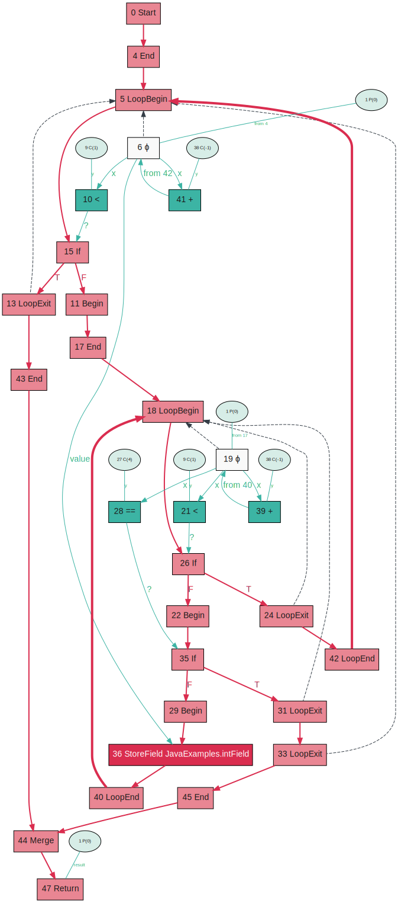</a>
</figure>

For a `break` from within a nested loop, notice how the dashed line identifying which loop is being exited is useful.

```java
private static int exampleReducible(boolean condition, int count) {
    int a = count;
    if (condition) {
        a = count - 1;
    }
    while (a > 0) {
        intField = a;
      inner:
        a--;
    }
    return count;
}
```

<figure>
<a href="exampleReducible@6.svg">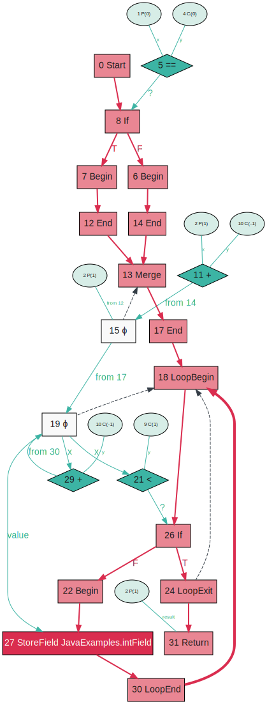</a>
</figure>

Graal has a structured representation of loops. They're kept as first-class parts of the graph all the way through - they aren't lowered to some kind of goto like you may have seen other compilers doing. This works fine for what a kind of structure loop that we call *reducible* loops. This is the only kind of loop that you can write in Java code, as Java has no `goto`. However by writing JVM bytecode directly, we can create a loop that is not so simply structured, and that we call *irreducible* (or *not-reducible* in some texts.)

```
  iload_1
  istore_2
  iload_0
  ifeq L_start_of_loop

  goto L_inside_loop    # jump inside the loop

L_start_of_loop:
  iload_2
  ifle L_end_of_loop
  iload_2
  putstatic Field Irreducible intField I

L_inside_loop:
  iinc 2 -1
  goto L_start_of_loop

L_end_of_loop:
  iload_1
  ireturn
```

Graal cannot simply represent this unstructured loop with multiple entry points. If you turn on compiler logger it will tell you that it is not going to compile it.

```
231  355       4       Irreducible::exampleIrreducible (25 bytes)   COMPILE SKIPPED: Non-reducible loop (not retryable)
```

You may be surprised if you try to decompile this code that it can be represented in Java code - we said it couldn't. What is happening here is that one iteration is being peeled off and duplicated so that the rest of the loop doesn't need a second entry point. So why doesn't Graal do this? Since Java code doesn't generate these kinds of loops, it hasn't been a priority yet.

```java
//
// Source code recreated from a .class file by IntelliJ IDEA
// (powered by Fernflower decompiler)
//

public class IrreducibleDecompiled {
    private static volatile int intField;

    public static int exampleIrreducible(boolean var0, int var1) {
        int var2 = var1;
        if (var0) {
            var2 = var1 - 1;
        }

        while(var2 > 0) {
            intField = var2--;
        }

        return var1;
    }
}
```

## Objects

```java
private static ExampleObject exampleObjectAllocation(int x) {
    return new ExampleObject(x);
}
```

<figure>
<a href="exampleObjectAllocation@6.svg">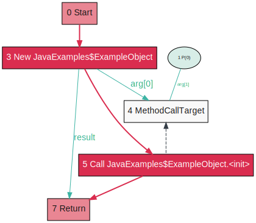</a>
</figure>

An object is allocated using a `New` node. You can see a separate call to the constructor. Notice that there is a control-flow edge from the `New` node to the `Call` node - this is because the `New` node creates space in the heap - it must happen first.

```java
private static int[] exampleArrayAllocation(int x, int y) {
    return new int[]{x, y};
}
```

<figure>
<a href="exampleArrayAllocation@6.svg">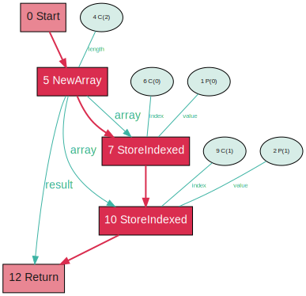</a>
</figure>

An array allocation creates the array and then you can see two store operations.

```java
private static int exampleFieldRead(ExampleObject object) {
    assert object != null; // otherwise this is a 'trivial' method and won't go past tier 1
    return object.x;
}
```

<figure>
<a href="exampleFieldRead@6.svg">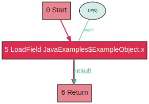</a>
</figure>

A field read generates a `LoadField` node.

Note that we must add additional code to this method, in the form of an assert, because otherwise it is classed as *trivial* by the JVM, which just means it's so simple that it's probably not worth compiling on its own because it's more likely to be inlined by something else and compiled as part of that.

<figure>
<a href="exampleFieldRead@42.svg">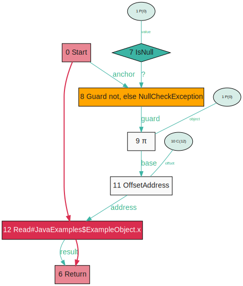</a>
</figure>

We can look at what this same graph looks like after later optimizations have run. The high-level load operation has become a low-level memory read operation, with the address calculation being made explicit in more nodes. Again, this is so that they can optimise independently. The constant value `C(12)` there is the offset within the object. We'll explain the π node later.

Many object operations are represented directly be specific nodes in the same way - including field writes, array reads and writes, and unsafe reads and writes.

```java
private static void exampleFieldWrite(ExampleObject object, int x) {
    object.x = x;
}

private static int exampleArrayRead(int[] array, int n) {
    return array[n];
}

private static void exampleArrayWrite(int[] array, int n, int x) {
    array[n] = x;
}
```

<figure>
<a href="exampleFieldWrite@6.svg">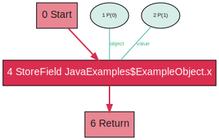</a>
<a href="exampleArrayRead@6.svg"></a>
<a href="exampleArrayWrite@6.svg">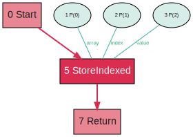</a>
</figure>

```java
private static boolean exampleInstanceOfOneImpl(Object x) {
    return x instanceof InterfaceOneImpl;
}
```

<figure>
<a href="exampleInstanceOfOneImpl@6.svg">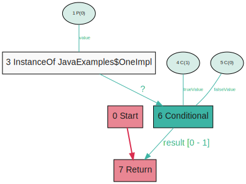</a>
</figure>

An `instanceof` expression is initially represented by a node, but it is lowered in later compiler passes.

<figure>
<a href="exampleInstanceOfOneImpl@65.svg">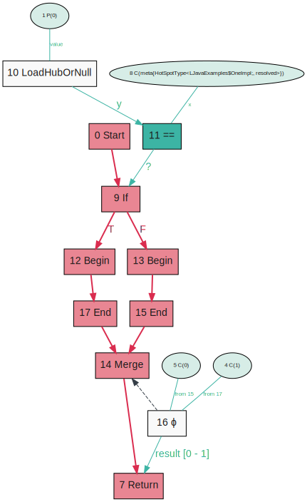</a>
</figure>

Here the `instanceof` for an interface with one implementation has become a simple compare of the class pointer - called the hub in Graal terminology. What happens if a new instance of the interface is loaded? In that case the VM will deoptimize, throwing away this compiled code, and compiling again.

```java
private static boolean exampleInstanceOfManyImpls(Object x) {
    return x instanceof InterfaceManyImpls;
}
```

<figure>
<a href="exampleInstanceOfManyImpls@6.svg"></a>
</figure>

An `instanceof` expression on an interface with multiple implementations must check against them all.

<figure>
<a href="exampleInstanceOfManyImpls@65.svg">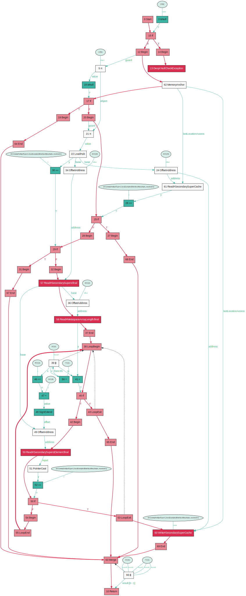</a>
</figure>

In later compiler passes we can see how this expands into a relatively complicated loop.

## Stamps and escape analysis

```java
private static int exampleStamp(int x) {
    return x & 0x1234;
}
```

<figure>
<a href="exampleStamp@6.svg"></a>
</figure>

A *stamp* is information that Graal knows about a value in the program. Stamps may convey more information than is expressible in the Java type system. For example if we write `x & 0x1234`, then we know that this value is not going to be larger than `0x1234` (`4660` in decimal). We can annotate that on the edges and it may be useful for subsequent nodes to optimize with that information in mind.

The π node that we saw earlier is there to attach extra stamps to a value. The idea of π nodes came from [work on checking array bounds](#abcd) - the name was arbitrary and doesn't mean anything according to the author.

```java
private static int exampleFullEscape(int x) {
    final int[] a = new int[]{x};
    objectField = a;
    return a[0];
}
```

<figure>
<a href="exampleFullEscape@6.svg">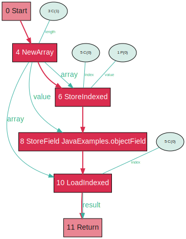</a>
</figure>

Graal has sophisticated support for *virtualisation* of objects, and [*escape analysis*](#escape), including [*partial escape analysis*](#partial-escape). We can see some evidence of this in how it represents object allocations and references in later phases. Initially this graph has a `NewArray` node, but this is decomposed later on.

<figure>
<a href="exampleFullEscape@33.svg">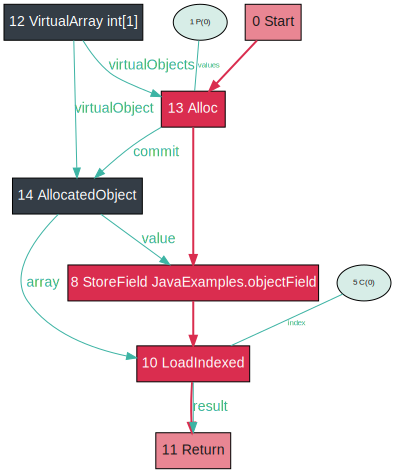</a>
</figure>

Now we have a separate virtual representation of the array, which is input to the actual allocation, and a node to represent the allocated object.

```java
private static int exampleNoEscape(int x) {
    final int[] a = new int[]{x};
    return a[0];
}
```

<figure>
<a href="exampleNoEscape@6.svg">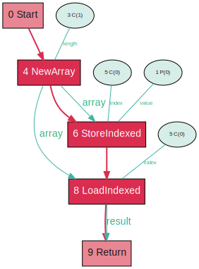</a>
</figure>

If we now try a version of the same code but where the array never escapes the method, we can see that this allows the allocation of the object to be removed, and the value that we wrote into it, then read back, can be returned directly.

<figure>
<a href="exampleNoEscape@33.svg">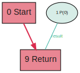</a>
</figure>

```java
private static int examplePartialEscape(boolean condition, int x) {
    final int[] a = new int[]{x};
    if (condition) {
        objectField = a;
        return a[0];
    } else {
        return a[0];
    }
}
```

<figure>
<a href="examplePartialEscape@6.svg">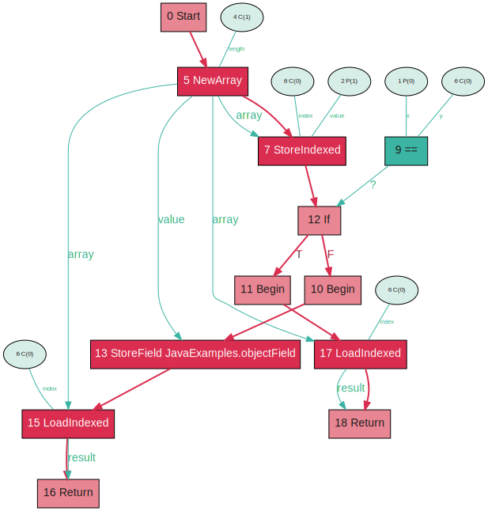</a>
</figure>

This is even more clear in the case of a partial escape, where the object escapes on one code path but not another. This is a real strength of Graal.

<figure>
<a href="examplePartialEscape@33.svg">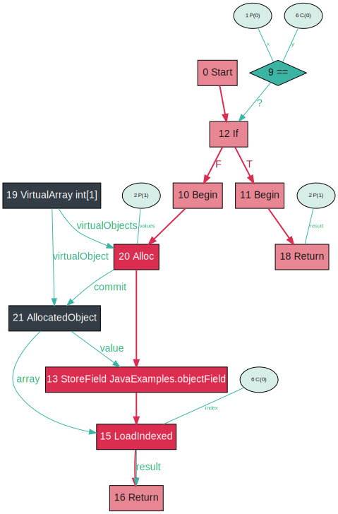</a>
</figure>

In the later graph we can see the allocation remains on just one branch, and has been removed on the other.

## Exceptions

```java
private static void exampleThrow() {
    throw RUNTIME_EXCEPTION;
}
```

<figure>
<a href="exampleThrow@6.svg">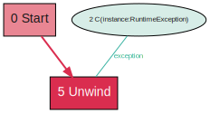</a>
</figure>

An exception `throw` is represented by an `Unwind` node that takes the exception to be thrown.

```java
private static void exampleCatch() {
  try {
      exampleThrow();
  } catch (RuntimeException e) {
      objectField = e;
  }
}
```

<figure>
<a href="exampleCatch@6.svg">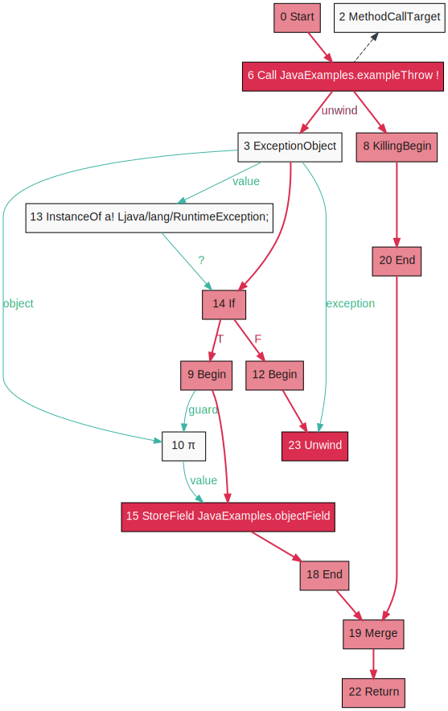</a>
</figure>

A call that can throw an exception has two control-flow edges coming out of it - one for the normal case and one for the exceptional case where we are unwinding. We can then get the exception with the `ExceptionObject` and then use an `InstanceOf` node as before to match it to the right catch branch.

```java
private static void exampleThrowCatch() {
  try {
      throw RUNTIME_EXCEPTION;
  } catch (RuntimeException e) {
  }
}
```

<figure>
<a href="exampleThrowCatch@6.svg">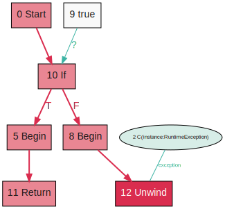</a>
</figure>

If we try and catch in the same method, and the exception does not escape, then notice how Graal compiles it away. There's some cruft leftover here - an If branch with `true` - that will be cleaned up later.

## Synchronization

```java
private static void exampleSynchronized(Object object, int x) {
    synchronized (object) {
        intField = x;
    }
}
```

<figure>
<a href="exampleSynchronized@6.svg">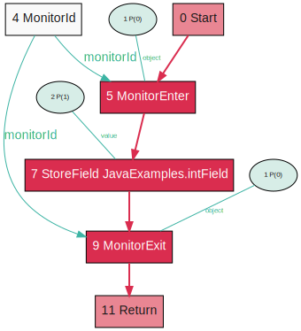</a>
</figure>

Synchronized blocks are represented by pairs of `MonitorEnter` and `MonitorExit` nodes. Another node, `MonitorId`, identifies which monitor we're using.

```java
private static void exampleDoubleSynchronized(Object object, int x) {
    synchronized (object) {
        intField = x;
    }
    synchronized (object) {
        intField = x;
    }
}
```

<figure>
<a href="exampleDoubleSynchronized@6.svg"></a>
</figure>

An optimization I like to demonstrate is that if you have two synchronized blocks next to each other using the same lock, Graal will combine them into one.

<figure>
<a href="exampleDoubleSynchronized@48.svg">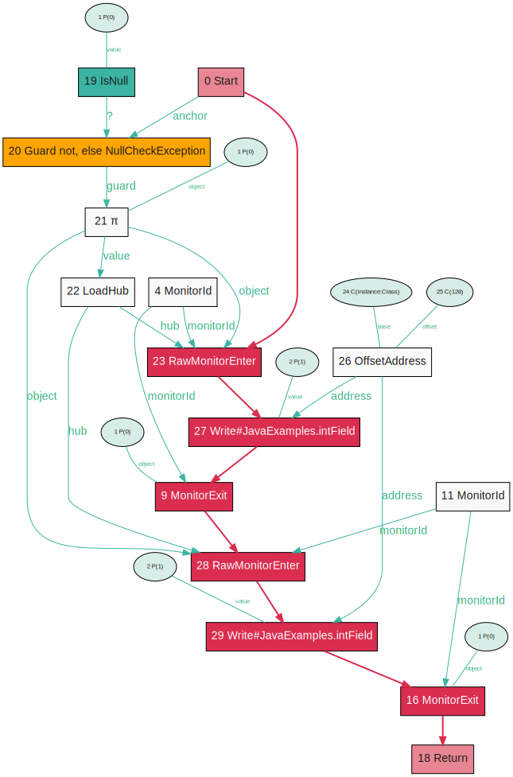</a>
</figure>

First we see the nodes lowered somewhat.

<figure>
<a href="exampleDoubleSynchronized@49.svg">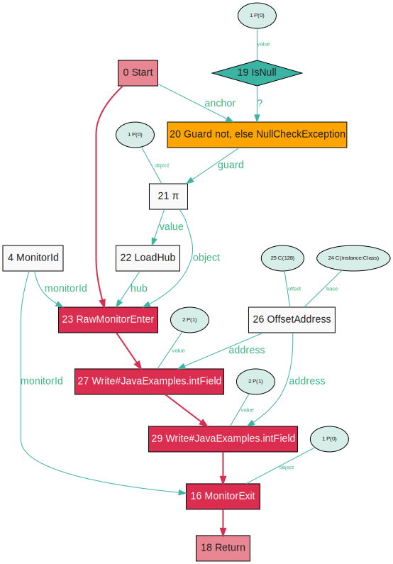</a>
</figure>

And here we see them combined - now a single enter and exit with both bodies inside it.

```java
private static void exampleLocalSynchronized(int x) {
    final Object object = new Object();
    synchronized (object) {
        intField = x;
    }
}
```

<figure>
<a href="exampleLocalSynchronized@6.svg">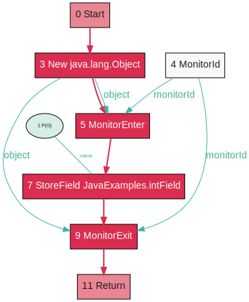</a>
</figure>

Like with object allocations with escape analysis, a monitor that does not escape a method can be optimized away, since we know that nobody else could be contending with it.

<figure>
<a href="exampleLocalSynchronized@33.svg">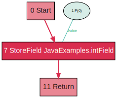</a>
</figure>

## Summary

These basics are enough to make sense of most Graal graphs to be able to understand what they're doing. If you see nodes you don't recognise here you can usually judge what they do from their name, or look them up in the [Graal source repository](https://github.com/oracle/graal/tree/master/compiler/src).

The free-form structure of a Graal graph allows the program to be easily manipulated as the program passes through the compiler, with nodes being swapped, reconnected, removed, or replaced with multiple simpler nodes. The balance is that the loose structure can make them hard to read, especially if they're very large.

I'm going to be writing some more about Graal graphs, showing more tools for working with them, and relating them to how they're used for Ruby at Shopify, in future blog posts.

## References

* <a id="pdg"></a>[The Program Dependence Graph and its use in optimization](https://www.cs.utexas.edu/~pingali/CS395T/2009fa/papers/ferrante87.pdf), Jeanne Ferrante, Karl Ottenstein, Joe Warren, 1987, or [on Wikipedia](https://en.wikipedia.org/wiki/Program_dependence_graph)
* <a id="ssa"></a>[Global value numbers and redundant computations](https://www.cse.wustl.edu/~cytron/cs531/Resources/Papers/valnum.pdf), Barry Rosen, Mark Wegman, Kenneth Zadeck, 1998, or [on Wikipedia](https://en.wikipedia.org/wiki/Static_single_assignment_form)
* <a id="c2"></a>[A simple graph-based intermeidate representation](https://www.oracle.com/technetwork/java/javase/tech/c2-ir95-150110.pdf), Cliff Click, Michael Paleczny, 1995
* <a id="pi"></a>[ABCD: eliminating array bounds checks on demand](https://dl.acm.org/doi/10.1145/358438.349342), Rastislav Bodík, Rajiv Gupta, Vivek Sarkar
* <a id="graal"></a>[An intermediate representation for speculative optimizations in a dynamic compiler](https://dl.acm.org/doi/10.1145/2542142.2542143), Gilles Duboscq, Thomas Würthinger, Lukas Stadler, Christian Wimmer, Doug Simon, Hanspeter Mössenböck, 2013
* <a id="truffle"></a>[Practical partial evaluation for high-performance dynamic language runtimes](https://dl.acm.org/doi/10.1145/3062341.3062381), Thomas Würthinger, Christian Wimmer, Christian Humer, Andreas Wöß, Lukas Stadler, Chris Seaton, Gilles Duboscq, Doug Simon, Matthias Grimmer, 2017
* <a id="truffleruby"></a>[Specialising dynamic techniques for implementing the Ruby programming language](../../phd)
* [Escape analysis for Java: theory and practice](https://dl.acm.org/doi/10.1145/945885.945886), Bruno Blanchet, 2003, or [on Wikipedia](https://en.wikipedia.org/wiki/Escape_analysis)
* <a id="partial-escape"></a>[Partial escape analysis and scalar replacement for Java](https://dl.acm.org/citation.cfm?id=2544157), Lukas Stadler, Thomas Würthinger, Hanspeter Mössenböck, 2014

## Notes

Where we show Java example methods, the methods are being called in a loop with random input, such as:

```java
while (true) {
    exampleLocalVariables(RANDOM.nextInt(), RANDOM.nextInt());
    exampleLocalVariablesState(RANDOM.nextInt(), RANDOM.nextInt());
}
```

*On-stack-replacement* (compiling loop bodies independently) and *inlining* are disabled, in order to constrain compilation units to the method as expressed in the source code. The random input prevents value profiling from turning parameters into constants.
