In a [previous blog post](../basic-graal-graphs) I showed a gallery of Graal IR graphs for basic Java language constructs, and explained what each part of the graph meant and showed what we can learn from this to understand how Java is compiled and optimized. One of the [great things about the Graal compiler project](../tenthings) is that the core compiler technology can be applied for many different purposes. As well as compiling Java it can be used to compile other languages, such as JavaScript, Python, and R, through partially evaluating an interpreter written in Java. When we use Graal to compile a language like Ruby, what do the graphs look like? How do they compare to the Java graphs for the corresponding language constructs? How are Ruby concepts being represented using an IR designed for Java? What can we learn from this? These are the questions we're going to answer in this blog post.

You should have read the blog post on Graal graphs produced from Java programs in order to have the context to get the most out of this blog post, but we'll also re-show the Java code and the Java graphs for comparison. We're using TruffleRuby because that's what I'm working with at Shopify. The general ideas probably transfer to most Truffle guest languages.

Don't forget you can click on graphs to get them at a larger scale.

## Arithmetic and logic

```java
private static int exampleArithOperator(int x, int y) {
    return x + y;
}
```

<figure>
<a href="exampleArithOperator@6.svg"></a>
</figure>

```ruby
def example_arith_operator(x, y)
  x + y
end
```

<figure>
<a href="example_arith_operator@4-literal.svg">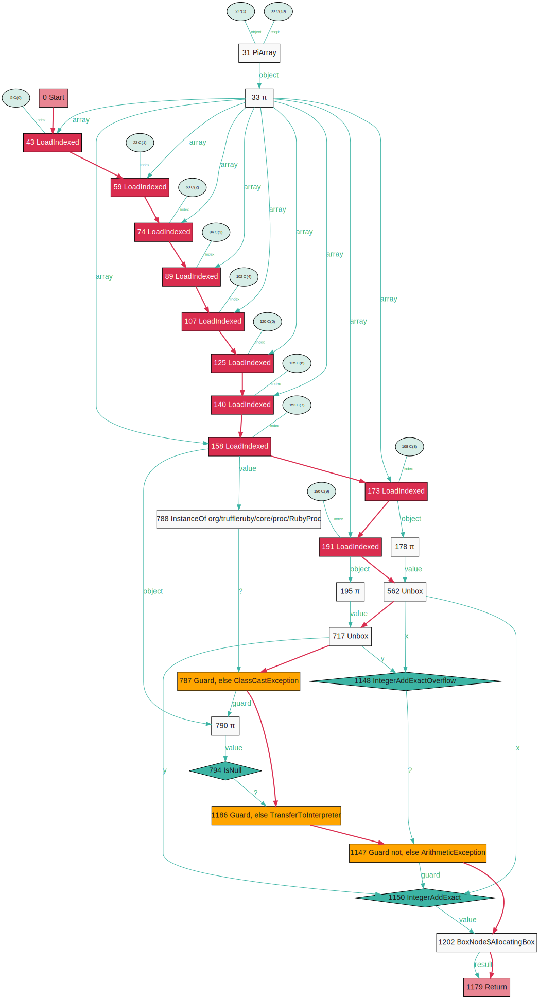</a>
</figure>

Let's go through the differences between these graphs. The best place to start reading it in this case is the essential logic - the actual add operation. Where Java had a single `+` node, Ruby has a pair of `IntegerAddExact` and `IntegerAddExactOverflow` nodes. As Ruby has integer arithmetic that overflows to arbitrary precision, it checks if the value will overflow, and this informs a guard. Note that there is no code here for handling that overflow - if the guard fails it transfer to interpreter. The second node does the actual operation. This are the same pattern as we saw for the `Math.addExact` example in the previous blog post. Then look at the inputs to these nodes. Both values come from an `Unbox`, which comes from a `LoadIndexed`, which comes from the second parameter, `P(1)`. This is a great example of the additional layer of abstraction Truffle languages work at. Instead of a Java parameter, Truffle arguments come in an array, which is stored in a Java parameter. To get the Truffle argument out we have to read an array of Truffle parameters from the Java parameter, read the element out of the array, and unbox it. You can see the Truffle tries to make this a little cheaper by injecting the known argument array length using the `PiArray`. The return value must also be boxed.

Now that we've explained some of the extra abstraction of Truffle graphs, can we do something automatically to simplify them? Perhaps instead of showing every Truffle argument being loaded with an individual node we could show where they're all loaded with a single node, and then show each Truffle argument as a `T(n)` node like we did with Java parameters as `P(n)` nodes. This isn't how the graph is actually working in the compiler, but if we understand how Truffle arguments work in general we can take this shortcut for a simpler graph. We could also remove `pi` nodes. These inject stamps, as described in the previous blog post, but they aren't really necessary for initially understanding what the graph does and how it has been optimised. This gives us this simpler graph instead.

<figure>
<a href="example_arith_operator@4.svg">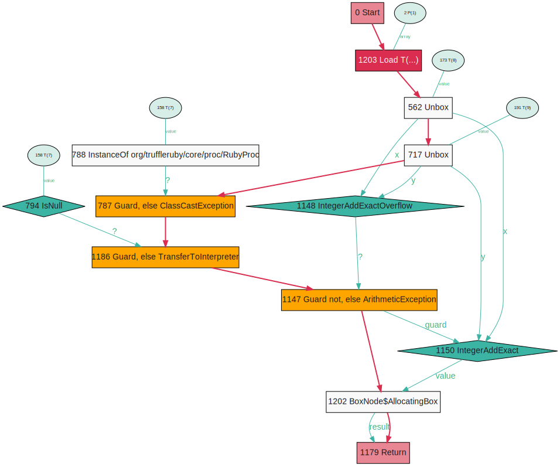</a>
</figure>

```java
private static boolean exampleCompareOperator(int x, int y) {
    return x <= y;
}
```

<figure>
<a href="exampleCompareOperator@6.svg">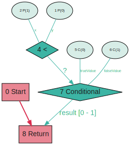</a>
</figure>

```ruby
def example_compare_operator(x, y)
  x <= y
end
```

<figure>
<a href="example_compare_operator@4.svg">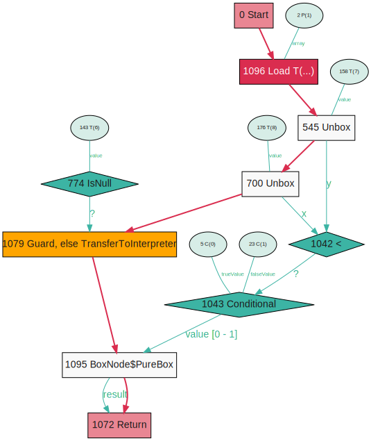</a>
</figure>

The graphs for a compare operator are more similar between Java and Ruby, especially now we did that work to slightly simplify the Truffle graphs. In fact with the exception of the extra work to store the Ruby block we talked about, and the boxing, they're the same. This is despite all Ruby's extra semantics for things like tracing, dynamic typing, and dynamic dispatch.

## Local variables

```java
private static int exampleLocalVariables(int x, int y) {
    int a = x + y;
    return a * 2 + a;
}
```

<figure>
<a href="exampleLocalVariables@6.svg">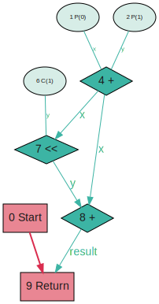</a>
</figure>

```ruby
def example_local_variables(x, y)
  a = x + y
  a * 2 + a
end
```

<figure>
<a href="example_local_variables@4.svg">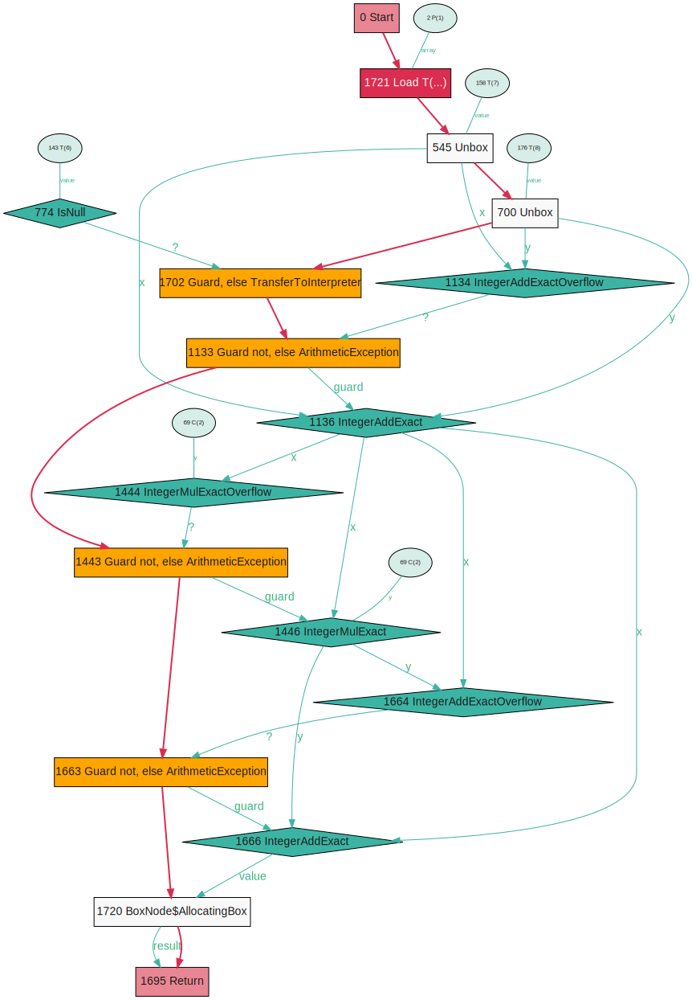</a>
</figure>

Local variables in Ruby are more complex than in Java. A called function is able to access the local variables of the calling function, so they're normally allocated in objects on the heap, rather than on the stack. But we can see here that Truffle has been able to do the same thing with Java as with Ruby, and has turned all named local variables into just edges. There is nowhere that `a` is stored and then read - it's all just edges to the producers of its value.

```java
private static int exampleLocalVariablesState(int x, int y) {
    int a = x + y;

    /*
     * The purpose of this function call to is to create a 'safepoint' - that
     * means a location where a debugger could be attached. It means that the
     * user may request the value of the local variable a at this point.
     */
    opaqueCall();

    return a * 2 + a;
}
```

<figure>
<a href="exampleLocalVariablesState@6.svg"></a>
</figure>

```ruby
def example_local_variables_state(x, y)
  a = x + y
  opaque_call
  a * 2 + a
end
```

<figure>
<a href="example_local_variables_state@4.svg">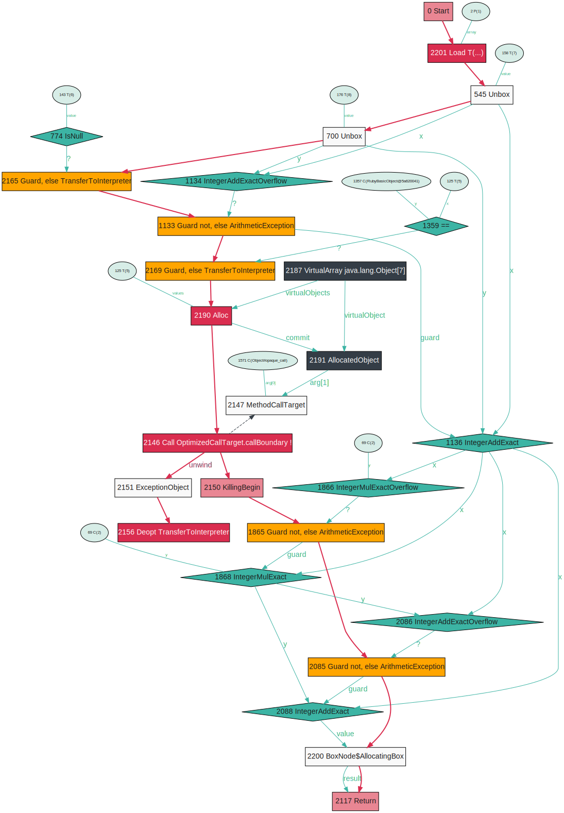</a>
</figure>

We said in Java that information about local variables is kept in `FrameState` nodes. That's true here as well in Ruby, but since local variables are stored in *objects* not in Java local variables in our interpreter, the frame state is much more complication. So here the core graph produced by Ruby and Java is the same, but there is a lot more hidden metadata in the Ruby graph in order to reconstruct Ruby's more complicated structure if required.

## Method calls

```java
private static class ExampleObject {
    public int x;

    public ExampleObject(int x) {
        this.x = x;
    }

    public int instanceCall(int y) {
        return x + y;
    }
}

private static int exampleSimpleCall(ExampleObject object, int x) {
    return object.instanceCall(x);
}
```

<figure>
<a href="exampleSimpleCall@6.svg"></a>
</figure>


```ruby
class ExampleObject
  attr_accessor :x

  def initialize(x)
    @x = x
  end

  # no inline
  def instance_call(y)
    @x + y
  end
end

def example_simple_call(object, x)
  object.instance_call(x)
end
```

<figure>
<a href="example_simple_call@4.svg">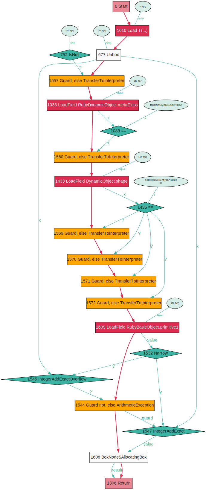</a>
</figure>

Most Ruby method calls are dynamically dispatched. This means that conceptually the method has to be looked up in the object each time. Most Ruby implementations will use a form of inline caching to make this simpler. Call sites store which method they expect to call for a given object, and then each time they check that the object is the same type as before and that the method has not been modified, which lets them go ahead and just call the method. In Truffle languages these inline caches are implemented using Java code, so instead of a single Java `Call` node, we have a call made up of many different Java nodes to implement the inline cache and call. I've disabled inlining of `instance_call` here, to make the logic for the inline cache stand out.

In the Ruby graph the `Call` node calls `callBoundary`, which is the generic Truffle method internal entry point. It passes in `MethodCallTarget`, which is the method to call (the `HotSpotOptimizedCallTarget` above it) and the arguments. These are complicated because it's a virtualized array, as described in the previous blog post, but follow it to the `Alloc` and then the input value - `T(8)`, which is the Truffle self argument, and `T(9)` which is the Truffle argument `x`, as we'd expect. Note that `x` is unboxed and reboxed here. That actually seems to not be optimised away - I'm not sure why. If we continue to follow the control-flow path back up we can see a the class being read out of the object in the `LoadField`, which is then compared against the cached class - the `C(instance:RubyClass)` - which is used as input to a guard. If the guard fails, we transfer to interpreter (deoptimise).

So what is the overhead of the dynamic dispatch and inline caching. Really it's loading the class address and comparing it against a known value. That's it. The arguments have to be allocated in a Java array as well, and passed all through in one Java parameter. This is a big difference and means every method call allocates memory.

We also have an `unwind` control flow edge coming out of our call. All Truffle methods can throw an exception, but here we just transfer to the interpreter.

## Control flow

```java
private static int exampleIf(boolean condition, int x, int y) {
    final int a;
    if (condition) {
        intField = x;
        a = x;
    } else {
        intField = y;
        a = y;
    }
    return a;
}
```

<figure>
<a href="exampleIf@6.svg">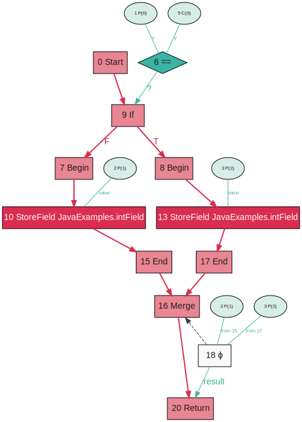</a>
</figure>

```ruby
def example_if(condition, x, y)
  if condition
    Primitive.blackhole x
    a = x
  else
    Primitive.blackhole y
    a = y
  end
  a
end
```


<figure>
<a href="example_if@4.svg">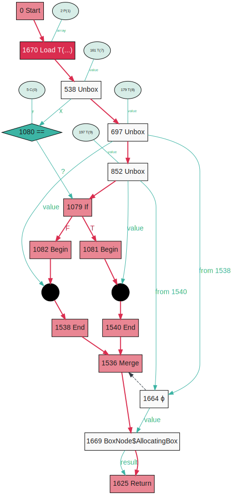</a>
</figure>

We use `Primitive.blackhole` to stop the program optimising away - it consumes a value in a way that is never elided. It's represented as the black circle in the graph. If you look at the `If` node, it points to an `==` between an unboxed `T(8)` and `C(0)`, which is the same as what the Java code does. The ϕ at the bottom is the same as well. Again, Ruby's `if` has more complex semantics than Java's, with the concepts of truthiness and falseiness, but here it compiles to the same as the Java code.

<figure>
<a href="example_if_never_taken@4.svg"></a>
</figure>

If we never use the `false` branch, Ruby's `else` case is optimised away exactly as in Java, and replaced with a `Guard` which transfers to interpreter.

```java
private static int exampleIntSwitch(int value, int x, int y, int z) {
    final int a;
    switch (value) {
        case 0:
            intField = x;
            a = x;
            break;
        case 1:
            intField = y;
            a = y;
            break;
        default:
            intField = z;
            a = z;
            break;
    }
    return a;
}
```

<figure>
<a href="exampleIntSwitch@6.svg"></a>
</figure>

```ruby
def example_int_switch(value, x, y, z)
  case value
  when 0
    Primitive.blackhole x
    a = x
  when 1
    Primitive.blackhole y
    a = y
  else
    Primitive.blackhole z
    a = z
  end
  a
end
```

<figure>
<a href="example_int_switch@4.svg">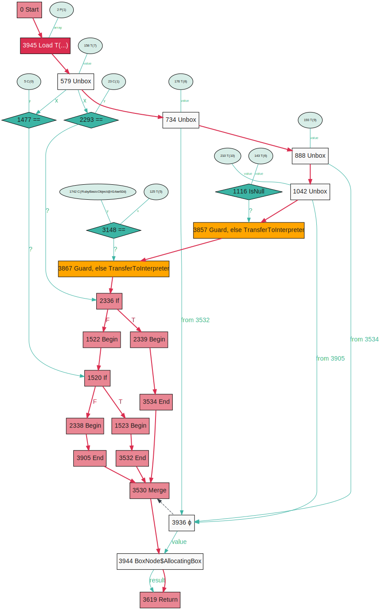</a>
</figure>

Ruby's `switch` statement as called `case`, and conceptually they apply a series of `===` comparisons against each case. We can see this in the graph, where we do have a chain of two `If` nodes rather than a Java `IntegerSwitch` node. <!-- Could it use `IntegerSwitch`? -->

```java
private static int exampleStringSwitch(String value, int x, int y, int z) {
    final int a;
    switch (value) {
        case "foo":
            intField = x;
            a = x;
            break;
        case "bar":
            intField = y;
            a = y;
            break;
        default:
            intField = z;
            a = z;
            break;
    }
    return a;
}
```

<figure>
<a href="exampleStringSwitch@6.svg">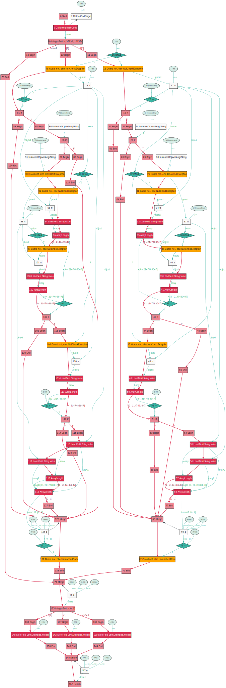</a>
</figure>

```ruby
def example_string_switch(value, x, y, z)
  case value
  when 'foo'
    Primitive.blackhole x
    a = x
  when 'bar'
    Primitive.blackhole y
    a = y
  else
    Primitive.blackhole z
    a = z
  end
  a
end
```

<figure>
<a href="example_string_switch@4.svg">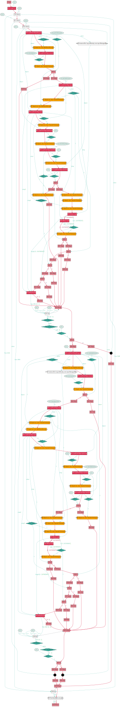</a>
</figure>

Switching on a string is another interesting example of a surprising symmetry with Java. In Java we switched on the hash code and then had a tree of a chain of comparisons, first checking if the character array lengths are equal and only then checking the actual bytes. Ruby's strings also have an encoding, so we check the encoding, the length, the hash code, and then the character array length and actual bytes.

## Loops

```java
private static int exampleWhile(int count) {
    int a = count;
    while (a > 0) {
        intField = a;
        a--;
    }
    return count;
}
```

<figure>
<a href="exampleWhile@6.svg">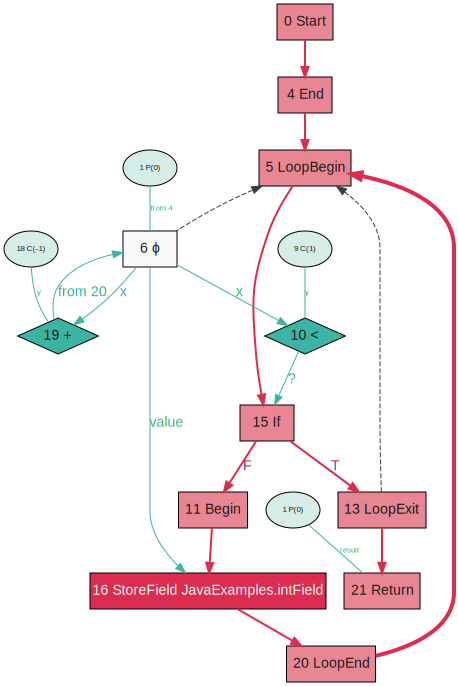</a>
</figure>

```ruby
def example_while(count)
  a = count
  while a > 0
    Primitive.blackhole a
    a -= 1
  end
  count
end
```

<figure>
<a href="example_while@4.svg">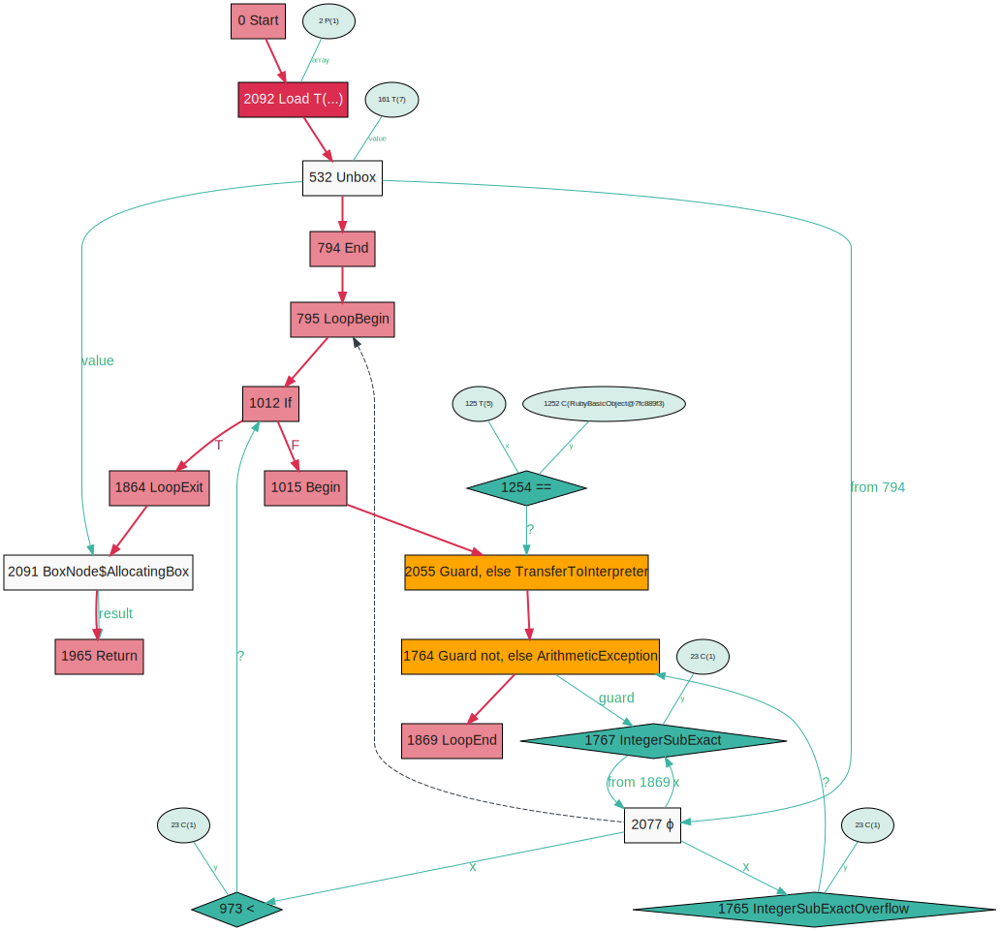</a>
</figure>

Ruby's `while` loop in Truffle is exactly the same as Java's, just for the call we've used to escape the value and the arithmetic checking for overflow. Critically, shape of the red control-flow edge loop is the same.

```java
private static int exampleFor(int count) {
    for (int a = count; a > 0; a--) {
        intField = a;
    }
    return count;
}
```

<figure>
<a href="exampleFor@6.svg"></a>
</figure>

```ruby
def example_for(count)
  count.times do |a|
    Primitive.blackhole a
  end
end
```

<figure>
<a href="example_for@4.svg">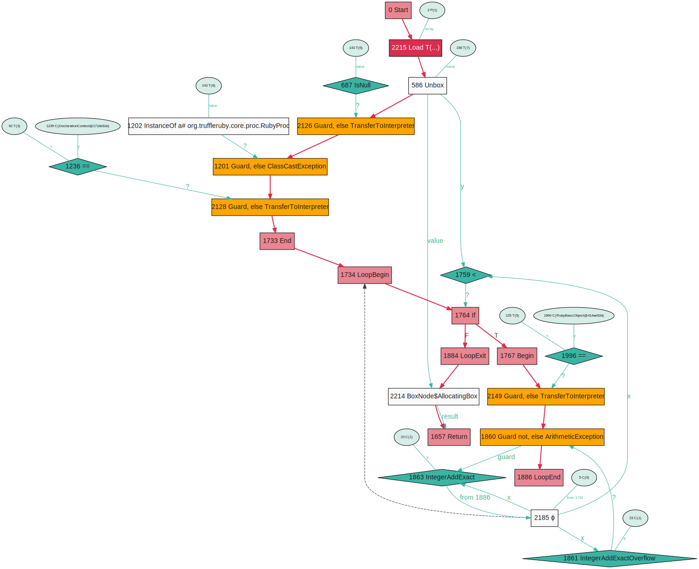</a>
</figure>

As in Java, the Ruby `for` loop looks very much like the `while` loop. But that's pretty extraordinary actually - Ruby's `for` loop is a higher-order function, `count`, which takes a block (anonymous function) to call back to that many times. The anonymous function is also a closure, capturing `count`. Yet the result of all that indirection and abstraction is partially-evaluated away here to give us code with the same structure as the Ruby `while` loop, and in fact with the same structure as the Java `while` loop.

```ruby
def example_nested_while(count)
  a = count
  while (a > 0)
    y = count
    while (y > 0)
      Primitive.blackhole a
      y -= 1
    end
    a -= 1
  end
  count
end
```

<figure>
<a href="example_nested_while@4.svg">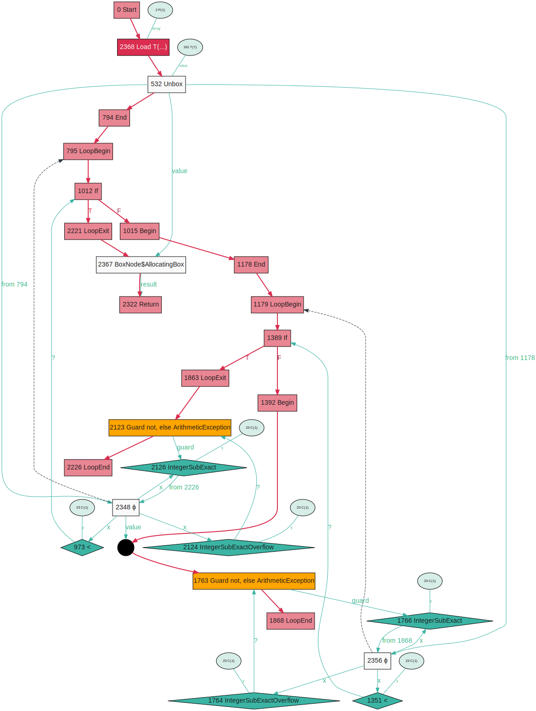</a>
</figure>

Nested `while` loops form nested control-flow path loops, exactly as in Java.

```ruby
def example_while_break(count)
  a = count
  while a > 0
    if a == 4
      break
    end
    Primitive.blackhole a
    a -= 1
  end
  count
end
```

<figure>
<a href="example_while_break@4.svg">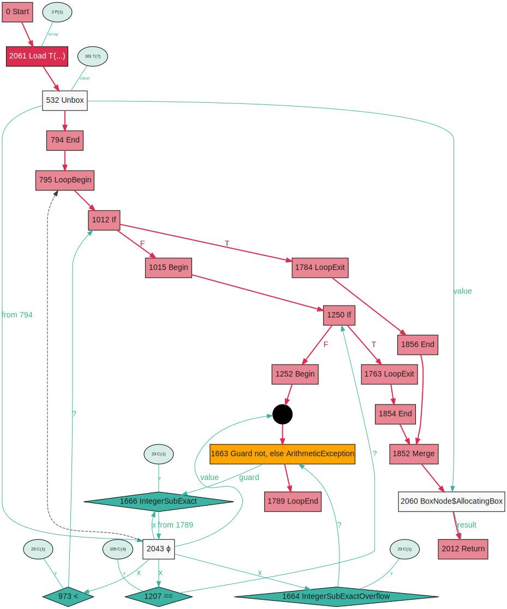</a>
</figure>

`break` from a `while` loop gives us a `LoopEnd`, exactly as in Java. Note however that the Truffle interpreter for Ruby implements `break` using an exception, as it has to jump out of the `break` interpreter node to the root of the `while` interpreter node. Truffle's partial evaluator has replaced the `throw` and `catch` with a direct `LoopEnd` node, and removed the overhead of the exception jump entirely.

## Objects

```java
private static ExampleObject exampleObjectAllocation(int x) {
    return new ExampleObject(x);
}
```

<figure>
<a href="exampleObjectAllocation@6.svg">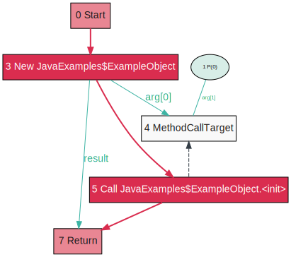</a>
</figure>

```ruby
def example_object_allocation(x)
  ExampleObject.new(x)
end
```

<figure>
<a href="example_object_allocation@4.svg">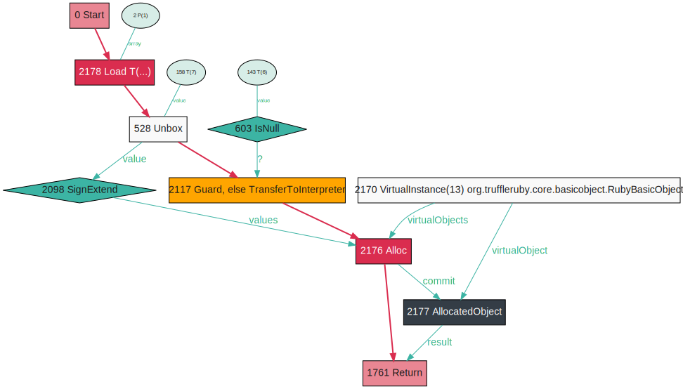</a>
</figure>

Allocation of a Truffle object isn't much more complicated than in Java. An `Alloc` node creates an instance of a `RubyBasicObject`. The value of `x` is unboxed and then stored in the object. Note how it isn't reboxed, as it's being stored into a primitive slot. <!-- The pattern of `Alloc`, `VirtualInstance`, and `AllocatedObject` is used rather than a simple `New` because.... -->

```java
private static int[] exampleArrayAllocation(int x, int y) {
    return new int[]{x, y};
}
```

<figure>
<a href="exampleArrayAllocation@6.svg">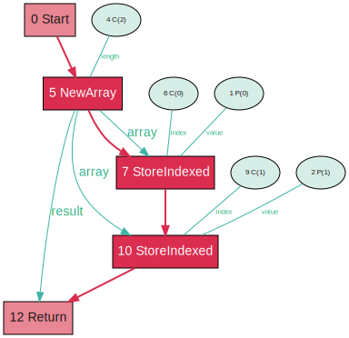</a>
</figure>

```ruby
def example_array_allocation(x, y)
  [x, y]
end
```

<figure>
<a href="example_array_allocation@4.svg">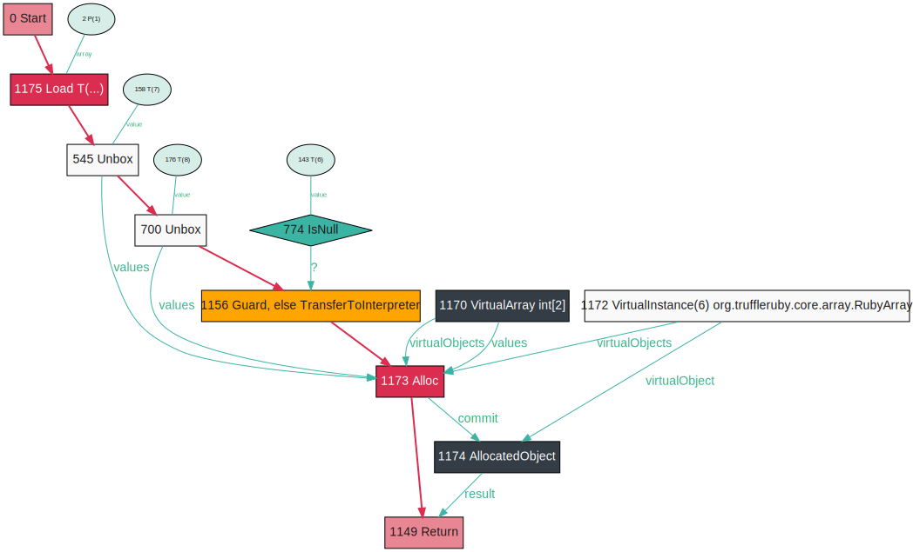</a>
</figure>

The pattern is similar for allocation of a Ruby array. The Ruby object is also now referring to a second Java object - the actual `int[]` storage for the array, which is where the unboxed `x` and `y` go.

In Java, object field and array element reads and writes were represented with single nodes.

<figure>
<a href="exampleFieldRead@6.svg"></a>
<a href="exampleFieldWrite@6.svg">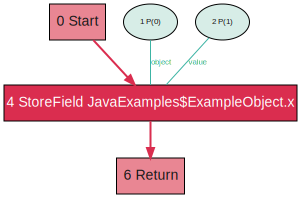</a>
<a href="exampleArrayRead@6.svg"></a>
<a href="exampleArrayWrite@6.svg"></a>
</figure>

```ruby
def example_field_read(object)
  object.x
end
```

<figure>
<a href="example_field_read@4.svg">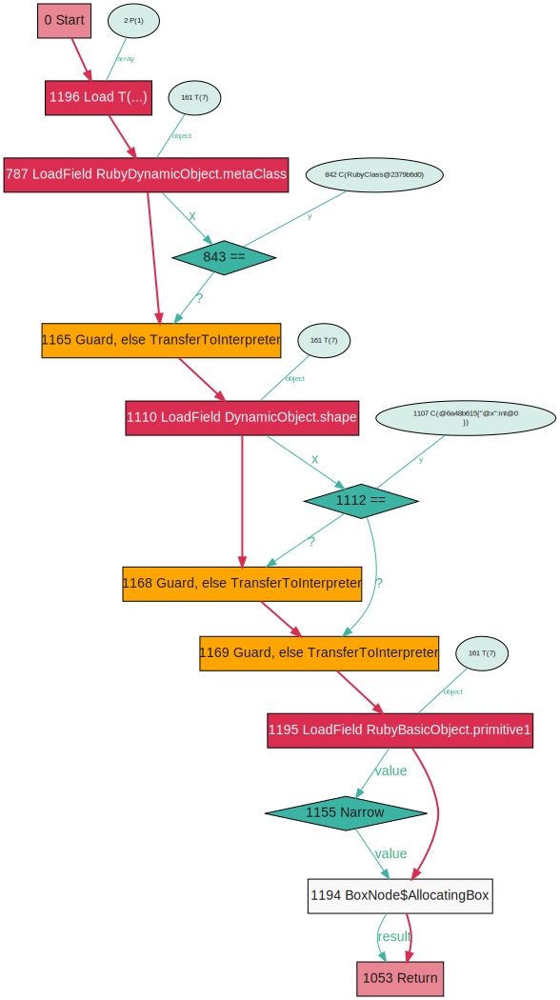</a>
</figure>

In Ruby, a field read is similar to a method call because they both use the same inline caching technique. There is a chain of guards to check that the object's layout is as expected from previous calls, following by reading a field from the object.

```ruby
def example_array_read(array, n)
  array[n]
end
```

<figure>
<a href="example_array_read@4.svg">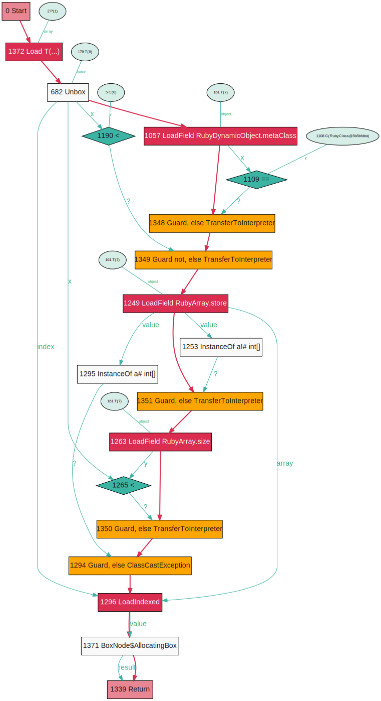</a>
</figure>

Array reads are also similar, but because the store is an object within the array object, we have to read that as well.


```ruby
def example_field_write(object, x)
  object.x = x
end

def example_array_write(array, n, x)
  array[n] = x
end
```

<figure>
<a href="example_field_write@4.svg"></a>
<a href="example_array_write@4.svg"></a>
</figure>

Field and array writes have the same chain of guards and then the same write node as in Java. However this in the case where the object already has a field or element of that type.

Note that in all the above cases reading and writing these fields and array elements are actually method calls that have been inlined.


```java
private static boolean exampleInstanceOfOneImpl(Object x) {
    return x instanceof InterfaceOneImpl;
}
```

<figure>
<a href="exampleInstanceOfOneImpl@6.svg"></a>
</figure>


```ruby
def example_instance_of(x)
  x.is_a?(ExampleObject)
end
```

<figure>
<a href="example_instance_of@4.svg">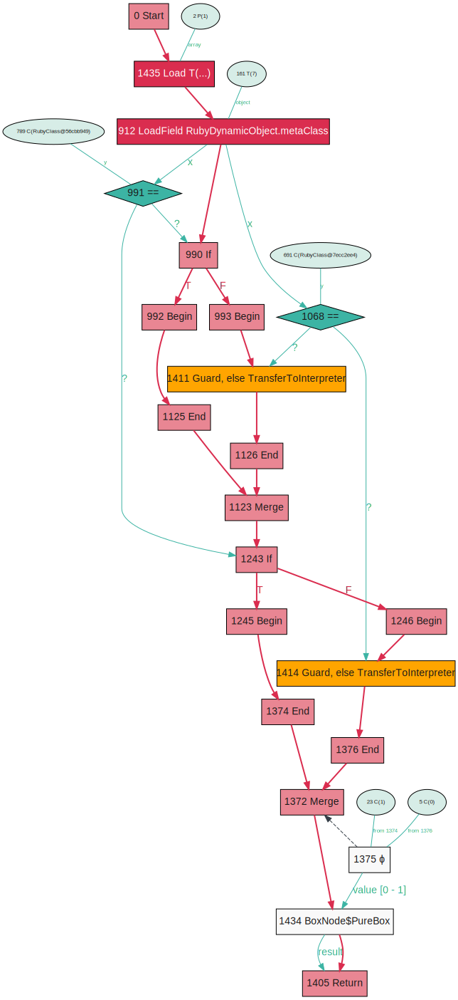</a>
</figure>

`instanceof` (`is_a?` in Ruby) is implemented in Ruby much like the inline caching - a comparison against the expected class. We get some redundancy here, as looking up the method `is_a?` is one check, and then the check itself is another.

## Stamps and escape analysis

```java
private static int exampleStamp(int x) {
    return x & 0x1234;
}
```

<figure>
<a href="exampleStamp@6.svg"></a>
</figure>

```ruby
def example_stamp(x)
  x & 0x1234
end
```

<figure>
<a href="example_stamp@4.svg"></a>
</figure>

Stamps work the same way in Java and Truffle. You get them for free for your Truffle interpreter. Here we can see the same `[0 - 4660]` applied on the edge coming out of the `%` in graphs for both languages. 

```java
private static int exampleNoEscape(int x) {
    final int[] a = new int[]{x};
    return a[0];
}
```

<figure>
<a href="exampleNoEscape@33.svg">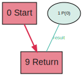</a>
</figure>

```ruby
def example_no_escape(x)
  a = [x]
  a[0]
end
```

<figure>
<a href="example_no_escape@4.svg">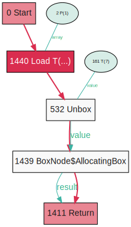</a>
</figure>

Escape analysis also works the same in both languages. If we allocate an array, write a value into it, and then read the value back out, in both Java and Truffle graphs the object completely disappears and the value read from the array is short-cut and directly connected to the source of the value going in. Again you get this extremely powerful and sophisticated optimization for free in your Truffle interpreters.

## Exceptions

I'm not going to show any graphs for throwing (`raise` in Ruby) an exception, because they're extremely complicated. Ruby exceptions always escape because the most recent exception is stored in a globally accessible variable. Storing guest-language stack information is also complicated. Even the code for catching (`rescue` in Ruby) an exception is complicated as it needs to do some of the work of filling in the exception.

## Summary

We can learn three things from these graphs. First we can clearly see the overhead that Ruby's semantics add when they're expressed in terms of Java, because we can see exactly what nodes are added over Java. For example all integer operations detecting overflow means we see the nodes for that rather than simpler nodes. Secondly we can clearly see the overhead of a Truffle interpreter - for example the arguments coming in from an array rather than normal Java parameters. Finally I think we can see some ways to improve how we understand these graphs - for example the idea of showing Truffle arguments as `T(n)` nodes. It doesn't matter that this isn't how the compiler is really understanding them if what we're trying to do is make sense of the graphs to see where they could be optimised.

A key problem we have at Shopify is the sheer size of these graphs. If every little field write or array read creates tens of nodes, the whole graph becomes extremely hard to understand, even for simple programs.

## Notes

Where we show Ruby example methods, the methods are being called in a loop with random input, such as:

```java
loop do
  example_local_variables RANDOM.rand(1000), RANDOM.rand(1000)
  example_local_variables_state RANDOM.rand(1000), RANDOM.rand(1000)
end
```

*On-stack-replacement* (compiling loop bodies independently) is disabled, in order to constrain compilation units to the method as expressed in the source code. Unlike in the previous Java blog post, *inlining* is not disabled in general, because it's such a core part of effectively compiling Ruby. Inlining of some helper methods was disabled manually. The random input prevents value profiling from turning parameters into constants.


