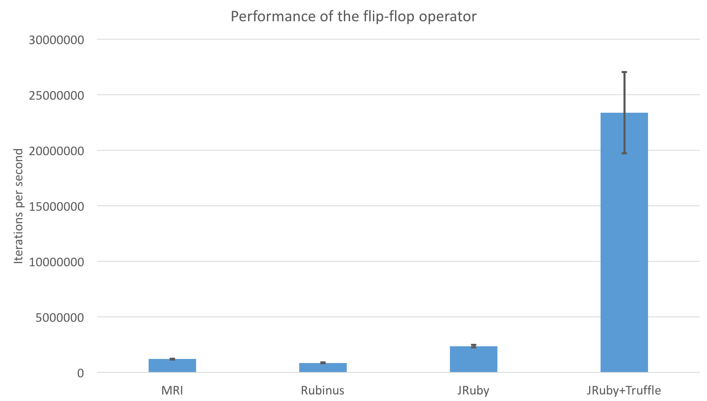

The Ruby [flip-flop operator](https://blog.newrelic.com/engineering/weird-ruby-part-3-fun-flip-flop-phenom/) is an example of a very obscure part of Ruby. Probably few people have heard of it. It’s not covered in any book I’ve read and it doesn’t even appear to be mentioned in the old ISO standard.

Briefly, it’s a form of `if` with two conditions, using syntax that looks like a range literal. It’s usually run in some kind of loop. The body is not executed until the first condition becomes true, and then it is executed again until the second condition becomes true, at which point it the body is not executed again. You can use it to count the number of days between Tuesday and Thursday, for example.

```ruby
DAYS = [:mon, :tue, :wed, :thur, :fri, :sat, :sun]

count = 0

DAYS.each do |day|
  if day == :tue .. day == :thur
    count += 1
  end
end
```

The name 'flip-flop' comes from the [electrical component](https://en.wikipedia.org/wiki/Flip-flop_(electronics)) that has a similar function, and the functionality in Ruby comes from Perl, as do many of Ruby’s more obscure features.

Some people think that the flip-flop operator is so little-known and rarely used, or perhaps not useful or even confusing, that it should be removed from Ruby. I’m interested in research on how Ruby is used in practice so I decided to see what the facts really are. To do this I have a large corpus of Ruby code on a machine, mirrored from RubyGems and extracted to be easy to query. This comprises around 1.6 billion lines of Ruby code.

I found the flip-flop operator actually being used in just 8 gems, on a total of 10 lines. These all appear to be hand-written lines, not generated code. I also found the operator used in test cases, but only those that were specifically testing the flip-flop operator such as in the Rubinius compiler gems.

The gems are `tailor`, a static analysis tool that helps you follow style guides. It uses flip-flops in 3 places which are all pretty sensible applications of the operator where it wants to make a predicate on code that is between two tokens [[1]](https://github.com/turboladen/tailor/blob/5fea7a7093c2ce2657d504e601942786eea3a3e5/lib/tailor/rulers/allow_conditional_parentheses.rb#L47), [[2]](https://github.com/turboladen/tailor/blob/5fea7a7093c2ce2657d504e601942786eea3a3e5/lib/tailor/rulers/allow_unnecessary_double_quotes_ruler.rb#L44), [[3]](https://github.com/turboladen/tailor/blob/develop/lib/tailor/rulers/allow_unnecessary_interpolation_ruler.rb#L59).

```ruby
tokens.select do |t|
  true if (conditional?(t))..(lparen?(t))
end.tap { |t| t.shift; t.pop }
```

```ruby
tokens.select do |t|
  true if (double_quote_start?(t))..(double_quote_end?(t))
end.slice_before { |t| double_quote_start?(t) }.reject { |q| q.empty? }
```

```ruby
tokens.select do |t|
  true if (t[1] == :on_tstring_beg)..(t[1] == :on_tstring_end)
end.slice_before { |t| t[1] == :on_tstring_beg }
```

Secondly, `antlr3`, a Ruby parser written in the Antlr parser generator. Again this is idiomatic and clear use of the flip-flop and it’s being used in a similar way as in `tailor` [[4]](https://github.com/ohboyohboyohboy/antlr3/blob/17015ed8213ff1dd4152f5b7761962b2e5d31710/lib/antlr3/tree.rb#L1172).

```ruby
for node in @nodes
  if node == start ... node == stop
      # <-- hey look, it's the flip flop operator
    buffer << @adaptor.text_of( node )
  end
end
```

Thirdly, the `xmigra` gem, a tool for managing evolution of your database schema [[5]](https://github.com/rtweeks/xmigra/blob/20c41ec29055879b2798b92a3dce69504d189867/lib/xmigra/program.rb#L74).

```ruby
description.lines.each_with_index do |line, i|
  indent = if (i > 0)..(i == description.lines.count - 1)
    cmd_width + 3
  else
    0
  end
  puts(" " * indent + line.chomp)
end
```

There is also an `unless` flip-flop, which isn’t covered in the Ruby spec suite or the MRI tests, so I’m not even sure anyone knows that one exists, except for the author of `blue-shell` [[6]](https://github.com/pivotal-legacy/blue-shell/blob/c1d0c1fbfb1343d68bc10eb432e98ceb49ca6c12/lib/blue-shell/buffered_reader_expector.rb#L54). The same line appears in the `cf`, `static` and `vmc` gems.

```ruby
unless (c == "\e") .. (c == "m")
  if c == "\b"
    ...
  else
    ...
  end
end
```

And finally `lazy-enumerator`, which is obsolete as it was a back-port of some Ruby 2.0 functionality. It's also an interesting case as the upper bound is just `true` [[7]](https://github.com/headius/lazy_enumerator/blob/5a5a79c18e195d6980954637ce7e88fca2f19f78/lib/lazy_enumerator.rb#L66).

```ruby
each do |element|
  output.yield(element) unless yield(element)..true
end
```

The 1.6 billion lines I searched included all versions of all gems, and the operators I found appeared in several versions of these gems for a total count of 69 instances, or about 1 in every 23 million lines of Ruby code, or 1-in-10 million to round to an order of magnitude.

Another way to put it is that there are only 5 people who we can confirm have used a flip-flop in anger. Also, the total volume of code to implement flip-flops in JRuby+Truffle, the implementation of Ruby that I work on, is well in excess of the total volume of code we can observe in the wild using it. The total volume of text in blogs posts about the flip-flop is again far more than actual applications of it.

This isn’t an argument to remove the flip-flop operator. I often say that as a Ruby researcher and implementor I don’t have an opinion on the design of the Ruby language and I’m not going to advocate its removal just because it’s rarely used. Unlike some other Ruby language features like `Proc#binding`, I can’t imagine that flip-flops cause any implementation difficulties no matter what VM technology they're using, and if you aren’t using them then the fact that they exist shouldn’t slow down the rest of the language in any measurable way. I may not choose to add it if I was doing Ruby from scratch, but there’s no empirical reason to remove it now.

I benchmark a lot of things in Ruby, so I also decided to benchmark how fast flip-flops are. Of course the performance of flip-flops doesn't really matter since they’re so little used, but it may at least be academically interesting to see what the different implementations do with them. I tested MRI 2.3.0, Rubinius 3.14, and JRuby+Truffle at 05a8efa with GraalVM 0.10. When JRuby re-did their compiler for the new version 9.0 they didn't reimplement the operator and they haven't received any complaints yet, so I benchmarked JRuby 1.7.24 with `invokedynamic`, which is the last version where it worked. I used benchmark-ips 2.5.0 to run this benchmark which counts the number of days between Tuesday and Thursday, implemented using a flip-flop, and an equivalent version implemented using local variables directly.

```ruby
require 'benchmark/ips'

DAYS = [:mon, :tue, :wed, :thur, :fri, :sat, :sun]

Benchmark.ips do |x|

  x.iterations = 5

  x.report("flip-flop") do
    count = 0

    DAYS.each do |day|
      if day == :tue .. day == :thur
        count += 1
      end
    end

    count
  end

  x.report("flip-flop-manual") do
    count = 0
    counting = false

    DAYS.each do |day|
      if counting
        count += 1
        if day == :thur
          counting = false
        end
      else
        if day == :tue
          counting = true
          count += 1
        end
      end
    end
  end

  x.compare!

end
```

I’m using the new `iterations` option of `benchmark-ips` here because optimising implementations of Ruby like JRuby+Truffle interact badly with the transition from warmup to timing phases.

These are the results:

### MRI

&nbsp;

    Warming up --------------------------------------
               flip-flop    55.022k i/100ms
        flip-flop-manual    61.914k i/100ms
    ...
               flip-flop    64.635k i/100ms
        flip-flop-manual    68.925k i/100ms
    Calculating -------------------------------------
               flip-flop      1.215M (± 2.9%) i/s -      6.076M
        flip-flop-manual      1.510M (± 3.0%) i/s -      7.582M
    ...
               flip-flop      1.196M (± 3.0%) i/s -      6.011M
        flip-flop-manual      1.487M (± 3.8%) i/s -      7.444M

    Comparison:
        flip-flop-manual:  1487076.7 i/s
               flip-flop:  1195938.2 i/s - 1.24x slower

&nbsp;

### Rubinius

&nbsp;

    Warming up --------------------------------------
               flip-flop    32.911k i/100ms
        flip-flop-manual   276.779k i/100ms
    ...
               flip-flop    76.601k i/100ms
        flip-flop-manual   280.456k i/100ms
    Calculating -------------------------------------
               flip-flop    870.156k (± 4.0%) i/s -      4.366M
        flip-flop-manual      4.073M (± 1.9%) i/s -     20.473M
    ...
               flip-flop    850.735k (± 4.2%) i/s -      4.290M
        flip-flop-manual      3.883M (± 5.3%) i/s -     19.351M

    Comparison:
        flip-flop-manual:  3882623.5 i/s
               flip-flop:   850735.0 i/s - 4.56x slower

&nbsp;

### JRuby

&nbsp;

    Warming up --------------------------------------
               flip-flop   118.523k i/100ms
        flip-flop-manual   119.702k i/100ms
    ...
               flip-flop   120.787k i/100ms
        flip-flop-manual   125.987k i/100ms
    Calculating -------------------------------------
               flip-flop      2.315M (± 3.6%) i/s -     11.596M
        flip-flop-manual      2.483M (± 3.5%) i/s -     12.473M
    ...
               flip-flop      2.356M (± 4.6%) i/s -     11.837M
        flip-flop-manual      2.416M (± 4.5%) i/s -     12.095M

    Comparison:
        flip-flop-manual:  2416249.8 i/s
               flip-flop:  2356372.7 i/s - same-ish: difference falls within error

&nbsp;

### JRuby+Truffle

&nbsp;

    Warming up --------------------------------------
               flip-flop   498.000  i/100ms
        flip-flop-manual     5.567k i/100ms
    ...
               flip-flop    24.581k i/100ms
        flip-flop-manual    21.477k i/100ms
    Calculating -------------------------------------
               flip-flop     23.964M (± 12.3%) i/s -     94.883M
        flip-flop-manual     21.356M (± 7.2%) i/s -     90.891M
    ...
               flip-flop     23.380M (± 15.7%) i/s -    109.484M
        flip-flop-manual     20.719M (± 13.4%) i/s -     97.055M

    Comparison:
               flip-flop:  23380294.1 i/s
        flip-flop-manual:  20719019.5 i/s - same-ish: difference falls within error

&nbsp;

{: .center-image }

&nbsp;

Rubinius is even slower than MRI at flip-flops, even with its JIT. JRuby is about twice as fast as MRI, and JRuby+Truffle an order of magnitude faster than that.

Using a flip-flop is 24% slower in MRI than using local variables directly, which is understandable as MRI without a JIT has very little opportunity to remove abstraction. It’s also a lot slower in Rubinius. Both JRuby and JRuby+Truffle use a JIT to remove the abstraction, and so there is no significant difference between the two forms.

I tried to benchmark `topaz` but I was unable to get it to run `benchmark-ips`, even with a few fixes.

Kevin Menard reviewed a draft and suggested I look at uses of `unless` flip-flops. The [flip-flop schematic](https://commons.wikimedia.org/wiki/File:RS_Flip-flop_%28NOR%29.svg) is by [inductiveload](https://commons.wikimedia.org/wiki/User:Inductiveload) and is in the public domain.


