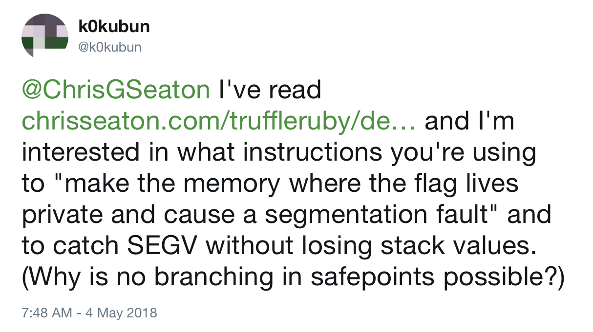

A few weeks ago, [Takashi Kokubun](https://twitter.com/k0kubun), one of the people working on the new JITs being developed for Ruby, asked me about how TruffleRuby was able to detect if optimised code that is already running was no longer valid without any branching.

<a href="https://twitter.com/k0kubun/status/992415679188951043"></a>

This blog post explains what he is asking about, how Ruby implementations currently solve the problem, the technique TruffleRuby uses to solve the problem, how it could be implemented in MRI's new JITs, and why it's important for Ruby optimisation in general.

## Guarding

One of the major reasons that languages like Ruby, JavaScript, and Python are slower than more static languages is that there are a lot of *what-ifs* that need to be considered.

Even in a trivial Ruby method that adds together two numbers you need to consider:

* What if someone has monkey patched the add operator?
* What if another thread is trying to kill or raise an exception in this thread?
* What if this thread has timed out?
* What if tracing is enabled?
* What if a debugger is attached?

In simpler implementations of Ruby, these *what-ifs* take the form of a lot of `if` statements. We call these *guards*. We have a simpler case for when things are normal, and a more complicated and slower case for when unusual things have been turned on. The guard is the condition that chooses between the *fast-path* and the *slow-path*, as they're called.

Here's some examples of guards.

In MRI the specialised string-freeze instruction guards that the `String#freeze` method has not been monkey patched. If it hasn't the fast-path just returns the string. If it has been monkey patched, the slow-path calls the method as normal.

```c
if (BASIC_OP_UNREDEFINED_P(BOP_FREEZE, STRING_REDEFINED_OP_FLAG)) {
  val = str;
}
else {
  val = rb_funcall(rb_str_resurrect(str), idFreeze, 0);
}
```

In Rubinius, the `thread_interrupted_p` method is regularly called to check a flag to see if a thread is supposed to raise an exception or be killed.

```c++
bool thread_interrupted_p(State* state) {
  if(check_local_interrupts()) {
    return check_thread_raise_or_kill(state);
  }

  return false;
}
```

In JRuby, `Array#sort` has a special case for when the `<=>` operator has not been redefined. It checks the redefinition once, and then stores a variable to say which path to use later on.

```java
protected IRubyObject sortInternal(final ThreadContext context,
      boolean honorOverride) {
    ...
    final boolean fixnumBypass = !honorOverride
      || runtime.getFixnum().isMethodBuiltin("<=>");
    final boolean stringBypass = !honorOverride
      || runtime.getString().isMethodBuiltin("<=>");
    if (fixnumBypass
          && o1 instanceof RubyFixnum
          && o2 instanceof RubyFixnum) {
        compare = compareFixnums((RubyFixnum) o1, (RubyFixnum) o2);
    } else if (stringBypass
          && o1 instanceof RubyString
          && o2 instanceof RubyString) {
        compare = ((RubyString) o1).op_cmp((RubyString) o2);
    } else {
        compare = compareOthers(context, o1, o2);
    }
    ...
}
```

As Ruby implementations become more sophisticated, more guards are added. For example, if a method parameter in TruffleRuby only ever sees one value, it will assume that this will always be the value, turn it into a constant, and will guard that it is still this value each time the method is called.

The *slow-path* that is taken if the guard fails can be code that is general enough handle any features being enabled, or for just-in-time compiled code it could be a *deoptimisation*, which means to not try to handle it at all and instead to jump from that point into an interpreter which will continue the execution. This way the optimised code doesn't even need to consider the slow-path - it can delegate handling it to someone else and just *guard* against it needing to do that.

This *deoptimisation* is described in the blog post that Kokubun is asking about in the Tweet.

## Interrupting

As there are a lot of guards needed in Ruby, and as we said increasingly sophisticated Ruby optimisations will need even more guards, an idea is to combine all the guards into one.

Instead of running code to check that things have not changed, such as someone monkey patching a method, the idea of *interruption* is that we turn this around and say that the optimised code is going to run, and if you want to monkey patch a method, then you need to interrupt the optimised code and tell it things have changed and perhaps have it replaced with either slow-path code, or to jump into an interpreter.

You can also think about this as being one big guard that says *has anything changed since I was compiled*. Then there's a single slow-path which actually looks into what has changed and updates the code to handle this. We'll call this the *interruption guard*. This is better because the check is done once to cover all the guards that we needed before.

A downside may be that this may be less granular, but we won't worry about that in this blog post.

It's this interruption guard mechanism that Kokubun wants to implement.

## Interrupting loops

Something important to note is that you need the have the interruption guard often enough in your compiled code that the compiled code will not run for very long without checking the guard.

Code that wants to trigger the interrupt has to wait until the code being interrupted realises this, so if we don't check the interrupt regularly enough we risk causing unbounded latency.

Specifically, it's not good enough to check for interruptions once per method call. In the extreme case, consider an infinite loop that is only broken by another thread monkey patching a Ruby method (I'm not arguing this is good code design - but we need to think about how to be correct for all valid Ruby code, not just Ruby code we approve of from a good-practice standpoint). We will need to check inside loops as well.

This will cause some complexity later on.

## Simple implementation

The simplest way to implement this interruption guard is another `if` statement, but just one rather than the multiple guards we had earlier. We'll have a single variable that is a global interruption flag.

```c
if (interrupt_flag) {
  // ...use the slow path
} else {
  // ...use the fast path
}
```

There a couple of problems with the simple implementation, although they are mostly mitigated by the sophisticated hardware in your processor.

Firstly it takes a couple of instructions to implement this. In a typical AMD64 machine like many of your servers and laptops will be, we can compile this to a compare against `true` (`test` against `1` in machine code), and a jump if they were equal.

```
test   $0x1, interrupt_flag
je     slow_path
```

Intel architectures will actually dynamically combine these two instructions in something called *macro-fusion*, and they'll be executed as if it was a single `test+je` instruction. However, doing that takes resources in the processor's decoders which could have been used to run the user's code instead.

*Intel 64 and IA-32 Architectures Optimization Reference Manual, April 2018, 3.4.2.2*

A second problem is that the `je` branch instruction interrupts the control flow of the method. The processor is continually looking ahead and starting to execute instructions ahead of time if it can. When it reaches a branch it does not know which way to look ahead.

To mitigate this, processors will predict if the branch will be taken or not, and will look ahead down that branch until it is either proven correct, or proven wrong, in which case it reverts the progress it has made so far on executing the branch.

By default, Intel architectures will predict that a forward branch will not be taken, so we always put the deoptimisation branch forward of the interruption guard. When the branch has been seen once before, the processor will remember whether it was taken or not to improve on that static prediction. However this is then another waste of resources that could be used to run the user's code instead.

*Intel 64 and IA-32 Architectures Optimization Reference Manual, April 2018, 3.4.1.3*

## Using memory protection

A better solution is possible, and it's to interrupt the running code by *causing it to crash*. Instead of branching to slow-path code, we will make the code that handles a crash the slow-path code.

To crash the code we will have the interruption guard access a region of memory. Normally the memory is readable and writable. When we wanted to crash we change the permission of the memory so that the next access becomes an error, similar to something like a null pointer dereference, or segmentation fault (the `SEGV` that Kokubun refers to in the Tweet.) To catch the crash we install a signal handler that calls a function we specify instead of the default behaviour of exiting the program. Inside this handler we can do whatever we want - we could jump back out of the function to a different version that handles the slow path, and we can even read the stack if we want to, to recover local variables that were active at the time.

We call the region of memory that we change the permissions of the *polling page*. It's allocated using the `mmap` system call which allows us to specify permissions, and `mprotect` which allows us to change the permissions after the page already exists. It's the processor hardware which enforces this memory protection, and the protection checks are applied to all memory access in the system, so they are extremely well optimised.

The access could be either a read or a write, but another option is to use the same `test` instruction as we used in the simple version. Unlike a read, the `test` version doesn't need a register to put the value into, meaning it cannot be used for the user's code, and unlike a write, the `test` version doesn't modify the polling page, causing thrashing of the page's cache line between cores.

## Demonstration

I've implemented the basic ideas here as a C program, since MRI is implemented in C.

I've written a long-running matrix-multiply routine.

```c
void uninterruptible_matrix_multiply(int size, double *a, double *b, double *c) {
  for (int i = 0; i < size; i++) {
    for (int j = 0; j < size; j++) {
      double sum = 0;
      for (int k = 0; k < size; k++) {
        sum += a[i*size + k] * b[k*size + j];        
      }
      c[i*size + j] = sum;
    }
  }
}
```

We'll make everything a bit more abstract here and say that we just want to interrupt this function in general. In Ruby it could be because that `Double#*` operator has been monkey patched, or because `set_trace_func` has been enabled, but here we'll just think about the general need for interruption.

This version of the function cannot be interrupted - it just runs from start to finish.

We can then implement a version of the function that is interruptible, by checking a flag variable on each iteration of the inner loop. If the flag variable is set, we jump out of this function, into a special handler which will then handle whatever it was that caused us to be interrupted. `longjmp` is like an exception raise in C - in fact it's how exception raises are implemented in MRI.

We won't worry about how the method resumes after being interrupted.

```c
void flag_matrix_multiply(int size, double *a, double *b, double *c) {
  ...
      for (int k = 0; k < size; k++) {
        if (interrupt_flag) {
          longjmp(interrupt_handler, 1);
        }
        sum += a[i*size + k] * b[k*size + j];        
      }
  ...
}
```

To use memory protection instead, we need to install a callback to handle a protection failure. In Linux and macOS you can do this using the `sigaction` function. It takes the signal (error condition effectively) that you want to handle, and a function pointer to run on that error.

```c
static void setup_protection_handler() {
  struct sigaction action;
  action.sa_flags = SA_SIGINFO;
  action.sa_sigaction = protection_handler;
  if (sigaction(SIGBUS, &action, NULL) != 0) {
    fprintf(stderr, "error setting up segfault handler: %s\n", strerror(errno));
    abort();
  }
}
```

Our callback logs the event, and like the flag handler, uses `longjmp` to exit the method.

```c
static void protection_handler(int signum, siginfo_t *siginfo, void *context) {
  fprintf(stderr, "protection fault handled\n");
  ...
  longjmp(interrupt_handler, 1);
}
```

Our polling page is allocated using `mmap`. This is like a lower-level version of `malloc` that allocates memory directly from the kernel, not just from within your application. `mmap` also lets us set permissions for the memory. We'll say that we can read and write it.

```c
void setup_poll_page() {
  poll_page = mmap(
    NULL,
    sizeof(int),
    PROT_READ | PROT_WRITE,
    MAP_PRIVATE | MAP_ANONYMOUS,
    -1, 0);
  if (poll_page == MAP_FAILED) {
    fprintf(stderr, "error creating poll page: %s\n", strerror(errno));
    abort();
  }
  fprintf(stderr, "poll page installed to %p\n", poll_page);
}
```

When we are ready to interrupt the function, we want to change the permissions of the page so it triggers that protection handler. We say that we *invalidate* the page. We do this with the `mprotect` call that changes just the permissions of the page. We change it to have no permissions - any read or write will cause the protection handler to be run.

```c
static void invalidate_poll_page() {
  fprintf(stderr, "invalidating poll page\n");
  mprotect(poll_page, sizeof(int), PROT_NONE);
}
```

An extra step is then to reverse this in the protection handler, to reset the polling page.

```c
static void protection_handler(int signum, siginfo_t *siginfo, void *context) {
  ...
  mprotect(poll_page, sizeof(int), PROT_READ | PROT_WRITE);
  ...
}
```

Now we can write a version of the matrix multiply function that does a write to the polling page to trigger the interrupt when wanted. It doesn't matter what we write to the page - it's the triggering of the memory protection routine in the hardware that we want.

```c
void write_matrix_multiply(int size, double *a, double *b, double *c) {
  ...
      for (int k = 0; k < size; k++) {
        *((int *)poll_page) = 14;
        sum += a[i*size + k] * b[k*size + j];        
      }
  ...
}
```

To write the version of the interruption guard that uses `test` we'll have to write some inline assembler to get exactly what we want. There's some assembly code complexity here - we test against the `rax` register because we need to test against something, but it doesn't matter what is actually in the register. If we tested against a constant, even zero, that would take more bytes to encode. We also need to test against the poll page address, relative to the instruction pointer register `rip` because the address needs to be 32bit to fit into a short instruction encoding. Making it relative to the instruction address makes it short, while the absolute address could be very high.

```c
void test_matrix_multiply(int size, double *a, double *b, double *c) {
  ...
      for (int k = 0; k < size; k++) {
        __asm__("testq %rax, _poll_page(%rip)");
        sum += a[i*size + k] * b[k*size + j];        
      }
  ...
}
```

I roughly compared the performance of these three versions of the function, using a simple monotonic clock.

You can see the code for this at [https://github.com/chrisseaton/low-overhead-polling-ruby](https://github.com/chrisseaton/low-overhead-polling-ruby).

I found that the uninterruptbile version is fastest, running for a large matrix in 9.8s, but of course we cannot interrupt it so we can't run that. The version with the flag check runs in around 10.7s. The version with the write to the polling page runs in around 10.3s for me, and the version with the test in around 10.2s. So I couldn't actually reproduce much of a practical difference in this quick experiment - these numbers are more than hovering around the margin of error to be honest.

However, the developers of HotSpot and other researchers have concluded that the `test` on a polling page technique is best for them.

## Relation to threads

You may be wondering why do we need to guard for interruptions, when we're the ones making changes like monkey patching methods. Can't we jump out of our optimised code when we monkey patch a method?

The problem is threads - it could be another thread that causes you to need to interrupt your function. This is slightly less complicated in an implementation of Ruby such as MRI where there is a GIL which means switching between threads only happens under control of the VM, but in an implementation of Ruby like Rubinius which does not have a GIL you could be running a second thread truly in parallel.

## Relation to garbage collection

Another key reason that functions need to be interrupted is to perform garbage collection. Except for some extremely sophisticated garbage collectors with significant trade-offs, most garbage collectors want to pause all threads for part of their work so that the object graph is not changing out from under their feet while they do it. Using this interruption is how the threads are brought to a stop. They usually then do not jump out of the function - they just wait in the signal handler before resuming.

## Deoptimisation and safepoints

We've glossed over one of the most complicated parts of this which is hinted at in the original Tweet - 'without losing stack values'.

If you want to jump out of the function and then resume it again in a non-optimised or interpreted version, you are going to have to read the state of the function somehow, in order to recreate that state to resume running it. By state, we mean the local variables, the position in the function, things like that. We said that loops caused complexity, and it's because you need the interruption guard inside the loop so it needs to be inside the method's body, not just at the start where there is no state yet.

We can do this deoptimisation with our memory protection technique because we can just read the native stack from the handler. As long as we know how the function's local variables are laid out, we can reach into the stack and read them.

We often talk about places where we place an interruption guard as being *safepoints* because at these points in the function we make sure that all local variables and other state are in some known locations where we will be able to find them.

Unfortunately, making sure that we are able to understand the state of the function at least once per loop can sometimes limit the optimisations that are possible.

## Why this matters to Ruby

Low-overhead polling to implement interruption allows us to be more aggressive in optimising Ruby, because it allows us to reverse any optimisations which later prove to be wrong. This means we can use more powerful *speculative optimisations* which are hopefully correct, but could also prove to be wrong halfway through a method which uses them.

I think that this is where the real potential for optimising Ruby will be found.

## More notes

Virtual machines and just-in-time compilers are remarkably undocumented areas of technical knowledge. A lot of what we know only exists in source code and in the experience of individual engineers. There is only recently a good paper giving an overview of the area of polling.

*[Stop and Go: Understanding Yieldpoint Behavior](http://users.cecs.anu.edu.au/~steveb/downloads/pdf/yieldpoint-ismm-2015.pdf)*. Y. Lin, K. Wang, S. Blackburn, A. Hosking, and M. Norrish, ISMM 2015.

This paper somewhat confirms my experimental results and finds that the best technique can vary, as well as providing lots of other useful information about what else we can do.

The terminology in this area is also varied. We can call the method of interrupting functions *polling*, *yielding* or *safepoints*.

I have done some of my own research into safepoints, co-inventing a way to build on simple VM safepoints to run arbitrary user code inside a safepoint. Normally in a memory protection handler you cannot run anything non-trivial, and certainly not arbitrary user code.

*[Techniques and Applications for Guest-Language Safepoints](http://chrisseaton.com/truffleruby/icooolps15-safepoints/safepoints.pdf)*. B. Daloze, C. Seaton, D. Bonetta, H. Mössenböck, ICOOOLPS 2015.

Another technique to implement interruption is to modify the running code. `nop` empty instructions can be placed where the interruption guard is supposed to be, and then replaced with a `jump` instruction to the slow path when the interruption is needed. This can be very slow to trigger if you have a lot of code installed, however.

In our examples we put the poll in the innermost loop. A compiler would in practice probably choose to put the poll once per iteration of a loop that it was not sure would finish in a reasonable amount of time. There's no need for a poll in a loop that you know will finish in a millisecond, because the person interrupting can wait that long. Graal does this by looking at the complexity of the code in a loop body, and the maximum number of times it could possibly be run.

JRuby uses the same implementation technique described here as TruffleRuby does, as both implementations get this service from the JVM.

In the past I've said that the signal we use is a *segmentation fault*, `SIGSEGV`. It's actually a *bus error*, `SIGBUS`, but this doesn't make any practical difference.

I've [written and talked more about what deoptimisation means for Ruby](http://chrisseaton.com/truffleruby/deoptimizing/) back at RubyConf 2014.

Thanks to Kevin Menard and Al Chou for proof-reading.
