*This article originally appeared in the [Java Advent 2020](https://www.javaadvent.com/2020/12/seeing-escape-analysis-working.html).*

You may have heard of a compiler analysis phase called [*escape analysis*](https://en.wikipedia.org/wiki/Escape_analysis). It informs an optimisation called *scalar replacement of aggregates* that removes unnecessary allocation of Java objects. I find that people often have a misunderstanding of what this optimisation really does and an under-appreciation of what it's capable of. We can know it better by seeing it working in practice.

## Context

I'll be showing how the GraalVM compiler, as part of [GraalVM](https://graalvm.org/) and configured for just-in-time compilation in hosted configuration, applies escape analysis and scalar replacement of aggregates. The GraalVM compiler is more powerful in this regard than the most common just-in-time compiler that you are probably used to, C2 in HotSpot.

Note that every time I say *compiler* in this article, I'm meaning just-in-time compilation, so the kind of compilation that happens at runtime in the JVM. I don't mean the `javac` compiler.

I'll show how the compiler understands our example programs by looking at one of the data structures it uses during compilation, its higher *intermediate representation*. This is a graph that captures the meaning of a Java program as it is optimised and transformed before conversion to machine code starts. That probably sounds very advanced but I think for most people with some experience of Java it's actually quite an approachable way to understand what the compiler is doing.

This intermediate representation is different to an *abstract syntax tree*, or *AST*, which is a syntactic representation of the text in your program. It's also different to a *call graph*, which just tells you which methods call which other methods.

I'll be using a tool called [Seafoam](https://github.com/Shopify/seafoam/), from Shopify's language implementation team, to create diagrams of the data structures dumped out of Graal. You could also use a tool called the *Ideal Graph Visualizer* from Oracle Labs.

## Terminology

*Escape analysis* is an analysis process. It detects if an object is visible outside of a compilation unit (a *compilation unit* is usually a method plus any other methods inlined into it.) An object can become visible outside a compilation unit by being returned, or passed as an argument to another method, or written to a field, or similar.

*Scalar replacement of aggregates* uses the result of escape analysis and works on objects that do not escape the compilation unit, or only escape it on some branches. It replaces objects (*aggregates*) with simple values (*scalars*) similar in effect to local variables. We'll see this more concretely later on.

## Object allocation

We'll work with a simple `Vector` class that holds `double` `x` and `y` fields. It has a constructor, getters, and an `add` method that returns a new object that is this `Vector` added to another.

```java
class Vector {

    private final double x;
    private final double y;

    public Vector(double x, double y) {
        this.x = x;
        this.y = y;
    }

    public double getX() {
        return x;
    }

    public double getY() {
        return y;
    }

    public Vector add(Vector other) {
        return new Vector(x + other.x, y + other.y);
    }

}
```

I have a `main` method that runs a loop and calls a `sum` method that uses `add`.

to sum two randomly generated vectors. The loop is there to get the code hot enough to trigger just-in-time compilation, the randomization is there so that values are not profiled to be effectively constant, and the separate `sum` method is there to create a neat block of code to look at when looking at how code is compiled.

```java
public static void main(String[] args) {
    while (true) {
       sum(new Vector(Math.random(), Math.random()), new Vector(Math.random(), Math.random()));
    }
}

private static Vector sum(Vector a, Vector b) {
    return a.add(b);
}
```

I'll compile and run this using GraalVM CE on Java 8 20.3.0 on macOS on AMD64. I turn off an optimization called *on-stack replacement* because this optimization makes compilation a little more complicated and harder to understand. I then use Graal's `dump` option to ask it to dump out its intermediate representation data structures.

```
% PATH=graalvm-ce-java8-20.3.0/Contents/Home/bin:$PATH
% javac Vector.java
% java -XX:+PrintCompilation -XX:-UseOnStackReplacement -Dgraal.Dump=:2 Vector
```

We can now use Seafoam to look at how the compiler understands the `sum` method, right before it runs escape analysis. The file `sum.bgv` contains the data structure that the compiler dumped out for us.

```
% seafoam sum.bgv:14 render
```

<figure>
<a href="sum-before.svg">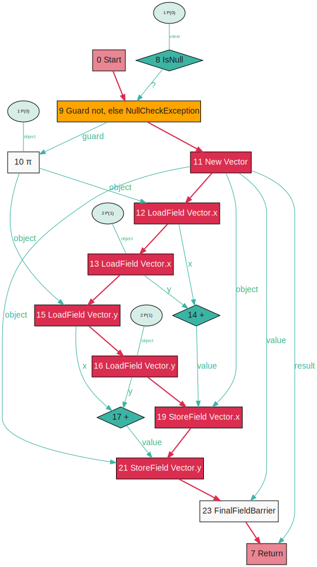</a>
</figure>

What are we seeing here? This graph is the way that Graal understands the `sum` method while it is compiling it. It's Java code, but free from the constraints of a textual representation. Operations are represented as nodes (the boxes, diamonds, and ovals) and the relationships between operations are represented as edges (the arrows). The thick red arrow means that one operation must happen before another. The thinner arrow means that the output of the operation is used as input to another operation.

We said the program was freed from the constraints of a textual representation. Look at the add operation in node 14 for example. We know it needs to happen after we load the two values from the two `x` fields, and before we store the value in the field `x` in node 19, but we don't care whether it happens before or after the two `y` fields are loaded. In Java textual source code, everything is written in one linear order. The graph relaxes this constraint and encodes only the constraints that the Java Language Specification actually requires. The compiler is then free to pick the final order everything runs in.

Reading this graph, we can see we create a new `Vector`, then load the two input objects' `x` and `y` fields, add them together and then store them into the new `Vector` we created before returning it. There are some extra details in the graph, such as the `null` check, the final field barrier, and more because this is a real compiler graph, but we'll ignore those for this article to keep it short.

The key thing to see here now is that there is a definite point where the new `Vector` object is created.

## Basic scalar replacement

Let's look at the same method right after escape analysis and scalar replacement of aggregates have run.

```
% seafoam sum.bgv:15 render
```

<figure>
<a href="sum-after.svg">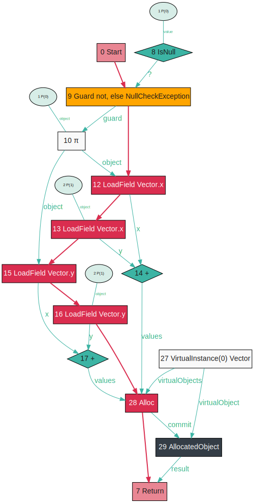</a>
</figure>

Now the graph has been even further relaxed from how it appears in text. Instead of a `New Vector` operation we have now decomposed it into a generic operation to allocate an object, taking the value of the fields of that object. There's no `StoreField` anymore here.

In this particular method, this hasn't achieved anything useful - the graph has been relaxed but it didn't reveal any really useful optimizations. That's because the only object we allocated really does need to be allocated because it leaves the method. The escape analysis has run but the object escaped so there was no scalar replacement of aggregates.

To take this further, let's look at a method which sums three `Vector` objects.

```java
private static Vector sum(Vector a, Vector b, Vector c) {
    return a.add(b).add(c);
}
```

<figure>
<a href="sum3-before.svg">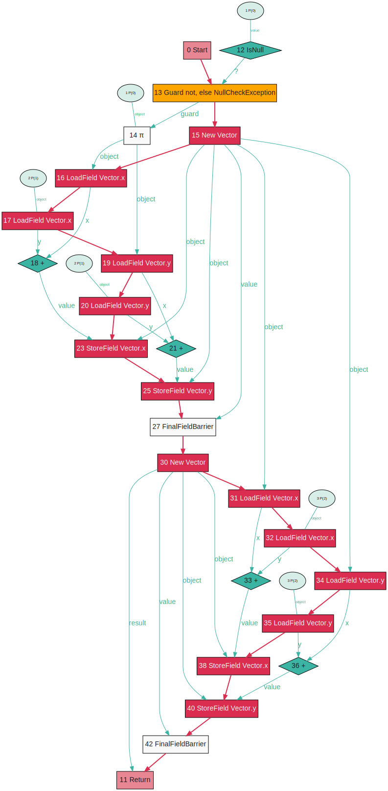</a>
</figure>

The graph before escape analysis and scalar replacement of aggregates has the same structure as the previous method. We have two `New Vector` operations. The result of `a.add(b)` is written into the first new object, and then read out again for the subsequent `.add(c)`. We can see how this is wasteful - the intermediate object is never visible outside of the compilation unit because it isn't stored or passed anywhere - so why allocate it and why store fields into it that we just immediately read out again?

<figure>
<a href="sum3-after.svg">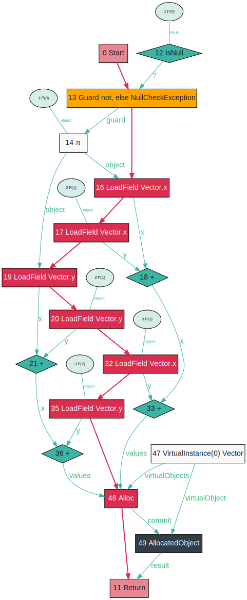</a>
</figure>

If we look at the graph after escape analysis and scalar replacement of aggregates we see that the intermediate `Vector` has been removed entirely. There is only one `Alloc`, not two. The *aggregate* of the intermediate object's fields has been replaced with the *scalar* values of edges directly connecting the producer and consumer, without doing an intermediate `StoreField` and then `LoadField`.

## The effectiveness of scalar replacement

A few more examples will show how this optimisation is a bit more powerful than people often assume.

If we sum an array of `Vector` objects we will be logically creating one `Vector` per iteration.

```java
private static Vector sum(Vector first, Vector... rest) {
    Vector sum = first;

    for (Vector vector : rest) {
        sum = sum.add(vector);
    }

    return sum;
}
```

<figure>
<a href="sumn-before.svg">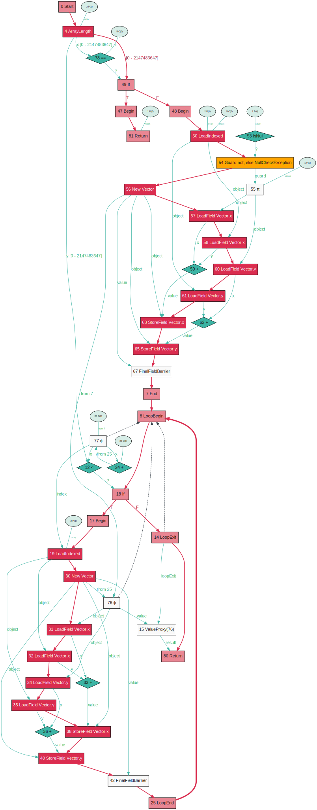</a>
</figure>

This graph is now pretty complicated, but the key point is you can see a `New Vector` operation inside the loop (inside the circle formed of thick red arrows.)

<figure>
<a href="sumn-after.svg">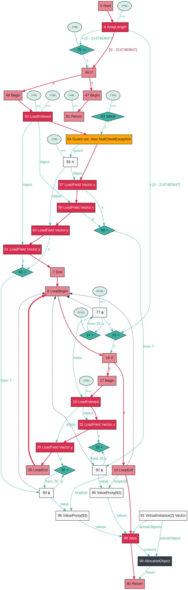</a>
</figure>

After partial escape analysis and scalar replacement of aggregates run there is now no `New Vector` inside the loop. There is a single allocation at the end for the final `Vector` that is returned, and the values for `x` and `y` are built up by accumulating values (the little loops around nodes 33 and 92, and nodes 36 and 93.) This means no memory is allocated anymore in the inner-loop of this method.

Sometimes people talk about objects that don't escape a compilation unit being *allocated on the stack*. Here's why that's a misunderstanding. This method sums two `Vector` objects but only returns the `x` component.

```java
private static double sumX(Vector a, Vector b) {
    return a.add(b).getX();
}
```

<figure>
<a href="sumX-before.svg">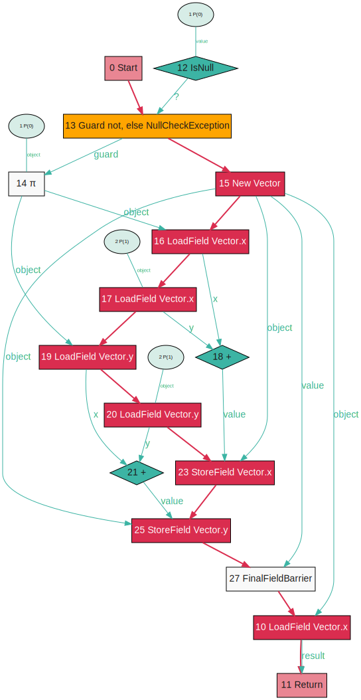</a>
</figure>

Before escape analysis runs this method looks exactly as the original `sum`, except the `x` field is then loaded and returned. The `y` field is stored but never used, and the intermediate `Vector` doesn't escape the compilation unit.

<figure>
<a href="sumX-after.svg">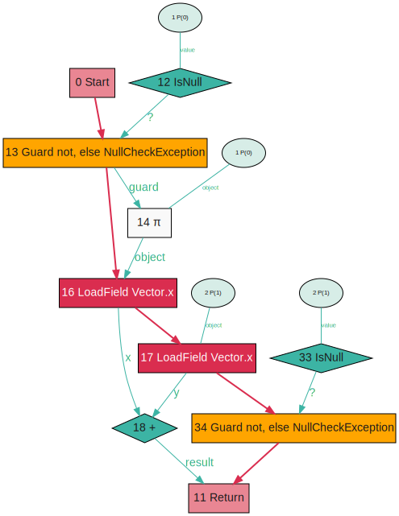</a>
</figure>

After escape analysis and scalar replacement of aggregates, we can see an important point to note - after the object was replaced with scalars, there was no consumer of the `y` value, so the code to generate it had nothing to connect it into the graph and so it was removed.

If we were literally *allocating the object on the stack*, storing the object in the same format just in stack memory rather than heap memory, we'd still have to generate the intermediate `y` value. We don't allocate the object *anywhere* - we've replaced it with dataflow edges instead.

Note that *stack allocation* of objects is really a thing, and it's [being proposed for standard HotSpot and C2](https://mail.openjdk.java.net/pipermail/hotspot-compiler-dev/2020-June/038779.html), but it's for a slightly different purpose which we won't go into here for simplicity.

## Comparing to manual optimisation

Would you rewrite some of these methods to accumulate the `x` and `y` in local variables and not create intermediate `Vector` objects? For example might you rewrite the `sum` over an array of `Vector` objects like this:

```java
private static Vector sumPremature(Vector first, Vector... rest) {
    double sumX = first.getX();
    double sumY = first.getY();

    for (Vector vector : rest) {
        sumX += vector.getX();
        sumY += vector.getY();
    }

    return new Vector(sumX, sumY);
}
```

<figure>
<a href="sumPremature-before.svg">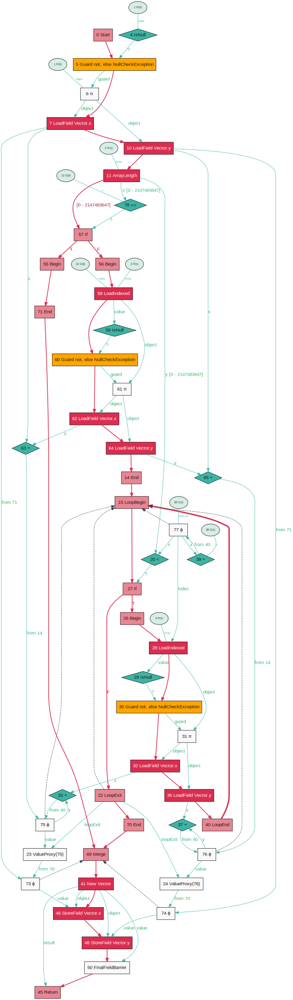</a>
</figure>

This graph is indeed more efficient than the graph of our sum with intermediate `Vector` objects before escape analysis. There is no allocation inside the loop.

<figure>
<a href="sumn-after.svg"></a>
</figure>

But if we look back to our previous sum loop with intermediate `Vector` objects after escape analysis and scalar replacement of aggregates, they look basically the same. There was no benefit in rewriting this method from the high-level version with simple intermediate `Vector` objects to the manually optimised version.

(Well actually perhaps there is - the manually optimised version is quicker to compile and runs more quickly while being interpreted until it is compiled.)

## Partial escape analysis

Something that Graal can do that C2 cannot, and a key advantage of GraalVM, is *partial* escape analysis. Instead of determining a binary value of whether an object escapes the compilation unit or not, this can determine on which branches an object escapes it, and move allocation of the object to only those branches where it escapes.

```java
private static Vector sumPartial(Vector a, Vector b, Vector c, boolean s) {
    final Vector x = a.add(b);

    if (s) {
        return blackhole(x);
    } else {
        return x.add(c);
    }
}
```

This contrived method sums two `Vector` objects, and then based on a condition `s` it either passes it as a parameter to another method called `blackhole`, which causes it to escape, or it adds a third vector, and then returns it.

The intermediate `Vector` stored in `x` escapes on the first branch, but not the second.

We prevent `blackhole` from being inlined by specifying `-XX:CompileCommand=dontinline,Vector.blackhole`.

<figure>
<a href="sumPartial-before.svg">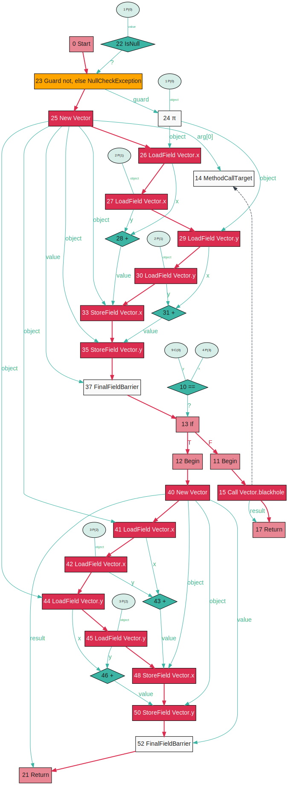</a>
</figure>

Before partial escape analysis runs we can see `New Vector` for `x` being run for both branches.

<figure>
<a href="sumPartial-after.svg">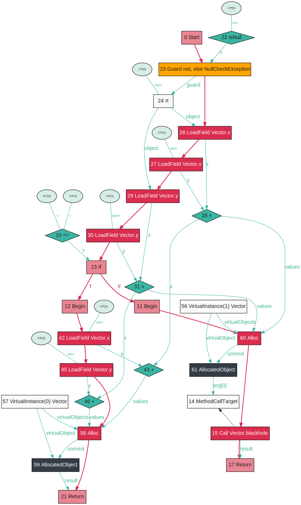</a>
</figure>

After partial escape analysis and scalar replacement of aggregates the intermediate `New Vector` has gone. Instead, on the branch where it escapes we have the `Alloc` object, which references the values it should have of `x` and `y`, and on the other branch where the object does not escape the values for `x` and `y` are just used directly.

The allocation has been moved to only the branch where it is actually needed.

Hopefully that all helps you understand what escape analysis and scalar replacement of aggregates is by seeing it working in practice. Also I hope it shows you that it's not really *stack allocation* and is actually something more powerful than that, and that it shows you what extra the GraalVM Compiler can do for you.

## More information

Graal's partial escape analysis algorithm is described in [Partial Escape Analysis and Scalar Replacement for Java](https://ssw.jku.at/Research/Papers/Stadler14/Stadler2014-CGO-PEA.pdf).

I've written more about these compiler graphs and how to read them in [Understanding Basic Graal Graphs](../basic-graal-graphs/).


