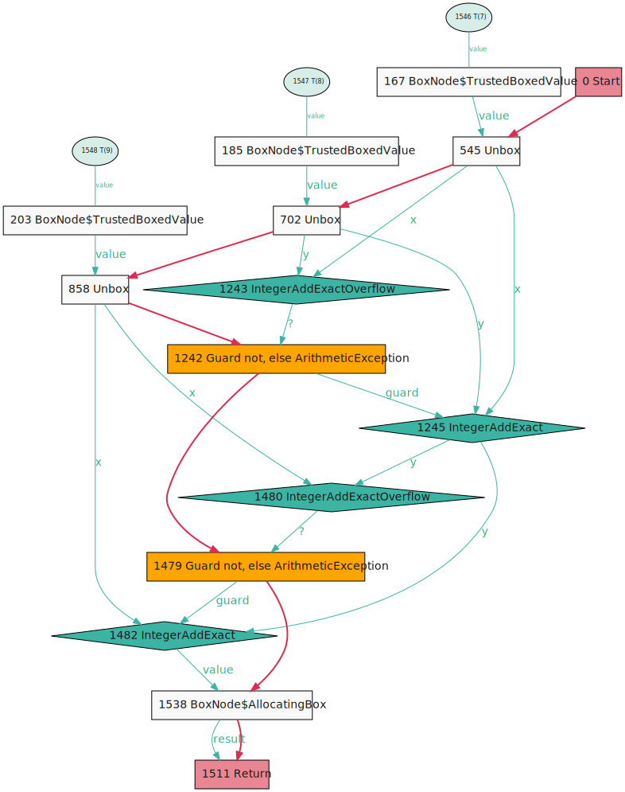
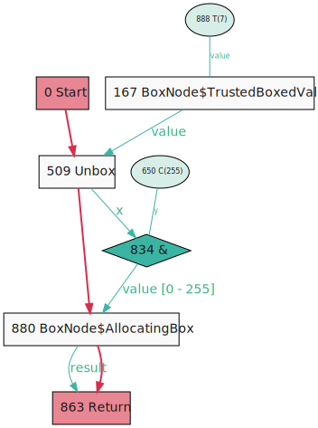
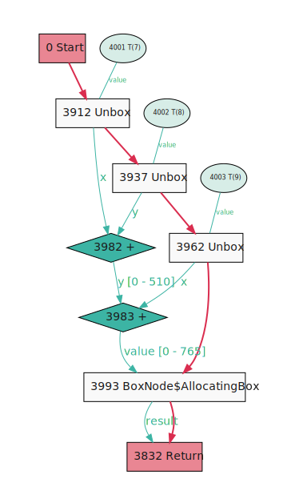
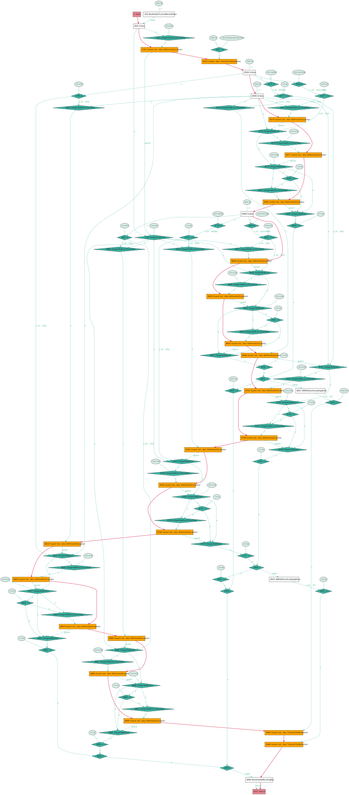
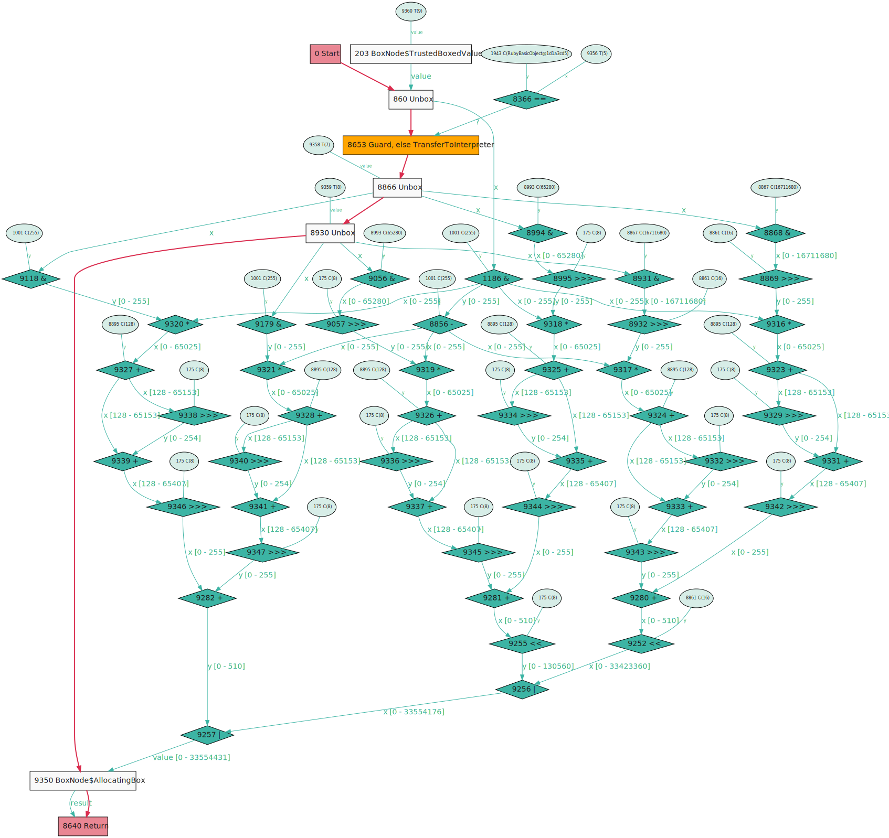
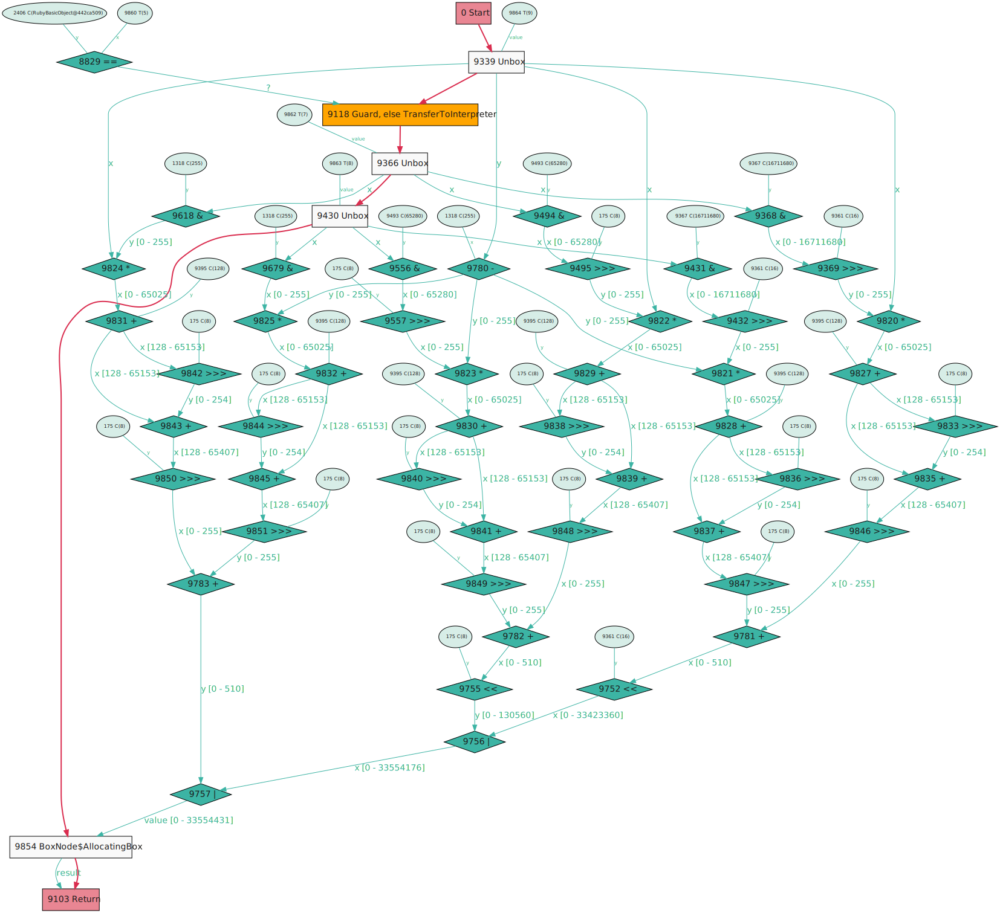
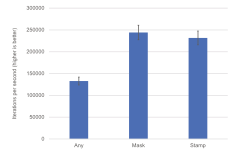

Someone on Reddit [asked](https://www.reddit.com/r/ruby/comments/pu16x6/in_ruby_3_is_there_any_way_to_turn_off_overflow/) if it was possible to turn off overflow checking on integer arithmetic in Ruby. They said that they could guarantee that their arithmetic would not overflow, and therefore they'd like to not pay the cost for a pointless check.

As several people said in the thread, this isn't possible in the standard implementation of Ruby, MRI, but it is possible and safe in TruffleRuby. And the great thing is it already happens automatically if you can prove using your code that your arithmetic will not overflow! Further than that, if your code doesn't prove it already then it's simple to add that proof using standard Ruby. To see if we can go a bit further, I've also tried adding a new zero-cost way to add proof that's less safe but could be a tiny bit faster.

We can show that this does actually have a measurable impact on performance, so can be worth doing, especially since it can be done with plain Ruby code.

It's worth talking about this because it's a good example of some of the subtle things that modern compilers do that people often aren't aware of.

## Overflow checks

Your processor has hardware support for integer arithmetic, but the integers it uses have a fixed-size, such as 32 or 64 bits. If the arithmetic operation gives you a result that's too large, it gets wrapped around to a different value that isn't what you'd want. Ruby integers don't have a fixed-size - they allow arbitrarily-large integers. So how can you use fixed-size hardware arithmetic to implement unlimited-size Ruby arithmetic? It's possible to detect if the result of a hardware arithmetic operation was too large. This is the *overflow check* that we're talking about. After every arithmetic operation that can overflow, Ruby checks if it did overflow, and if it did, it re-does the arithmetic in a software library that supports arbitrarily-large integers.

Here's some example Ruby code - an add operation.

```ruby
def add_any(a, b, c)
  a + b + c
end
```

TruffleRuby and Graal use a graph data structure to represent your program as it's being compiled. I've [talked about this elsewhere](https://shopify.engineering/understanding-programs-using-graphs), but you can basically think about it as a flowchart of your code. The arrows represent control and data flowing through your program, and the boxes represent operations and calculations. We're using a tool developed at Shopify called [Seafoam](https://github.com/Shopify/seafoam) to visualise the graph.

Here's the graph of that example Ruby code. The `T(7)`, `T(8)`, and `T(9)` nodes are `a`, `b`, and `c`. You can see that their values flow through `IntegerAddExact` operation nodes. `Exact` means that it will check for overflow.

<figure>
<a href="add-any.svg"></a>
</figure>

Here's the resulting machine code. You can see the `add` and `jo` machine instructions. `jo` stands for jump-on-overflow. It means jump to some other code, to handle the arithmetic in software, if the result was too large for the hardware integer.

```s
	0x11bb1f909:	add	esi, eax
	0x11bb1f90b:	jo	0x11bb1f9fc
...
	0x11bb1f91f:	add	r10d, esi
	0x11bb1f922:	jo	0x11bb1f9de
```

You can imagine how that sounds bad - an extra check to make after every arithmetic operation - and why people would want to remove it. There's immediate good news and bad news here. The good news is that most people will tell you that the `jo` instruction is very cheap to execute. The processor is good at pipelining it and it doesn't really have a large impact on performance on its own. The bad news is that the presence of the instruction prevents operations being packed as effectively as they can be, preventing further optimisations.

## Stamps - micro-types within the compiler

We need to talk about a new concept before we can explain what we're going to do next.

Ruby is a dynamically typed language (except for recent static typing ideas), but did you know that a good compiler will automatically discover static types as it's compiling your dynamically typed program? There's a simple version of this - such as knowing that `a`, `b`, and `c` in the code above are all integers, but there's also something more subtle going on that few people are aware of - stamps.

Stamps are a kind of micro-types that exist just within the compiler. Like all types they represent information about values, but unlike types you've usually worked with, stamps can give us a variety of properties, such as whether an object can be null or not, or whether a value is positive or negative, or even which individual bits are set in an integer. That's the property we're going to be interested in.

We can see an example of stamps in Ruby if we use the `&` bit-wise *and* operation.

```ruby
def stamp(a)
  a & 0xff
end
```

<figure>
<a href="stamp.svg"></a>
</figure>

In the compiler graph of this code, you can see the stamp annotated on the edge that represents the value flowing from node 834 to 880. It says `value [0 - 255]`, which means there is a stamp on this edge that guarantees that the value will definitely be in that inclusive range.

What's the point of stamps? Well if you're compiling an operation, you can look at the stamps of the values that flow into the operation, and compile it differently based on what the stamp guarantees about the value.

Here's the big idea - if you are adding two values where the stamp says that they are small enough that they cannot possibly overflow, then the compiler can automatically remove the overflow check. Your program needs to have some kind of proof in order to generate these stamps in order to do that. We'll explain that next.

## Masking to add stamps

One way we can add this proof is to simply use the `&` operation. We can modify our `add` to mask the three values to be in the range of a single byte, then we are proving that the operations cannot possibly overflow.

```ruby
def add_masks(a, b, c)
  a &= 0xff
  b &= 0xff
  c &= 0xff
  a + b + c
end
```

Now the graph doesn't contain those `Exact` nodes anymore. It's much simpler, with basic `+` nodes instead. You can see how this has happened - the stamps flowing into them show that the values are small enough that they cannot possibly overflow. Note that the second `+` has a stamp going in `[0 - 510]` and coming out `[0 - 765]`.

<figure>
<a href="add-mask.svg"></a>
</figure>

And the machine code.

```s
	0x1211f4095:	and	esi, 0xff
	0x1211f409b:	and	r10d, 0xff
	0x1211f40a2:	and	eax, 0xff
	0x1211f40a8:	add	r10d, eax
	0x1211f40ab:	add	r10d, esi
```

This is what we were originally after! So that's one way of doing it - add masks to prove the range of your values to prove that your arithmetic will not overflow, and a good compiler will use that information to remove the overflow check.

Notice that the value with the stamp is stored in a local variable before we then retrieve it and use it - the stamp can live through being stored and retrieved, that's not a problem.

## An intrinsic to add stamps

But one problem we did introduce with masking is that the mask instruction is actually run. We get extra `and` instructions. They're pointless as they shouldn't be actually doing anything, since we knew (through our own reasoning as the programmer) that the value is already within that range. We were just letting the compiler know that. If we're really super-sure of that, and prepared to accept the risk of being wrong, could we do better?

We could write a special function to *inject* the stamp directly, without actually performing an operation. I've implemented this in Graal and TruffleRuby as `Truffle::Graal.inject_stamp(value, 0xff)`. This is implemented as  *compiler intrinsic* - that means a method call which is recognised by the compiler and treated differently. Here's the implementation in Graal.

```java
r.register2("injectStamp", int.class, int.class, new InvocationPlugin() {
    @Override
    public boolean inlineOnly() {
        return true;
    }

    @Override
    public boolean apply(GraphBuilderContext b, ResolvedJavaMethod targetMethod, Receiver receiver, ValueNode value, ValueNode stamp) {
        b.addPush(JavaKind.Boolean, new InjectStampNode(value, stamp));
        return true;
    }
});
```

This says that when the compiler sees a call to `injectStamp`, to run this code instead. It adds a special `InjectStampNode` into the graph. You'll never see this node though - it has an optimisation to simplify itself.

```java
public void simplify(SimplifierTool tool) {
    if (!hasUsages()) {
        return;
    }
    if (stamp.isConstant()) {
        int stampValue = stamp.asJavaConstant().asInt();
        replaceAtUsagesAndDelete(graph().addOrUnique(
            new PiNode(value, StampFactory.forInteger(32, 0, stampValue))));
    }
}
```

The simplify operation gets the value of the stamp - the mask, and injects it using something called a π node, which means a node that is just there to add a stamp. Remember that it's actually the overflow operation which looks for the stamp. Here we can see it checking if the stamp permits the operation to overflow or not. You can see that if it cannot, it replaces itself with the boolean constant `false`, meaning can never overflow.

```java
public ValueNode canonical(CanonicalizerTool tool, ValueNode forX, ValueNode forY) {
    if (forX.isConstant() && !forY.isConstant()) {
        return new IntegerAddExactOverflowNode(forY, forX).canonical(tool);
    }
    if (forX.isConstant() && forY.isConstant()) {
        return canonicalXYconstant(forX, forY);
    } else if (forY.isConstant()) {
        long c = forY.asJavaConstant().asLong();
        if (c == 0) {
            return LogicConstantNode.forBoolean(false);
        }
    }
    if (!IntegerStamp.addCanOverflow((IntegerStamp) forX.stamp(NodeView.DEFAULT), (IntegerStamp) forY.stamp(NodeView.DEFAULT))) {
        return LogicConstantNode.forBoolean(false);
    }
    return this;
}
```

Here's our `add` with the intrinsic instead.

```ruby
def add_stamps(a, b, c)
  a = Truffle::Graal.inject_stamp(a, 0xff)
  b = Truffle::Graal.inject_stamp(b, 0xff)
  c = Truffle::Graal.inject_stamp(c, 0xff)
  a + b + c
end
```

Now in the graph you can see it's simpler still, because the `&` operations have gone away. This dynamic Ruby code now looks almost as simple as the static Java equivalent.

<figure>
<a href="add-stamps.svg"></a>
</figure>

And in the machine code... wow look at that - just two simple machine `add` instructions and no `and` instructions. Shame about the intermediate `mov` - that's due to register allocation decisions. Due to hardware register renaming, it doesn't really make any difference apart from being an unfortunate wart right in the middle of our example!

```s
	0x12457278d:	add	eax, dword ptr [r10*8 + 0xc]
	0x124572795:	mov	r10d, eax
	0x124572798:	add	r10d, esi
```

What happens if we were wrong about our assumptions of the code and we're injecting a stamp which could be wrong?

If we write a program that injects a stamp which is purposefully wrong we can observe an overflow and wrap-around. This program injects a stamp that applies correctly for the first ten seconds, then it starts being passed values outside that range. But by then we're in our optimized machine code without an overflow check, and the exception on the second-to-last line is triggered - the value will be negative because it was wrapped around and there was no overflow check.

```ruby
def foo(a, b)
  a = Truffle::Graal.inject_stamp(a, 0xff)
  b = Truffle::Graal.inject_stamp(b, 0xff)
  a + b
end

start = Time.now

until Time.now - start > 10
  a = rand(0xff)
  b = rand(0xff)
  raise if foo(a, b) < 0
end

puts 'state change'

loop do
  a = 0x7FFFFFFF
  b = 0x7FFFFFFF
  raise if foo(a, b) < 0
end
```

## Measuring the impact

Does this actually do anything useful?

I took this code from [`ChunkyPNG`](https://github.com/wvanbergen/chunky_png), a Ruby graphics library. It's been slightly simplified It composes two colours based on a transparency value. The colours are stored as packed RGB values, and composing them requires some integer arithmetic. 

```ruby
def r(value)
  (value & 0x00ff0000) >> 16
end

def g(value)
  (value & 0x0000ff00) >> 8
end

def b(value)
  value & 0x000000ff
end

def rgb(r, g, b)
  r << 16 | g << 8 | b
end

def int8_mult(a, b)
  t = a * b + 0x80
  ((t >> 8) + t) >> 8
end

def interpolate_quick(fg, bg, alpha)
  alpha_com = 255 - alpha
  new_r = int8_mult(alpha, r(fg)) + int8_mult(alpha_com, r(bg))
  new_g = int8_mult(alpha, g(fg)) + int8_mult(alpha_com, g(bg))
  new_b = int8_mult(alpha, b(fg)) + int8_mult(alpha_com, b(bg))
  rgb(new_r, new_g, new_b)
end
```

If we look at the graph and machine code of this version we can see a ton of overflow checks.

<figure>
<a href="bench-any.svg"></a>
</figure>

```s
...
	0x120f8329e:	sub	esi, eax
	0x120f832a0:	jo	0x120f835fc
	0x120f832a6:	mov	r10d, dword ptr [r11 + 0x2c]
	0x120f832aa:	mov	r10d, dword ptr [r10*8 + 0xc]
	0x120f832b2:	mov	edx, r10d
	0x120f832b5:	and	edx, 0xff0000
	0x120f832bb:	shr	edx, 0x10
	0x120f832be:	imul	edx, eax
	0x120f832c1:	jo	0x120f835b8
	0x120f832c7:	add	edx, 0x80
	0x120f832cd:	jo	0x120f83612
	0x120f832d3:	mov	r8d, edx
	0x120f832d6:	sar	r8d, 8
	0x120f832da:	mov	r9d, r8d
	0x120f832dd:	add	r9d, edx
	0x120f832e0:	jo	0x120f835c5
	0x120f832e6:	mov	r9d, r10d
	0x120f832e9:	and	r9d, 0xff00
	0x120f832f0:	shr	r9d, 8
	0x120f832f4:	mov	ecx, r9d
	0x120f832f7:	imul	ecx, eax
	0x120f832fa:	nop	word ptr [rax + rax]
	0x120f83300:	jo	0x120f835ad
	0x120f83306:	imul	r9d, eax
	0x120f8330a:	add	r9d, 0x80
	0x120f83311:	jo	0x120f8351c
	0x120f83317:	mov	ecx, r9d
	0x120f8331a:	sar	ecx, 8
	0x120f8331d:	mov	ebx, ecx
	0x120f8331f:	add	ebx, r9d
...
  ```

But we know pixel values are always in the range of a byte, so we know all these checks are a pointless waste. We can fix this with adding just one line of code!

First, we can turn it into a benchmark by composing some whole random images.

```ruby
a, b, c = [], [], []

1_000.times do
  a.push rgb(rand(255), rand(255), rand(255))
  b.push rgb(rand(255), rand(255), rand(255))
  c.push rgb(rand(255), rand(255), rand(255))
end

Benchmark.ips do |ips|
  ips.report('interpolate_quick') do
    alpha = rand(255)
    a.size.times do |n|
      c[n] = interpolate_quick(a[n], b[n], alpha)
    end
  end
end
```

This produces 1062 bytes of machine code.

Now let's try masking. We'll just add one line - to mask `alpha` to be in the range of a byte.

```ruby
def interpolate_quick(fg, bg, alpha)
  alpha &= 0xff
  alpha_com = 255 - alpha
  new_r = int8_mult(alpha, r(fg)) + int8_mult(alpha_com, r(bg))
  new_g = int8_mult(alpha, g(fg)) + int8_mult(alpha_com, g(bg))
  new_b = int8_mult(alpha, b(fg)) + int8_mult(alpha_com, b(bg))
  rgb(new_r, new_g, new_b)
end
```

This produces a far simpler graph, and 640 bytes of machine code, and now no overflow nodes and no `jo` instructions - it worked - we completely removed the cost of overflow from this code.

<figure>
<a href="bench-mask.svg"></a>
</figure>


```s
...
	0x124f5a3b9:	and	edx, 0xff0000     # the mask
...
	0x124f5a3df:	sub	edx, r10d
	0x124f5a3e2:	mov	r9d, esi
	0x124f5a3e5:	and	r9d, 0xff0000
	0x124f5a3ec:	shr	r9d, 0x10
	0x124f5a3f0:	imul	r9d, edx
	0x124f5a3f4:	lea	r9d, [r9 + 0x80]
	0x124f5a3fb:	mov	ecx, r9d
	0x124f5a3fe:	shr	ecx, 8
	0x124f5a401:	add	ecx, r9d
	0x124f5a404:	shr	ecx, 8
	0x124f5a407:	add	r8d, ecx
	0x124f5a40a:	shl	r8d, 0x10
	0x124f5a40e:	mov	r9d, eax
	0x124f5a411:	and	r9d, 0xff00
	0x124f5a418:	shr	r9d, 8
	0x124f5a41c:	imul	r9d, r10d
	0x124f5a420:	lea	r9d, [r9 + 0x80]
	0x124f5a427:	mov	ecx, r9d
	0x124f5a42a:	shr	ecx, 8
	0x124f5a42d:	add	ecx, r9d
...
```

Now let's try our intrinsic.

```ruby
def interpolate_quick(fg, bg, alpha)
  alpha = Truffle::Graal.inject_stamp(alpha, 0xff)
  alpha_com = 255 - alpha
  new_r = int8_mult(alpha, r(fg)) + int8_mult(alpha_com, r(bg))
  new_g = int8_mult(alpha, g(fg)) + int8_mult(alpha_com, g(bg))
  new_b = int8_mult(alpha, b(fg)) + int8_mult(alpha_com, b(bg))
  rgb(new_r, new_g, new_b)
end
```

<figure>
<a href="bench-stamp.svg"></a>
</figure>

This produces 614 bytes of machine code - under 60% of the original code size. It's more compact still, because we don't have the actual masking `and` instruction now.

We know the machine code looks a lot better - a lot more compact and straight-forward. Does it have an impact on actual running time?

<figure>
<a href="any-mask-stamp.svg"></a>
</figure>

Yes it's nearly twice as fast to use a mask! All for adding one line of pure Ruby code. The intrinsic doesn't really add much beyond that - it's all within the margin of error.

Didn't we say that `jo` didn't add much of an impact? Well that's what I was always taught - maybe I should reconsider that and measure it a bit more. Also, removing the linear overflow checks generally relaxes the entire graph, allowing perhaps a better scheduling. I could measure that as well.

And just for fun, let's compare TruffleRuby, with it's sophisticated stamp system, to YARV, some other optimising Ruby implementations.

<figure>
<a href="impls.svg"></a>
</figure>

The mask doesn't do much for the other simpler implementations, but TruffleRuby is up to 200x faster than YARV, up to 140x faster than MJIT, and up to 50x faster than JRuby, for this benchmark.

So there you go - yes there is a way using pure Ruby to hint to a compiler that an arithmetic operation cannot overflow - you just have to write a proof that the compiler can use - and a real Ruby compiler is able to take advantage of it (maybe the other compilers should as well), and it really does have a useful impact on performance.

## Related idea in asm.js

Do you think you've seen this idea of masking values with `& 0xff` before? [asm.js](https://en.wikipedia.org/wiki/Asm.js) is a subset of JavaScript designed to run more efficiently by using more hardware primitives in the same way we are. It uses a pattern `value | 0` to similarly force a value to be treated as a machine integer.
